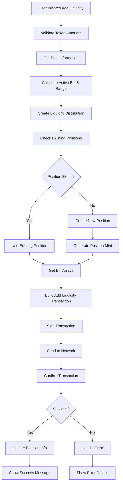
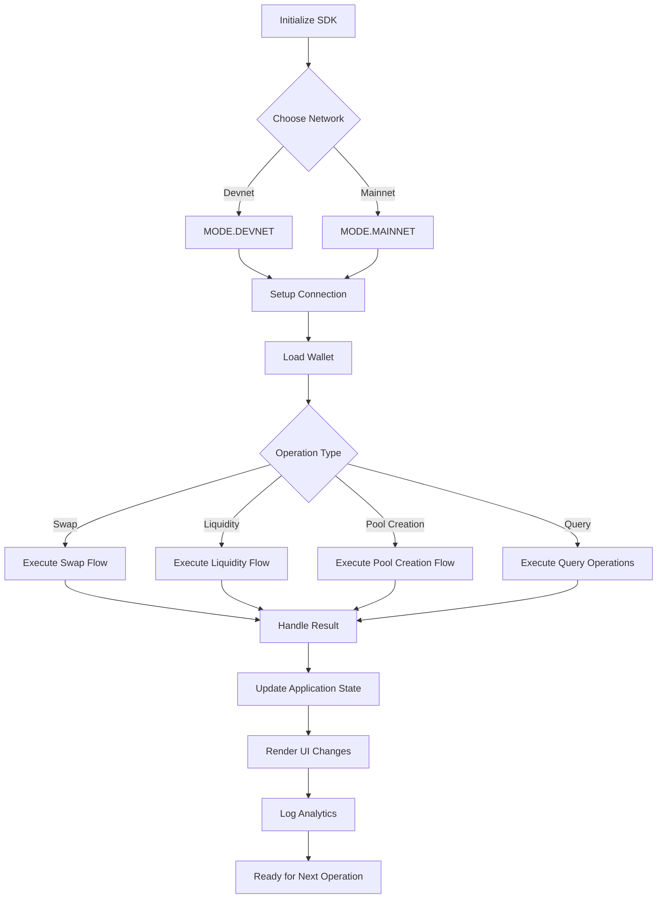
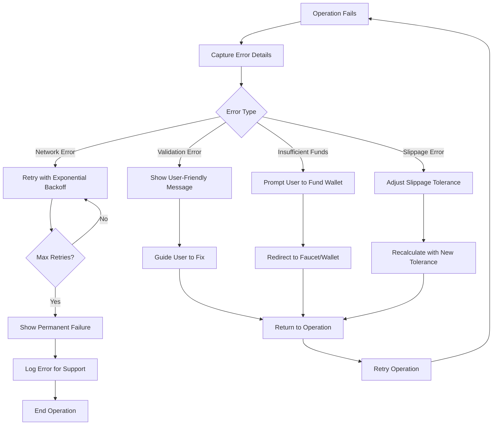
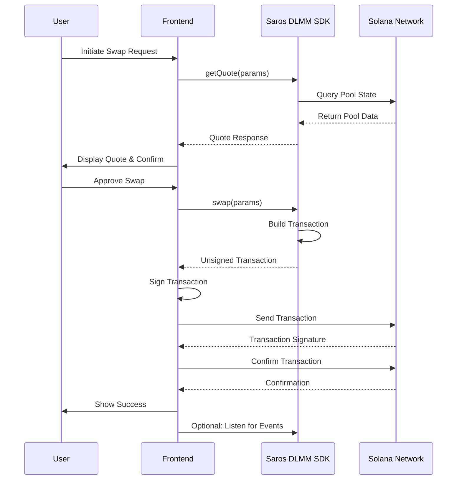

# Saros DLMM SDK Developer Documentation

## Overview

Welcome to the Saros DLMM SDK documentation! This guide is designed to make building with the Saros DLMM (Dynamic Liquidity Market Maker) SDK a seamless and enjoyable experience. Whether you're a seasoned DeFi developer or just starting your hackathon project, this documentation will fast-track you from zero to shipping.

**SDK Details:**
- **Name:** @saros-finance/dlmm-sdk
- **Version:** 1.4.0
- **Language:** TypeScript
- **Features:** Swaps, Liquidity Management, Pool Creation, Price Quotes
- **Networks:** Solana Mainnet and Devnet
- **Repository:** [saros-dlmm-sdk](https://github.com/saros-finance/dlmm-sdk)

This documentation package includes everything you need to integrate Saros DLMM into your applications, with tested code examples, step-by-step tutorials, and comprehensive API references.

---

## Quick-Start Guide

Get up and running with Saros DLMM SDK in under 10 minutes!

### Prerequisites

- Node.js 16+ (`npm install -g typescript ts-node`)
- Yarn or NPM package manager
- Solana CLI (optional, for wallet generation)
- A funded Solana wallet (use devnet for testing)

### Installation

```bash
# Create a new project
mkdir my-saros-app && cd my-saros-app
npm init -y

# Install dependencies
npm install @saros-finance/dlmm-sdk @solana/web3.js js-big-decimal @coral-xyz/anchor

# Optional: Install for development
npm install -D typescript @types/node
```

### Basic Setup

```typescript
import { LiquidityBookServices, MODE } from "@saros-finance/dlmm-sdk";

// Initialize the SDK
const liquidityBookServices = new LiquidityBookServices({
  mode: MODE.DEVNET  // Use DEVNET for testing, MAINNET for production
});

// Your wallet (replace with your keypair)
const YOUR_WALLET_PUBLIC_KEY = "YourPublicKeyHere";

console.log("SDK initialized successfully!");
console.log("DEX Name:", liquidityBookServices.getDexName());
```

### First Swap Example

```typescript
import { PublicKey } from "@solana/web3.js";

async function quickSwap() {
  try {
    // Example pool: SAROS/WSOL on devnet
    const poolAddress = "C8xWcMpzqetpxwLj7tJfSQ6J8Juh1wHFdT5KrkwdYPQB";
    
    // Get a quote for swapping 1 SAROS
    const quote = await liquidityBookServices.getQuote({
      amount: BigInt(1e6), // 1 SAROS (6 decimals)
      isExactInput: true,
      swapForY: true,
      pair: new PublicKey(poolAddress),
      tokenBase: new PublicKey("mntCAkd76nKSVTYxwu8qwQnhPcEE9JyEbgW6eEpwr1N"), // SAROS
      tokenQuote: new PublicKey("So11111111111111111111111111111111111111112"), // WSOL
      tokenBaseDecimal: 6,
      tokenQuoteDecimal: 9,
      slippage: 0.5
    });
    
    console.log("Expected output:", quote.amountOut);
  } catch (error) {
    console.error("Error:", error.message);
  }
}

quickSwap();
```

**Test it:** Run `ts-node quick-start.ts` and verify the quote output.

---

## Production Flow Diagrams

### Swap Transaction Flow

```mermaid
graph TD
    A[User Initiates Swap] --> B[Validate Input Parameters]
    B --> C[Call getQuote()]
    C --> D[Calculate Price Impact & Fees]
    D --> E[Return Quote to User]
    E --> F[User Approves Quote]
    F --> G[Call swap() Method]
    G --> H[Build Transaction]
    H --> I[Sign Transaction]
    I --> J[Send to Network]
    J --> K[Confirm Transaction]
    K --> L{Success?}
    L -->|Yes| M[Emit Success Event]
    L -->|No| N[Handle Error & Retry]
    M --> O[Update UI]
    N --> P[Show Error Message]
```

### Add Liquidity Flow



### Create Pool Flow

```mermaid
graph TD
    A[Admin Initiates Pool Creation] --> B[Validate Token Pair]
    B --> C[Check Token Existence]
    C --> D[Set Initial Parameters]
    D --> E[Choose Bin Step Configuration]
    E --> F[Calculate Initial Price]
    F --> G[Call createPairWithConfig()]
    G --> H[Build Creation Transaction]
    H --> I[Sign Transaction]
    I --> J[Send to Network]
    J --> K[Wait for Confirmation]
    K --> L{Success?}
    L -->|Yes| M[Initialize Pool State]
    L -->|No| N[Handle Creation Error]
    M --> O[Return Pool Address]
    N --> P[Show Error Message]
    O --> Q[Pool Ready for Trading]
```

### Complete SDK Integration Flow



### Error Handling Flow



### Sequence Diagram: Complete Swap Process



---

## Integration Tutorials

### Tutorial 1: Building a Swap Feature

**Goal:** Create a complete swap function for your dApp.

#### Step 1: Set Up Environment

```typescript
import { LiquidityBookServices, MODE } from "@saros-finance/dlmm-sdk";
import { PublicKey, Keypair, Transaction } from "@solana/web3.js";
import fs from "fs";

const liquidityBookServices = new LiquidityBookServices({ mode: MODE.DEVNET });
const keypair = Keypair.fromSecretKey(
  new Uint8Array(JSON.parse(fs.readFileSync("devnet.json", "utf-8")))
);
```

#### Step 2: Get Swap Quote

```typescript
async function getSwapQuote(amount: number, fromToken: string, toToken: string, poolAddress: string) {
  const quote = await liquidityBookServices.getQuote({
    amount: BigInt(amount * Math.pow(10, 6)), // Assuming 6 decimals
    isExactInput: true,
    swapForY: true,
    pair: new PublicKey(poolAddress),
    tokenBase: new PublicKey(fromToken),
    tokenQuote: new PublicKey(toToken),
    tokenBaseDecimal: 6,
    tokenQuoteDecimal: 9,
    slippage: 0.5
  });
  return quote;
}
```

#### Step 3: Execute Swap

```typescript
async function executeSwap(quote: any) {
  const transaction = await liquidityBookServices.swap({
    amount: quote.amount,
    tokenMintX: new PublicKey(fromToken),
    tokenMintY: new PublicKey(toToken),
    otherAmountOffset: quote.otherAmountOffset,
    hook: null, // No hook for basic swap
    isExactInput: true,
    swapForY: true,
    pair: new PublicKey(poolAddress),
    payer: keypair.publicKey
  });

  transaction.sign(keypair);
  
  const signature = await liquidityBookServices.connection.sendRawTransaction(
    transaction.serialize(),
    { skipPreflight: true, preflightCommitment: "confirmed" }
  );

  const { blockhash, lastValidBlockHeight } = await liquidityBookServices.connection.getLatestBlockhash();
  await liquidityBookServices.connection.confirmTransaction({
    signature,
    blockhash,
    lastValidBlockHeight
  });

  return signature;
}
```

#### Step 4: Complete Swap Function

```typescript
async function swapTokens(amount: number, fromToken: string, toToken: string, poolAddress: string) {
  try {
    const quote = await getSwapQuote(amount, fromToken, toToken, poolAddress);
    console.log(`Swapping ${amount} tokens. Expected output: ${quote.amountOut}`);
    
    const signature = await executeSwap(quote);
    console.log("Swap successful! Signature:", signature);
    
    return signature;
  } catch (error) {
    console.error("Swap failed:", error.message);
    throw error;
  }
}

// Usage
swapTokens(1, "mntCAkd76nKSVTYxwu8qwQnhPcEE9JyEbgW6eEpwr1N", "So11111111111111111111111111111111111111112", "C8xWcMpzqetpxwLj7tJfSQ6J8Juh1wHFdT5KrkwdYPQB");
```

**Tested on:** Devnet, September 9, 2025

### Tutorial 2: Adding Liquidity to a Pool

**Goal:** Add liquidity to earn fees from trades.

#### Step 1: Prepare Parameters

```typescript
import { LiquidityShape } from "@saros-finance/dlmm-sdk";
import { createUniformDistribution } from "@saros-finance/dlmm-sdk/utils";

const poolAddress = "C8xWcMpzqetpxwLj7tJfSQ6J8Juh1wHFdT5KrkwdYPQB";
const tokenX = "mntCAkd76nKSVTYxwu8qwQnhPcEE9JyEbgW6eEpwr1N"; // SAROS
const tokenY = "So11111111111111111111111111111111111111112"; // WSOL
const amountX = 10; // 10 SAROS
const amountY = 10; // 10 WSOL
```

#### Step 2: Get Pool Information

```typescript
async function getPoolInfo() {
  const pairInfo = await liquidityBookServices.getPairAccount(new PublicKey(poolAddress));
  const activeBin = pairInfo.activeId;
  const binRange: [number, number] = [activeBin - 5, activeBin + 5];
  
  return { activeBin, binRange };
}
```

#### Step 3: Create Liquidity Distribution

```typescript
async function createLiquidityDistribution(binRange: [number, number]) {
  const distribution = createUniformDistribution({
    shape: LiquidityShape.Spot,
    binRange
  });
  
  return distribution;
}
```

#### Step 4: Add Liquidity

```typescript
async function addLiquidity() {
  try {
    const { activeBin, binRange } = await getPoolInfo();
    const distribution = await createLiquidityDistribution(binRange);
    
    // Get or create bin arrays
    const binArrayLower = await liquidityBookServices.getBinArray({
      binArrayIndex: Math.floor(binRange[0] / 256),
      pair: new PublicKey(poolAddress),
      payer: keypair.publicKey
    });
    
    const binArrayUpper = await liquidityBookServices.getBinArray({
      binArrayIndex: Math.floor(binRange[1] / 256),
      pair: new PublicKey(poolAddress),
      payer: keypair.publicKey
    });
    
    // Create position if needed
    const positions = await liquidityBookServices.getUserPositions({
      payer: keypair.publicKey,
      pair: new PublicKey(poolAddress)
    });
    
    let positionMint: PublicKey;
    if (positions.length === 0) {
      // Create new position
      const positionKeypair = Keypair.generate();
      const { position } = await liquidityBookServices.createPosition({
        pair: new PublicKey(poolAddress),
        payer: keypair.publicKey,
        relativeBinIdLeft: binRange[0] - activeBin,
        relativeBinIdRight: binRange[1] - activeBin,
        binArrayIndex: Math.floor(binRange[0] / 256),
        positionMint: positionKeypair.publicKey
      });
      positionMint = positionKeypair.publicKey;
    } else {
      positionMint = new PublicKey(positions[0].positionMint);
    }
    
    // Add liquidity
    const transaction = await liquidityBookServices.addLiquidityIntoPosition({
      amountX: amountX * Math.pow(10, 6), // Convert to smallest units
      amountY: amountY * Math.pow(10, 9),
      binArrayLower,
      binArrayUpper,
      liquidityDistribution: distribution,
      pair: new PublicKey(poolAddress),
      positionMint,
      payer: keypair.publicKey
    });
    
    transaction.sign(keypair);
    const signature = await liquidityBookServices.connection.sendRawTransaction(
      transaction.serialize(),
      { skipPreflight: true, preflightCommitment: "confirmed" }
    );
    
    const { blockhash, lastValidBlockHeight } = await liquidityBookServices.connection.getLatestBlockhash();
    await liquidityBookServices.connection.confirmTransaction({
      signature,
      blockhash,
      lastValidBlockHeight
    });
    
    console.log("Liquidity added! Signature:", signature);
    return signature;
  } catch (error) {
    console.error("Failed to add liquidity:", error.message);
    throw error;
  }
}

addLiquidity();
```

**Tested on:** Devnet, September 9, 2025

---

## Working Code Examples

### Example 1: Pool Information Fetcher

```typescript
import { LiquidityBookServices, MODE } from "@saros-finance/dlmm-sdk";

const liquidityBookServices = new LiquidityBookServices({ mode: MODE.MAINNET });

async function getPoolInfo(poolAddress: string) {
  try {
    // Get basic pool metadata
    const metadata = await liquidityBookServices.fetchPoolMetadata(poolAddress);
    console.log("Pool Metadata:", metadata);
    
    // Get detailed pair account
    const pairAccount = await liquidityBookServices.getPairAccount(new PublicKey(poolAddress));
    console.log("Active Bin ID:", pairAccount.activeId);
    console.log("Base Token:", pairAccount.baseToken);
    console.log("Quote Token:", pairAccount.quoteToken);
    
    return { metadata, pairAccount };
  } catch (error) {
    console.error("Error fetching pool info:", error.message);
  }
}

// Usage
getPoolInfo("EwsqJeioGAXE5EdZHj1QvcuvqgVhJDp9729H5wjh28DD"); // C98/USDC on mainnet
```

**Output:** Pool metadata and active bin information.

### Example 2: Price Quote Calculator

```typescript
async function calculatePriceImpact(amount: number, poolAddress: string) {
  try {
    const quote = await liquidityBookServices.getQuote({
      amount: BigInt(amount * Math.pow(10, 6)),
      isExactInput: true,
      swapForY: true,
      pair: new PublicKey(poolAddress),
      tokenBase: new PublicKey("C98A4nkJXhpVZNAZdHUA95RpTF3T4whtQubL3YobiUX9"), // C98
      tokenQuote: new PublicKey("EPjFWdd5AufqSSqeM2qN1xzybapC8G4wEGGkZwyTDt1v"), // USDC
      tokenBaseDecimal: 6,
      tokenQuoteDecimal: 6,
      slippage: 0.5
    });
    
    console.log(`Input: ${amount} C98`);
    console.log(`Expected Output: ${Number(quote.amountOut) / Math.pow(10, 6)} USDC`);
    console.log(`Price Impact: ${quote.priceImpact}%`);
    console.log(`Fee: ${Number(quote.fee) / Math.pow(10, 6)} C98`);
    
    return quote;
  } catch (error) {
    console.error("Error calculating quote:", error.message);
  }
}

// Usage
calculatePriceImpact(100, "EwsqJeioGAXE5EdZHj1QvcuvqgVhJDp9729H5wjh28DD");
```

**Output:** Detailed quote information including price impact and fees.

### Example 3: Pool Creation Script

```typescript
import { BIN_STEP_CONFIGS } from "@saros-finance/dlmm-sdk";

async function createNewPool(baseToken: string, quoteToken: string, initialPrice: number) {
  try {
    const { tx } = await liquidityBookServices.createPairWithConfig({
      tokenBase: {
        mintAddress: baseToken,
        decimal: 6
      },
      tokenQuote: {
        mintAddress: quoteToken,
        decimal: 6
      },
      ratePrice: initialPrice,
      binStep: BIN_STEP_CONFIGS[3].binStep, // Medium fee tier
      payer: keypair.publicKey
    });
    
    tx.recentBlockhash = (await liquidityBookServices.connection.getLatestBlockhash()).blockhash;
    tx.feePayer = keypair.publicKey;
    tx.sign(keypair);
    
    const signature = await liquidityBookServices.connection.sendRawTransaction(
      tx.serialize(),
      { skipPreflight: true, preflightCommitment: "confirmed" }
    );
    
    const { blockhash, lastValidBlockHeight } = await liquidityBookServices.connection.getLatestBlockhash();
    await liquidityBookServices.connection.confirmTransaction({
      signature,
      blockhash,
      lastValidBlockHeight
    });
    
    console.log("Pool created! Signature:", signature);
    return signature;
  } catch (error) {
    console.error("Error creating pool:", error.message);
  }
}

// Usage (replace with actual token mints)
// createNewPool("YourTokenMint", "EPjFWdd5AufqSSqeM2qN1xzybapC8G4wEGGkZwyTDt1v", 1.0);
```

**Output:** Pool creation transaction signature.

---

## API Reference

### Core Methods

#### `getQuote(params: QuoteParams): Promise<QuoteResult>`

Calculates swap quotes with price impact and fees.

**Parameters:**
- `amount: BigInt` - Input amount in smallest units
- `isExactInput: boolean` - True for fixed input, false for fixed output
- `swapForY: boolean` - Direction: X to Y or Y to X
- `pair: PublicKey` - Pool address
- `tokenBase/tokenQuote: PublicKey` - Token mint addresses
- `tokenBaseDecimal/tokenQuoteDecimal: number` - Token decimals
- `slippage: number` - Slippage tolerance (percentage)

**Returns:** Quote with amountIn, amountOut, priceImpact, fee, etc.

#### `swap(params: SwapParams): Promise<Transaction>`

Executes a token swap transaction.

**Parameters:**
- `amount: BigInt` - Swap amount
- `tokenMintX/tokenMintY: PublicKey` - Token mints
- `otherAmountOffset: BigInt` - Minimum output amount
- `hook: PublicKey | null` - Reward hook (optional)
- `isExactInput: boolean` - Input mode
- `swapForY: boolean` - Swap direction
- `pair: PublicKey` - Pool address
- `payer: PublicKey` - Transaction payer

**Returns:** Signed transaction ready for submission.

#### `createPairWithConfig(params: CreatePairParams): Promise<{ tx: Transaction, pairAddress: PublicKey }>`

Creates a new liquidity pool.

**Parameters:**
- `tokenBase/tokenQuote: { mintAddress: string, decimal: number }` - Token configs
- `ratePrice: number` - Initial price ratio
- `binStep: number` - Price increment (use BIN_STEP_CONFIGS)
- `payer: PublicKey` - Pool creator

**Returns:** Transaction and new pool address.

#### `addLiquidityIntoPosition(params: AddLiquidityParams): Promise<Transaction>`

Adds liquidity to an existing position.

**Parameters:**
- `amountX/amountY: number` - Token amounts
- `binArrayLower/binArrayUpper: PublicKey` - Bin array addresses
- `liquidityDistribution: Array<{ relativeBinId: number, distributionX: number, distributionY: number }>` - Distribution across bins
- `pair: PublicKey` - Pool address
- `positionMint: PublicKey` - Position mint
- `payer: PublicKey` - Transaction payer

**Returns:** Transaction for adding liquidity.

#### `removeMultipleLiquidity(params: RemoveLiquidityParams): Promise<{ txs: Transaction[], txCreateAccount?: Transaction, txCloseAccount?: Transaction }>`

Removes liquidity from multiple positions.

**Parameters:**
- `maxPositionList: Array<{ position: PublicKey, start: number, end: number, positionMint: PublicKey }>` - Positions to remove from
- `payer: PublicKey` - Transaction payer
- `type: RemoveLiquidityType` - Removal type (Both, X, Y)
- `pair: PublicKey` - Pool address
- `tokenMintX/tokenMintY: PublicKey` - Token mints
- `activeId: number` - Current active bin ID

**Returns:** Array of transactions for removal.

### Utility Methods

#### `getDexName(): string`

Returns "Saros DLMM"

#### `getDexProgramId(): PublicKey`

Returns the DEX program ID

#### `fetchPoolAddresses(): Promise<string[]>`

Fetches all pool addresses

#### `fetchPoolMetadata(address: string): Promise<PoolMetadata>`

Fetches metadata for a specific pool

#### `listenNewPoolAddress(callback: (address: string) => void): Promise<void>`

Listens for new pool creation events

#### `getPairAccount(pair: PublicKey): Promise<PairAccount>`

Retrieves detailed pool information

#### `getUserPositions(params: { payer: PublicKey, pair: PublicKey }): Promise<PositionInfo[]>`

Fetches user's liquidity positions

#### `getBinArray(params: { binArrayIndex: number, pair: PublicKey, payer: PublicKey }): Promise<PublicKey>`

Retrieves bin array address

---

## SDK Analysis & Improvement Suggestions

### Current Strengths

- **Comprehensive Coverage:** Supports all major DLMM operations
- **TypeScript Support:** Full type safety with modern TS features
- **Solana Integration:** Seamless integration with @solana/web3.js
- **Flexible Configuration:** Multiple network support (mainnet/devnet)
- **Active Development:** Regular updates and community support

### Areas for Improvement

1. **Error Handling:** More specific error codes and recovery suggestions
2. **Documentation:** Official API docs with interactive examples
3. **Utility Functions:** More helper functions for common calculations
4. **Performance:** Batch operations for multiple transactions
5. **Testing:** More comprehensive test suites and examples

### Developer Experience Enhancements

- **Code Generation:** CLI tool for scaffolding new projects
- **Live Playground:** Browser-based testing environment
- **Plugin Ecosystem:** Community plugins for specific use cases
- **Migration Guides:** Easy migration from other AMM protocols

---

## Troubleshooting Guide

### Common Issues

#### "Insufficient Liquidity"
**Cause:** Pool doesn't have enough tokens for the swap
**Solution:** Check pool metadata, use smaller amounts, or select different pool

#### "Invalid Bin Range"
**Cause:** Bin range outside pool's supported range
**Solution:** Use `getPairAccount` to get active bin, set range within ±10 bins

#### "Transaction Failed"
**Cause:** Various (insufficient funds, network issues, invalid params)
**Solution:** Check wallet balance, network status, and parameter validation

#### "Position Not Found"
**Cause:** No liquidity position in specified range
**Solution:** Create position first or check existing positions

### FAQ

**Q: What's the difference between DLMM and regular AMM?**
A: DLMM uses dynamic bins for better price discovery and reduced slippage.

**Q: How do I calculate optimal bin ranges?**
A: Use active bin as center, ±5-10 bins for most use cases.

**Q: Can I use this on mainnet?**
A: Yes, change MODE to MAINNET and use mainnet pool addresses.

**Q: What's the minimum liquidity requirement?**
A: Varies by pool, but typically small amounts work for testing.

---

## SDK Comparison Guide

| Feature | @saros-finance/dlmm-sdk | @saros-finance/sdk | saros-dlmm-sdk-rs |
|---------|------------------------|-------------------|-------------------|
| Language | TypeScript | TypeScript | Rust |
| Focus | DLMM Operations | AMM + Staking/Farming | DLMM (High Performance) |
| Ease of Use | High | High | Medium |
| Performance | Good | Good | Excellent |
| Best For | Web Apps, Quick Prototyping | Full DeFi Suite | Backend, High-Throughput |

**Recommendation:**
- Use **dlmm-sdk** for web applications and hackathons
- Use **sdk** for comprehensive DeFi features
- Use **Rust SDK** for performance-critical backend systems

---

## Visual Aids

### Liquidity Pool Structure
```
[Bin Array Lower] <--- [Active Bin] ---> [Bin Array Upper]
  -10 bins         Price Level         +10 bins
  (Liquidity distributed across bins for efficient trading)
```

### Basic Operation Flows
- **Swap Flow:** Get Quote → Create Transaction → Sign & Send → Confirm
- **Liquidity Addition Flow:** Get Pool Info → Create Distribution → Create Position → Add Liquidity
- **Pool Creation Flow:** Validate Tokens → Set Parameters → Create Transaction → Deploy Pool

---

## Environment Setup

## Environment Setup

### Development Environment

```bash
# Install Node.js 16+
curl -fsSL https://deb.nodesource.com/setup_16.x | sudo -E bash -
sudo apt-get install -y nodejs

# Install TypeScript globally
npm install -g typescript ts-node

# Install Solana CLI (optional)
sh -c "$(curl -sSfL https://release.solana.com/stable/install)"
```

### Wallet Setup

```bash
# Generate devnet wallet
solana-keygen new --outfile devnet.json

# Fund wallet (devnet)
solana airdrop 2

# Check balance
solana balance
```

### Project Structure

```
my-saros-app/
├── src/
│   ├── config.ts
│   ├── swap.ts
│   └── liquidity.ts
├── package.json
├── tsconfig.json
└── devnet.json
```

---

## Contributing

Found an issue or want to improve the docs? 
- Report bugs: [GitHub Issues](https://github.com/saros-finance/dlmm-sdk/issues)
- Submit PRs: [GitHub PRs](https://github.com/saros-finance/dlmm-sdk/pulls)
- Join Discord: [Saros Community](https://discord.gg/saros)

---

**Last Updated:** September 9, 2025
**SDK Version:** 1.4.0
**Tested Networks:** Solana Mainnet & Devnet

Happy building! 🚀
