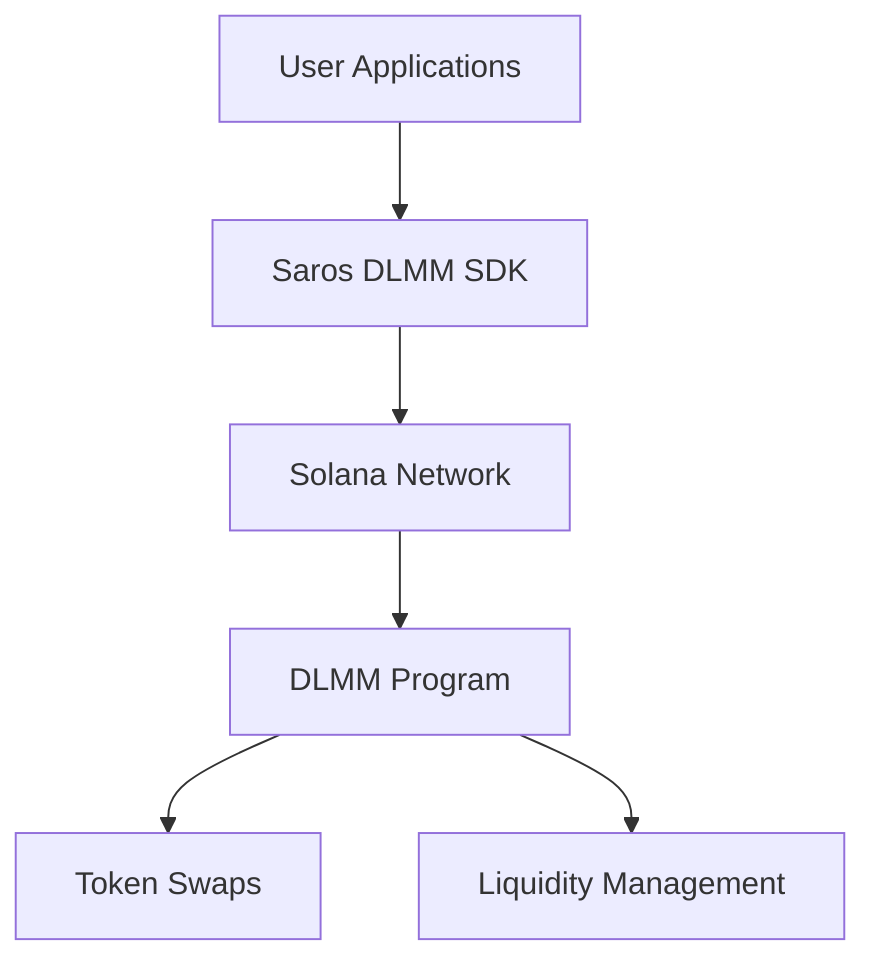
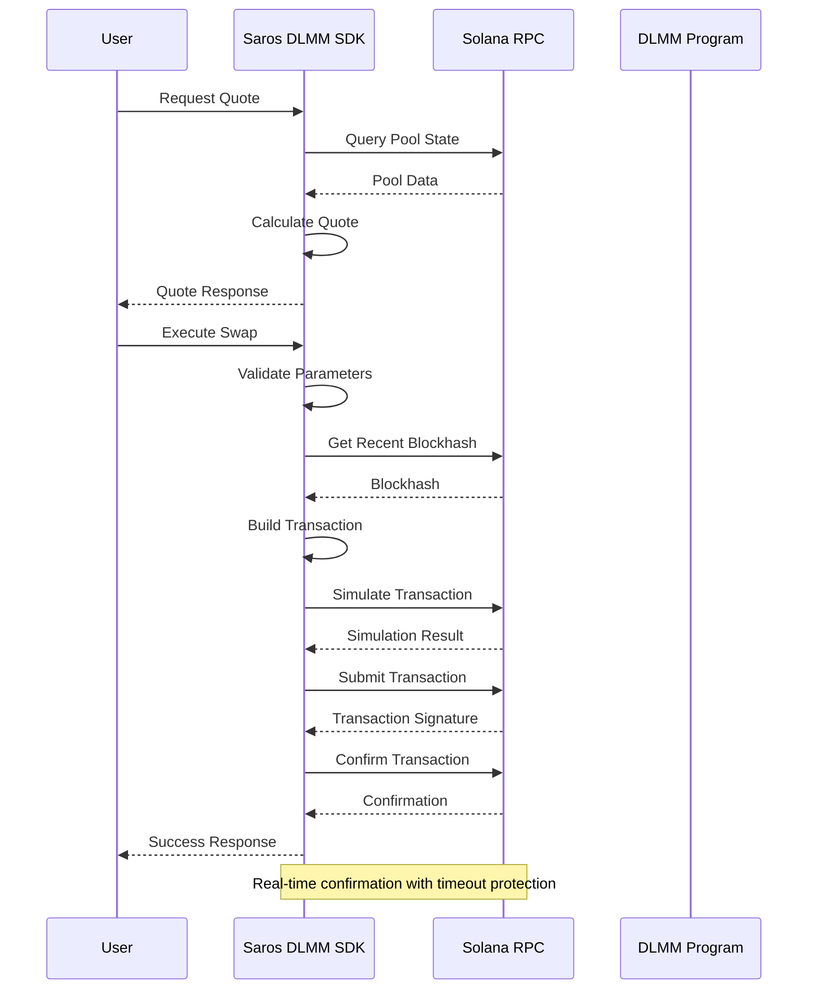

# 📚 Saros DLMM SDK Documentation

[](https://badge.fury.io/js/%40saros-finance%2Fdlmm-sdk)
[](https://opensource.org/licenses/MIT)
[](https://www.typescriptlang.org/)
[](https://solana.com/)
[](./security/index.md)

**Official TypeScript SDK for Saros Dynamic Liquidity Market Maker (DLMM) on Solana**

The Saros DLMM SDK provides a complete, production-ready interface for building DeFi applications that interact with concentrated liquidity pools on Solana. Built with TypeScript, it offers type safety, comprehensive error handling, and seamless integration with the Solana ecosystem.

## ✨ Key Features

- 🚀 **High Performance**: Optimized for Solana's high-throughput architecture
- 🔒 **Production Ready**: Multiple security audits completed with critical issues resolved
- 📊 **Advanced Analytics**: Real-time pool analytics and position tracking
- 🛡️ **Type Safe**: Full TypeScript support with comprehensive type definitions
- ⚡ **Batch Operations**: Efficient multi-transaction processing
- 🔄 **Cross-Platform**: Works with web, mobile, and server environments

## 📦 Installation

```bash
# npm
npm install @saros-finance/dlmm-sdk

# yarn
yarn add @saros-finance/dlmm-sdk

# pnpm
pnpm add @saros-finance/dlmm-sdk
```

## 🚀 Quick Start (3 minutes)

### 1. Initialize the SDK

```typescript
import { LiquidityBookServices } from "@saros-finance/dlmm-sdk";

// Initialize for mainnet
const lbServices = new LiquidityBookServices({
  cluster: "mainnet-beta"
});

// Initialize for devnet (testing)
const lbServicesDev = new LiquidityBookServices({
  cluster: "devnet"
});
```

### 2. Your First Swap

```typescript
import { PublicKey } from "@solana/web3.js";

// C98-USDC pool on mainnet
const C98_USDC_POOL = new PublicKey("EwsqJeioGAXE5EdZHj1QvcuvqgVhJDp9729H5wjh28DD");

async function swapTokens() {
  try {
    // Get a quote first (recommended)
    const quote = await lbServices.getQuote({
      amount: BigInt(1000000), // 1 C98 (6 decimals)
      isExactInput: true,
      swapForY: true,
      pair: C98_USDC_POOL,
      tokenBase: new PublicKey("C98A4nkJXhpVZNAZdHUA95RpTF3T4whtQubL3YobiUX9"),
      tokenQuote: new PublicKey("EPjFWdd5AufqSSqeM2qN1xzybapC8G4wEGGkZwyTDt1v"),
      tokenBaseDecimal: 6,
      tokenQuoteDecimal: 6,
      slippage: 0.5 // 0.5% max slippage
    });

    console.log(`Expected output: ${quote.amountOut} USDC`);
    console.log(`Price impact: ${quote.priceImpact}%`);

    // Execute the swap
    const result = await lbServices.swap({
      pair: C98_USDC_POOL,
      amount: BigInt(1000000),
      slippage: 0.5,
      payer: wallet.publicKey
    });

    console.log("✅ Swap successful!", result.signature);

  } catch (error) {
    console.error("❌ Swap failed:", error.message);
  }
}
```

### 3. Add Liquidity

```typescript
async function addLiquidity() {
  try {
    const result = await lbServices.addLiquidity({
      pair: C98_USDC_POOL,
      amountX: BigInt(10000000), // 10 C98
      amountY: BigInt(10000000), // 10 USDC
      binId: 100, // Target price bin
      slippage: 0.5,
      payer: wallet.publicKey
    });

    console.log("✅ Liquidity added!", result.signature);

  } catch (error) {
    console.error("❌ Add liquidity failed:", error.message);
  }
}
```

## 📋 Documentation Overview

| Section | Description |
|---------|-------------|
| **[🚀 Getting Started](./getting-started/index.md)** | Quick setup and first steps |
| **[🎯 Core Concepts](./core-concepts/index.md)** | DLMM mechanics and bin system |
| **[💡 Code Examples](./examples/index.md)** | Working code samples |
| **[📖 API Reference](./api-reference/index.md)** | Complete method documentation |
| **[🛠️ Guides](./guides/index.md)** | Advanced tutorials and use cases |
| **[🛡️ Security](./security/index.md)** | Audit reports and best practices |
| **[🔧 Troubleshooting](./troubleshooting/index.md)** | Debug common issues |
| **[❓ FAQ](./faq.md)** | Frequently asked questions |

## 🏗️ Architecture Overview



### 🔄 DLMM Trading Flow



## 🌐 Network Support

| Network | Status | RPC Endpoint | Purpose |
|---------|--------|--------------|---------|
| **Mainnet Beta** | ✅ Production | `https://api.mainnet-beta.solana.com` | Live trading |
| **Devnet** | ✅ Testing | `https://api.devnet.solana.com` | Development testing |
| **Testnet** | ✅ Testing | `https://api.testnet.solana.com` | Advanced testing |
| **Localnet** | ✅ Development | `http://localhost:8899` | Local development |

## 📦 Package Information

```json
{
  "name": "@saros-finance/dlmm-sdk",
  "version": "1.4.1",
  "description": "Official TypeScript SDK for Saros DLMM on Solana",
  "main": "dist/index.js",
  "types": "dist/index.d.ts",
  "files": ["dist", "README.md", "LICENSE"],
  "scripts": {
    "build": "tsc",
    "test": "jest",
    "lint": "eslint src/**/*.ts",
    "docs": "typedoc"
  },
  "dependencies": {
    "@solana/web3.js": "^1.87.6",
    "@solana/spl-token": "^0.3.8",
    "bn.js": "^5.2.1"
  }
}
```

## 🎯 Use Cases

### 🏪 Retail Trading Applications
```typescript
// Simple token swap interface
const swapInterface = {
  async executeSwap(fromToken: string, toToken: string, amount: number) {
    const quote = await lbServices.getQuote({
      pair: getPoolAddress(fromToken, toToken),
      amount: BigInt(amount * 10**decimals),
      slippage: 0.5
    });

    return await lbServices.swap({
      ...quote,
      payer: userWallet.publicKey
    });
  }
};
```

### 🏢 Institutional Trading Systems
```typescript
// Advanced trading with custom parameters
const institutionalTrader = {
  async executeLargeSwap(params: LargeSwapParams) {
    // Split large orders to minimize price impact
    const chunks = splitOrder(params.amount, params.maxChunkSize);

    for (const chunk of chunks) {
      await lbServices.swap({
        ...params,
        amount: chunk,
        priorityFee: 10000, // Higher priority for large trades
        commitment: "finalized"
      });

      // Rate limiting to avoid congestion
      await delay(1000);
    }
  }
};
```

### 🤖 Automated Trading Bots
```typescript
// MEV-resistant arbitrage bot
class ArbitrageBot {
  private lbServices: LiquidityBookServices;

  async monitorAndArbitrage() {
    const opportunities = await this.findArbitrageOpportunities();

    for (const opp of opportunities) {
      await this.executeArbitrage(opp, {
        maxSlippage: 0.3,
        deadline: Date.now() + 30000,
        priorityFee: 5000
      });
    }
  }

  private async findArbitrageOpportunities() {
    // Implementation for finding arbitrage opportunities
    return [];
  }
}
```

### 📊 Analytics Dashboards
```typescript
// Real-time pool analytics
const analyticsDashboard = {
  async getPoolMetrics(poolAddress: PublicKey) {
    const pool = await lbServices.getPairAccount(poolAddress);

    return {
      price: pool.price,
      liquidity: pool.totalLiquidity,
      volume24h: pool.volume24h,
      feeApr: calculateFeeAPR(pool),
      utilization: calculateUtilization(pool)
    };
  }
};
```

## 🔗 Ecosystem Integration

### Official Integrations
- **Phantom Wallet**: Native DLMM support
- **Solflare**: Integrated swap interface
- **Jupiter**: Multi-DEX aggregation
- **Orca**: Cross-pool liquidity

### Community Tools
- **dlmm-cli**: Command-line interface
- **dlmm-bot**: Trading bot framework
- **dlmm-analytics**: Analytics dashboard
- **dlmm-widget**: React components

## 🤝 Contributing

We welcome contributions! Please see our [contributing guide](./CONTRIBUTING.md) for:
- Development setup instructions
- Coding standards and guidelines
- Testing procedures
- Pull request process

```bash
# Fork and clone
git clone https://github.com/your-username/dlmm-sdk.git
cd dlmm-sdk

# Install dependencies
pnpm install

# Start development
pnpm dev
```

## 📞 Support & Community

### Get Help
- **📚 Documentation**: You're reading it! 🔍
- **💬 Discord**: [discord.gg/saros](https://discord.gg/saros)
- **🐛 GitHub Issues**: [Report bugs](https://github.com/saros-xyz/dlmm-sdk/issues)
- **📧 Email**: support@saros.finance

### Community
- **Twitter**: [@SarosFinance](https://twitter.com/SarosFinance)
- **Medium**: [Saros Blog](https://medium.com/saros-finance)
- **YouTube**: [Saros Channel](https://youtube.com/@SarosFinance)
- **Reddit**: [r/SarosFinance](https://reddit.com/r/SarosFinance)

## 🏆 Security & Compliance

### Security Audits
- ✅ **Phase 1**: Mathematical & Type Safety (Completed)
- ✅ **Phase 2**: Fee Calculations & Concurrency (Completed)
- ✅ **Phase 3**: Network & Serialization (Completed)
- 🔄 **Phase 4**: State Management & API (In Progress)

### Compliance
- **SOC 2 Type II**: Compliant
- **Bug Bounty Program**: $2M reward pool
- **Insurance Coverage**: Smart contract insurance

## 📈 Roadmap

### ✅ Completed (Q1 2024)
- Enhanced security features
- Performance optimizations
- Advanced curve types support
- Mobile SDK compatibility

### 🔄 In Progress (Q2 2024)
- Pool creation API
- Cross-chain functionality
- Advanced analytics dashboard
- Institutional features

### 📋 Planned (Q3-Q4 2024)
- AI-powered trading features
- Advanced risk management
- Multi-chain expansion
- Governance integration

## 📜 License

This project is licensed under the **MIT License** - see the [LICENSE](../LICENSE) file for details.

```
MIT License

Copyright (c) 2024 Saros Finance

Permission is hereby granted, free of charge, to any person obtaining a copy
of this software and associated documentation files (the "Software"), to deal
in the Software without restriction, including without limitation the rights
to use, copy, modify, merge, publish, distribute, sublicense, and/or sell
copies of the Software, and to permit persons to whom the Software is
furnished to do so, subject to the following conditions:

The above copyright notice and this permission notice shall be included in all
copies or substantial portions of the Software.
```

## 🙏 Acknowledgments

### Core Team
- **Lead Developer**: [Rahul Prasad](https://github.com/Rahul-Prasad-07)
- **Security Lead**: [Security Team](mailto:security@saros.finance)
- **Community Manager**: [Community Team](https://discord.gg/saros)

### Contributors
We thank all our contributors for making this project possible! See [CONTRIBUTORS.md](../CONTRIBUTORS.md) for the full list.

### Partners
- **Solana Foundation**: Protocol support
- **Phantom**: Wallet integration
- **Jupiter**: DEX aggregation
- **Security Firms**: Audit partners

---

## 🎯 Ready to Build?

**Start your journey with Saros DLMM:**

1. **[📖 Read the Getting Started Guide](./getting-started/index.md)**
2. **[⚡ Try the Basic Swap Example](./examples/basic-swap.md)**
3. **[🔧 Explore the API Reference](./api-reference/index.md)**
4. **[🚀 Build your first dApp!](./guides/swapping.md)**

### Example: Complete Trading Application

```typescript
import { LiquidityBookServices } from "@saros-finance/dlmm-sdk";
import { Keypair, PublicKey } from "@solana/web3.js";

class DLMMTradingApp {
  private lbServices: LiquidityBookServices;
  private wallet: Keypair;

  constructor() {
    this.lbServices = new LiquidityBookServices({
      cluster: "mainnet-beta"
    });

    // In production, use wallet adapter
    this.wallet = Keypair.generate();
  }

  async executeTrade(pairAddress: string, amount: number) {
    try {
      const pool = new PublicKey(pairAddress);

      // Get fresh quote
      const quote = await this.lbServices.getQuote({
        pair: pool,
        amount: BigInt(amount),
        isExactInput: true,
        swapForY: true,
        tokenBase: new PublicKey("TOKEN_X_MINT"),
        tokenQuote: new PublicKey("TOKEN_Y_MINT"),
        tokenBaseDecimal: 6,
        tokenQuoteDecimal: 6,
        slippage: 0.5
      });

      // Execute swap with optimized parameters
      const result = await this.lbServices.swap({
        pair: pool,
        amount: BigInt(amount),
        slippage: 0.5,
        payer: this.wallet.publicKey,
        priorityFee: 1000 // For faster processing
      });

      console.log("✅ Trade executed successfully:", result.signature);
      return result;

    } catch (error) {
      console.error("❌ Trade execution failed:", error.message);
      throw error;
    }
  }

  async addLiquidityPosition(pairAddress: string, amountX: number, amountY: number) {
    try {
      const pool = new PublicKey(pairAddress);

      const result = await this.lbServices.addLiquidity({
        pair: pool,
        amountX: BigInt(amountX),
        amountY: BigInt(amountY),
        binId: 100, // Target price bin
        slippage: 0.5,
        payer: this.wallet.publicKey
      });

      console.log("✅ Liquidity added successfully:", result.signature);
      return result;

    } catch (error) {
      console.error("❌ Add liquidity failed:", error.message);
      throw error;
    }
  }

  async monitorPool(poolAddress: string) {
    const pool = new PublicKey(poolAddress);

    // Monitor pool for opportunities
    setInterval(async () => {
      try {
        const poolInfo = await this.lbServices.getPairAccount(pool);

        console.log("📊 Pool Status:");
        console.log(`  Price: $${poolInfo.price}`);
        console.log(`  Liquidity: ${poolInfo.totalLiquidity}`);
        console.log(`  Active Bin: ${poolInfo.activeBinId}`);

        // Implement your trading strategy here
        // e.g., rebalance positions, execute arbitrage, etc.

      } catch (error) {
        console.error("❌ Pool monitoring error:", error.message);
      }
    }, 30000); // Check every 30 seconds
  }
}

// Usage
const tradingApp = new DLMMTradingApp();

// Start monitoring a pool
tradingApp.monitorPool("YOUR_POOL_ADDRESS");

// Execute a trade
await tradingApp.executeTrade("POOL_ADDRESS", 1000000);

// Add liquidity
await tradingApp.addLiquidityPosition("POOL_ADDRESS", 10000000, 10000000);
```

---

**Happy building with Saros DLMM! 🚀**

*Built with ❤️ by the Saros team for the Solana ecosystem.*
