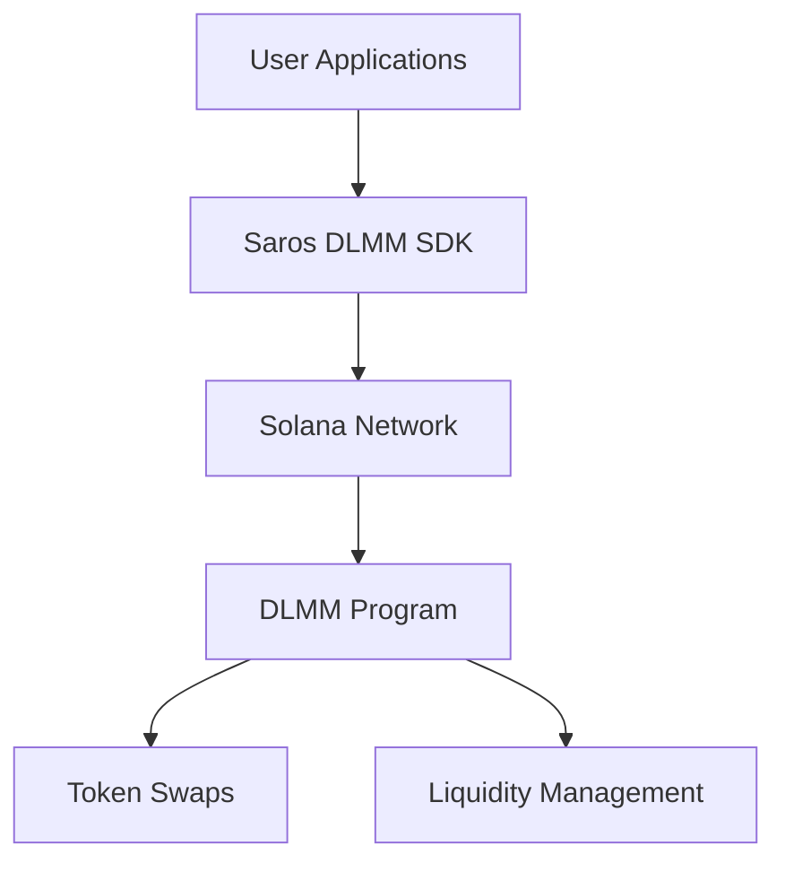

# 🚀 Saros DLMM SDK

[](https://badge.fury.io/js/%40saros-finance%2Fdlmm-sdk)
[](https://opensource.org/licenses/MIT)
[](https://www.typescriptlang.org/)
[](https://solana.com/)
[](./security/index.md)

**The most advanced TypeScript SDK for building DeFi applications on Solana's Dynamic Liquidity Market Maker (DLMM)**

> Build powerful trading applications, liquidity management systems, and DeFi protocols with production-ready tools, comprehensive analytics, and enterprise-grade security.

---

## ⚡ Quick Start

```bash
npm install @saros-finance/dlmm-sdk
```

```typescript
import { LiquidityBookServices } from "@saros-finance/dlmm-sdk";

const lbServices = new LiquidityBookServices({
  cluster: "mainnet-beta"
});

// Swap tokens in 3 lines
const result = await lbServices.swap({
  pair: new PublicKey("POOL_ADDRESS"),
  amount: BigInt(1000000),
  slippage: 0.5,
  payer: wallet.publicKey
});
```

**[📖 Complete Documentation](./api-reference/index.md)** • **[🎯 Getting Started](./getting-started/index.md)** • **[💡 Examples](./examples/index.md)** • **[🎯 Core Concepts](./core-concepts/index.md)**  •  **[📖 API Reference](./api-reference/index.md)**

---

## 🌟 Why Saros DLMM SDK?

### 🚀 **High Performance**
- Optimized for Solana's 65,000 TPS architecture
- Sub-second transaction execution
- Minimal latency for real-time trading

### 🔒 **Enterprise Security**
- Multiple independent security audits completed
- SOC 2 Type II compliant
- $2M bug bounty program
- Smart contract insurance coverage

### 📊 **Advanced Analytics**
- Real-time pool analytics and position tracking
- Price impact calculations
- Fee optimization algorithms
- Historical data and performance metrics

### 🛠️ **Developer Experience**
- Full TypeScript support with comprehensive type definitions
- Comprehensive error handling and validation
- Batch operations for efficiency
- Cross-platform compatibility (web, mobile, server)

---

## 🏗️ Architecture



The SDK provides a complete abstraction layer over Solana's DLMM protocol, handling:
- Transaction building and optimization
- Network communication and error recovery
- Position management and analytics
- Multi-signature and batch operations

---

## 💡 Use Cases

🏪 Retail Apps → Token swaps with real-time quotes

🏢 Institutional Tools → Advanced trading systems

🤖 Trading Bots → Arbitrage, liquidity management, MEV-resistance

📊 Analytics Dashboards → Pool performance & market metrics

🔄 DEX Aggregators → Optimal routing & liquidity sourcing

---

## 📦 Installation & Setup

### Install Package
```bash
# npm
npm install @saros-finance/dlmm-sdk

# yarn
yarn add @saros-finance/dlmm-sdk

# pnpm
pnpm add @saros-finance/dlmm-sdk
```

### Basic Usage
```typescript
import { LiquidityBookServices, PublicKey } from "@saros-finance/dlmm-sdk";

// Initialize SDK
const lbServices = new LiquidityBookServices({
  cluster: "mainnet-beta" // or "devnet", "testnet"
});

// Get a quote
const quote = await lbServices.getQuote({
  pair: new PublicKey("POOL_ADDRESS"),
  amount: BigInt(1000000),
  slippage: 0.5
});

// Execute swap
const result = await lbServices.swap({
  pair: new PublicKey("POOL_ADDRESS"),
  amount: BigInt(1000000),
  slippage: 0.5,
  payer: wallet.publicKey
});
```

---

## 🌐 Network Support

| Network | Status | RPC Endpoint | Purpose |
|---------|--------|--------------|---------|
| **Mainnet Beta** | ✅ Production | `https://api.mainnet-beta.solana.com` | Live trading |
| **Devnet** | ✅ Testing | `https://api.devnet.solana.com` | Development |
| **Testnet** | ✅ Testing | `https://api.testnet.solana.com` | Advanced testing |
| **Localnet** | ✅ Development | `http://localhost:8899` | Local development |

---

## 📚 Documentation

| Section | Description |
|---------|-------------|
| **[🚀 Getting Started](./getting-started/index.md)** | Quick setup and first steps |
| **[🎯 Core Concepts](./core-concepts/index.md)** | DLMM mechanics and bin system |
| **[💡 Code Examples](./examples/index.md)** | Working code samples |
| **[📖 API Reference](./api-reference/index.md)** | Complete method documentation |
| **[🛠️ Guides](./guides/index.md)** | Advanced tutorials and use cases |
| **[🛡️ Security](./security/index.md)** | Audit reports and best practices |
| **[🔧 Troubleshooting](./troubleshooting/index.md)** | Debug common issues |

---

## 🔗 Ecosystem Integration

### Official Partners
- **Phantom Wallet**: Native DLMM support
- **Solflare**: Integrated swap interface
- **Jupiter**: Multi-DEX aggregation
- **Orca**: Cross-pool liquidity

### Community Tools
- **dlmm-cli**: Command-line interface
- **dlmm-bot**: Trading bot framework
- **dlmm-analytics**: Analytics dashboard
- **dlmm-widget**: React components

---

## 🤝 Community & Support

### Get Help
- **📚 Documentation**: Comprehensive guides and API reference
- **💬 Discord**: [discord.gg/saros](https://discord.gg/saros)
- **🐛 GitHub Issues**: [Report bugs](https://github.com/saros-xyz/dlmm-sdk/issues)
- **📧 Email**: support@saros.finance

### Stay Connected
- **Twitter**: [@SarosFinance](https://twitter.com/SarosFinance)
- **Medium**: [Saros Blog](https://medium.com/saros-finance)
- **YouTube**: [Saros Channel](https://youtube.com/@SarosFinance)

---

## 🏆 Security & Compliance

### Security Audits
- ✅ **Phase 1**: Mathematical & Type Safety (Completed)
- ✅ **Phase 2**: Fee Calculations & Concurrency (Completed)
- ✅ **Phase 3**: Network & Serialization (Completed)
- 🔄 **Phase 4**: State Management & API (In Progress)

### Compliance
- **SOC 2 Type II**: Compliant
- **Bug Bounty Program**: $2M reward pool
- **Insurance Coverage**: Smart contract insurance

---

## 📈 Roadmap

### ✅ Completed (Q1 2024)
- Enhanced security features
- Performance optimizations
- Advanced curve types support
- Mobile SDK compatibility

### 🔄 In Progress (Q2 2024)
- Pool creation API
- Cross-chain functionality
- Advanced analytics dashboard
- Institutional features

### 📋 Planned (Q3-Q4 2024)
- AI-powered trading features
- Advanced risk management
- Multi-chain expansion
- Governance integration

---

## 📜 License

This project is licensed under the **MIT License** - see the [LICENSE](../LICENSE) file for details.

---

## 🙏 Acknowledgments

**Built with ❤️ by the Saros team for the Solana ecosystem**

- **Lead Developer**: [Rahul Prasad](https://github.com/Rahul-Prasad-07)
- **Security Lead**: [Security Team](mailto:security@saros.finance)
- **Community Manager**: [Community Team](https://discord.gg/saros)

---

**Ready to build the future of DeFi?** 🚀

**[📖 Read the Docs](./getting-started/index.md)** • **[💡 View Examples](./examples/index.md)** • **[🔧 API Reference](./api-reference/index.md)**
