# 🎯 Core Concepts

**Master the fundamentals of Dynamic Liquidity Market Maker (DLMM) in 10 minutes.** This comprehensive guide explains how concentrated liquidity works and why it's revolutionizing DeFi.

## 📚 What is DLMM?

**DLMM (Dynamic Liquidity Market Maker)** is an advanced AMM protocol that concentrates liquidity in specific price ranges, providing **1000x better efficiency** than traditional AMMs.

### The Problem with Traditional AMMs

Traditional AMMs spread liquidity across all prices from $0 to infinity:

```
Traditional AMM Liquidity Distribution:
███████████████████████████████████████  (Liquidity everywhere)
Price Range: $0.01 → $100.00
Efficiency: 1x
Capital Utilization: ~1%
```

**Problems:**
- ❌ **Poor capital efficiency**: Only 1% of capital is used effectively
- ❌ **High slippage**: Large trades move prices significantly
- ❌ **Impermanent loss**: LPs lose money when prices fluctuate
- ❌ **Low yields**: Fee generation is inefficient

### DLMM Solution

DLMM concentrates liquidity around the current market price:

```
DLMM Liquidity Distribution:
░░░░░░░░░░░░░░░░░░██████████████░░░░░░░░░░  (Liquidity concentrated)
Price Range: $1.45 → $1.55 (Current price: $1.50)
Efficiency: 1000x
Capital Utilization: ~80%
```

**Advantages:**
- ✅ **Superior capital efficiency**: 80% of capital is actively working
- ✅ **Lower slippage**: Better price execution for traders
- ✅ **Reduced impermanent loss**: LPs earn more with less risk
- ✅ **Higher yields**: Concentrated liquidity generates more fees

## 🗂️ The Bin System Explained

### What are Bins?

**Bins** are discrete price buckets where liquidity providers deposit their tokens. Each bin represents a specific price range.


### How Bins Work

1. **Price Discovery**: Each bin represents a 0.1% price increment
2. **Liquidity Concentration**: LPs choose specific bins to deposit liquidity
3. **Dynamic Adjustment**: Bins automatically adjust as prices move
4. **Fee Collection**: Fees are collected per bin and distributed to LPs

### Bin Structure

```typescript
interface Bin {
  binId: number;           // Unique bin identifier
  price: number;           // Price at this bin
  liquidity: bigint;       // Total liquidity in this bin
  tokenXAmount: bigint;    // Amount of token X
  tokenYAmount: bigint;    // Amount of token Y
  feeAmount: bigint;       // Accumulated fees
}
```

## 📊 Liquidity Distribution Visualization

### Traditional AMM vs DLMM

```mermaid
graph LR
    subgraph "Traditional AMM"
        A1[Price: $0] --> A2[Liquidity: 1000]
        A2 --> A3[Price: $1] --> A4[Liquidity: 1000]
        A4 --> A5[Price: $2] --> A6[Liquidity: 1000]
        A6 --> A7[Price: ∞] --> A8[Liquidity: 1000]
    end

    subgraph "DLMM (Concentrated)"
        B1[Price: $1.45] --> B2[Liquidity: 0]
        B2 --> B3[Price: $1.50] --> B4[Liquidity: 8000]
        B4 --> B5[Price: $1.55] --> B6[Liquidity: 0]
        B6 --> B7[Price: $2.00] --> B8[Liquidity: 0]
    end

    style A1 fill:#ffcccc
    style A2 fill:#ffcccc
    style A3 fill:#ffcccc
    style A4 fill:#ffcccc
    style A5 fill:#ffcccc
    style A6 fill:#ffcccc
    style A7 fill:#ffcccc
    style A8 fill:#ffcccc

    style B1 fill:#ccffcc
    style B2 fill:#ccffcc
    style B3 fill:#ccffcc
    style B4 fill:#ccffcc
    style B5 fill:#ccffcc
    style B6 fill:#ccffcc
    style B7 fill:#ccffcc
    style B8 fill:#ccffcc
```



## 🔄 How Trading Works

### Swap Process Flow


### Price Impact Calculation

```typescript
// Price impact is minimized due to concentrated liquidity
function calculatePriceImpact(
  tradeSize: number,
  binLiquidity: number,
  currentPrice: number
): number {
  const impact = (tradeSize / binLiquidity) * 100;
  return Math.min(impact, 100); // Max 100% impact
}
```

## 💰 Fee Structure

### Fee Collection Mechanism


### Fee Tiers

| Fee Tier | Description | Use Case |
|----------|-------------|----------|
| **0.01%** | Ultra Low | Stable pairs (USDC/USDT) |
| **0.05%** | Low | Blue-chip tokens |
| **0.30%** | Standard | Most token pairs |
| **1.00%** | High | Volatile pairs |

## 🏗️ Architecture Overview

### DLMM System Architecture


## 📈 Key Metrics

### Performance Comparison

| Metric | Traditional AMM | DLMM | Improvement |
|--------|-----------------|------|-------------|
| **Capital Efficiency** | 1% | 80% | 80x better |
| **Slippage (1k trade)** | 5% | 0.1% | 50x better |
| **LP APY** | 5-15% | 50-200% | 10x higher |
| **Gas Usage** | High | Medium | 30% reduction |

### Risk Metrics

```typescript
interface RiskMetrics {
  impermanentLoss: number;    // IL protection through concentration
  slippageTolerance: number;  // Max acceptable slippage
  liquidityDepth: number;     // Available liquidity at current price
  priceVolatility: number;    // Price movement tolerance
}
```

## 🎯 Best Practices

### For Liquidity Providers

1. **Choose Price Ranges Wisely**
   - Place liquidity ±10% around current price
   - Monitor and rebalance positions regularly
   - Use multiple positions for diversification

2. **Fee Optimization**
   - Higher fee tiers for volatile pairs
   - Lower fee tiers for stable pairs
   - Consider gas costs vs. fee rewards

3. **Risk Management**
   - Set appropriate slippage tolerances
   - Monitor impermanent loss
   - Use stop-loss mechanisms

### For Traders

1. **Slippage Management**
   - Use appropriate slippage settings (0.5-2%)
   - Split large orders to minimize impact
   - Monitor price impact before execution

2. **Gas Optimization**
   - Use priority fees for faster execution
   - Batch multiple operations
   - Choose optimal timing for transactions

## 🔍 Advanced Concepts

### Bin Activation


### Price Oracle Integration

```typescript
// DLMM provides accurate price feeds
interface PriceOracle {
  getPrice(tokenPair: string): Promise<number>;
  getTwap(tokenPair: string, interval: number): Promise<number>;
  getVolatility(tokenPair: string): Promise<number>;
}
```

## 🚀 Getting Started

Ready to dive deeper? Here's your next steps:

1. **[📖 Installation Guide](../getting-started/index.md)** - Set up your development environment
2. **[💡 Basic Examples](../examples/basic-swap.md)** - Try your first swap
3. **[🛠️ Advanced Guides](../guides/index.md)** - Master complex operations
4. **[📊 Analytics](../examples/pool-analytics.md)** - Monitor pool performance

---

**🎉 Congratulations!** You now understand the core concepts of DLMM. The bin system, concentrated liquidity, and advanced fee mechanisms give DLMM its superior performance compared to traditional AMMs.

```typescript
interface Bin {
  binId: number;           // Unique identifier (e.g., 100)
  price: number;           // Price at this bin (e.g., 1.50)
  liquidity: bigint;       // Amount of liquidity in this bin
  tokenXAmount: bigint;    // Amount of token X
  tokenYAmount: bigint;    // Amount of token Y
  fee: number;            // Fee rate for this bin
}
```

### Bin Step = Price Precision

**Bin Step** determines the price granularity between bins:

```typescript
const BIN_STEPS = [
  { step: 1,   precision: "0.01%", fee: "0.001%" },  // Very precise, low fees
  { step: 10,  precision: "0.1%",  fee: "0.01%"  },  // Balanced precision/fees
  { step: 100, precision: "1%",    fee: "0.1%"   },  // Wide range, higher fees
  { step: 1000, precision: "10%",  fee: "1%"     }   // Very wide, highest fees
];
```

**How it works:**
- **Bin Step 10**: Price increases by ~0.1% per bin
- **Bin Step 100**: Price increases by ~1% per bin
- **Higher bin step** = Wider price ranges = Higher fees

### Visualizing Bins

```
Bin ID:  95   96   97   98   99   100  101  102  103  104  105
Price:  $1.40 $1.41 $1.42 $1.43 $1.44 $1.45 $1.46 $1.47 $1.48 $1.49 $1.50
Liquidity: ░░░░ ████ ████ ████ ████ ████████████ ████ ████ ████ ████ ░░░░
Current Price: $1.45 (Bin 100)
Active Range: Bins 96-104 (concentrated liquidity)
```

## 💰 Fee Structure & Economics

### Dynamic Fee System

Fees adjust based on **volatility** and **liquidity concentration**:

| Volatility Level | Fee Rate | Best For |
|------------------|----------|----------|
| 🟢 **Low** (0-1%) | 0.01% - 0.05% | Stable pairs (USDC/USDT) |
| 🟡 **Medium** (1-5%) | 0.05% - 0.2% | Normal pairs (SOL/USDC) |
| 🔴 **High** (5%+) | 0.2% - 1.0% | Volatile pairs (MEME/SOL) |

### Fee Calculation

```typescript
function calculateFees(tradeAmount: bigint, feeRate: number): bigint {
  // Fee = Trade Amount × Fee Rate
  const fee = (tradeAmount * BigInt(feeRate * 10000)) / BigInt(10000);
  return fee;
}

// Example: 1000 USDC trade at 0.05% fee
const tradeAmount = BigInt(1000000000); // 1000 USDC (6 decimals)
const feeRate = 0.0005; // 0.05%
const fee = calculateFees(tradeAmount, feeRate); // 5000 (0.005 USDC)
```

### Fee Distribution

**Liquidity Providers earn fees** proportional to their share:

```typescript
interface FeeEarnings {
  totalFees: bigint;        // Total fees collected in bin
  userLiquidity: bigint;    // User's liquidity in bin
  totalLiquidity: bigint;   // Total liquidity in bin
  userShare: number;        // User's percentage share
  userEarnings: bigint;     // User's fee earnings
}

function calculateUserEarnings(fees: FeeEarnings): bigint {
  const userShare = Number(fees.userLiquidity) / Number(fees.totalLiquidity);
  return fees.totalFees * BigInt(Math.floor(userShare * 10000)) / BigInt(10000);
}
```

## 🎯 Position Management

### Single-Sided vs Multi-Bin Positions

#### Single-Bin Position
```typescript
// Deposit into one specific bin
const singleBinPosition = {
  binId: 100,              // Target bin
  amountX: BigInt(1000000), // 1 token X
  amountY: BigInt(1000000), // 1 token Y
  type: "single-bin"
};
```

#### Multi-Bin Position
```typescript
// Deposit across multiple bins
const multiBinPosition = {
  binRange: [95, 105],     // Range of bins
  amountX: BigInt(10000000), // 10 token X
  amountY: BigInt(10000000), // 10 token Y
  distribution: "uniform", // How to distribute across bins
  type: "multi-bin"
};
```

### Liquidity Distribution Shapes

#### 1. Uniform Distribution
Spreads liquidity evenly across all bins in range:

```
Uniform Distribution:
█████████████████████████████████████████
Bins: 95 96 97 98 99 100 101 102 103 104 105
Liquidity: ███ ███ ███ ███ ███ ███ ███ ███ ███ ███ ███
```

#### 2. Spot Distribution
Concentrates liquidity around current price:

```
Spot Distribution:
░░░░░░░░░░░ ████████████████████ ░░░░░░░░░
Bins: 95 96 97 98 99 100 101 102 103 104 105
Liquidity: ░░░ ░░░ ░░░ ███ ████████████ ███ ░░░ ░░░ ░░░
```

#### 3. Curve Distribution
Creates a curved distribution for broader coverage:

```
Curve Distribution:
░░░░░░ ████████ ████████████ ████████ ░░░░░░
Bins: 95 96 97 98 99 100 101 102 103 104 105
Liquidity: ░░░ ███ █████ ████████████ █████ ███ ░░░
```

### Position Tracking

```typescript
interface LiquidityPosition {
  positionAddress: PublicKey;    // Unique position identifier
  owner: PublicKey;             // Position owner
  pair: PublicKey;              // Trading pair
  lowerBinId: number;           // Lower bound bin
  upperBinId: number;           // Upper bound bin
  liquidity: bigint;            // Total liquidity
  feeX: bigint;                 // Accumulated token X fees
  feeY: bigint;                 // Accumulated token Y fees
  lastUpdated: number;          // Last update timestamp
}
```

## 📊 Advanced Analytics

### Price Impact Analysis

```typescript
function calculatePriceImpact(
  tradeAmount: bigint,
  binLiquidity: bigint,
  binStep: number
): number {
  // Simplified price impact calculation
  const liquidityRatio = Number(tradeAmount) / Number(binLiquidity);
  const impact = liquidityRatio * (binStep / 10000); // Convert to percentage
  return impact * 100; // Return as percentage
}

// Example: 1000 USDC trade in bin with 10000 USDC liquidity
const impact = calculatePriceImpact(
  BigInt(1000000000),  // 1000 USDC
  BigInt(10000000000), // 10000 USDC liquidity
  10                   // Bin step
);
// Result: ~1% price impact
```

### Impermanent Loss Calculation

```typescript
function calculateImpermanentLoss(
  priceChangeRatio: number,
  positionWidth: number
): number {
  // Simplified IL calculation for concentrated positions
  const sqrtPriceChange = Math.sqrt(priceChangeRatio);
  const sqrtWidth = Math.sqrt(positionWidth);

  const il = 2 * sqrtPriceChange / (sqrtWidth + sqrtPriceChange) - 1;
  return Math.abs(il);
}

// Example: 50% price increase, position width of 2%
const il = calculateImpermanentLoss(1.5, 0.02);
// Result: ~8.7% impermanent loss
```

### Fee APR Calculation

```typescript
function calculateFeeAPR(
  dailyFees: bigint,
  positionValue: bigint,
  daysInYear: number = 365
): number {
  const dailyFeeRate = Number(dailyFees) / Number(positionValue);
  const apr = dailyFeeRate * daysInYear * 100;
  return apr;
}

// Example: $10 daily fees on $1000 position
const apr = calculateFeeAPR(
  BigInt(10000000),  // $10 in smallest units
  BigInt(1000000000) // $1000 position value
);
// Result: ~365% APR
```

## 🔄 Trading Mechanics

### How Swaps Work

1. **Route Finding**: Find optimal path through bins
2. **Price Calculation**: Calculate execution price across bins
3. **Fee Collection**: Collect fees at each bin
4. **Liquidity Update**: Update bin liquidity after trade

```typescript
async function executeSwap(swapParams: SwapParams) {
  // 1. Find active bins in price range
  const activeBins = await findActiveBins(swapParams.pair);

  // 2. Calculate swap across bins
  const swapResult = await calculateSwapExecution(
    swapParams.amount,
    activeBins,
    swapParams.isExactInput
  );

  // 3. Execute the swap
  const result = await processSwap(swapResult);

  return result;
}
```

### Slippage Protection

```typescript
interface SlippageProtection {
  minimumOutAmount: bigint;    // Minimum tokens to receive
  maximumInAmount: bigint;     // Maximum tokens to spend
  deadline: number;           // Transaction deadline
  priceImpactLimit: number;   // Maximum price impact
}

function validateSlippage(
  expectedOut: bigint,
  actualOut: bigint,
  slippageTolerance: number
): boolean {
  const slippage = (Number(expectedOut - actualOut) / Number(expectedOut)) * 100;
  return slippage <= slippageTolerance;
}
```

## 🏗️ Architecture Deep Dive

### Bin Array Structure

```typescript
interface BinArray {
  index: number;              // Array index
  bins: Bin[];               // Array of bins (70 bins per array)
  version: number;           // Version for upgrades
}

interface Bin {
  amountX: bigint;           // Token X amount
  amountY: bigint;           // Token Y amount
  price: bigint;             // Bin price (Q64.64 format)
  liquidity: bigint;         // Total liquidity
  fee: number;              // Fee rate
  isActive: boolean;         // Whether bin has liquidity
}
```

### Position Structure

```typescript
interface Position {
  owner: PublicKey;           // Position owner
  pair: PublicKey;            // Trading pair
  lowerBinId: number;         // Lower bin boundary
  upperBinId: number;         // Upper bin boundary
  liquidity: bigint;          // Position liquidity
  feeX: bigint;              // Accumulated token X fees
  feeY: bigint;              // Accumulated token Y fees
  lastUpdated: number;       // Last update timestamp
  isActive: boolean;         // Position status
}
```

## 🎮 Interactive Examples

### Bin Calculator

```typescript
class BinCalculator {
  static calculateBinId(price: number, binStep: number): number {
    // Convert price to bin ID
    const binId = Math.floor(Math.log(price) / Math.log(1 + binStep / 10000));
    return binId;
  }

  static calculateBinPrice(binId: number, binStep: number): number {
    // Convert bin ID to price
    const price = Math.pow(1 + binStep / 10000, binId);
    return price;
  }

  static getBinRange(currentBin: number, range: number): BinRange {
    return {
      lower: currentBin - range,
      upper: currentBin + range
    };
  }
}

// Usage
const currentBin = BinCalculator.calculateBinId(1.50, 10); // Bin 100
const price = BinCalculator.calculateBinPrice(100, 10); // Price 1.50
const range = BinCalculator.getBinRange(100, 5); // Bins 95-105
```

### Position Simulator

```typescript
class PositionSimulator {
  static simulatePosition(
    amountX: bigint,
    amountY: bigint,
    binRange: BinRange,
    currentPrice: number
  ) {
    const position = {
      amountX,
      amountY,
      binRange,
      currentPrice,
      value: this.calculatePositionValue(amountX, amountY, currentPrice),
      fees: this.estimateFees(amountX, amountY, binRange)
    };

    return position;
  }

  static calculatePositionValue(amountX: bigint, amountY: bigint, price: number): number {
    const tokenXValue = Number(amountX) / Math.pow(10, 6); // Assuming 6 decimals
    const tokenYValue = Number(amountY) / Math.pow(10, 6) * price;
    return tokenXValue + tokenYValue;
  }

  static estimateFees(amountX: bigint, amountY: bigint, binRange: BinRange): FeeEstimate {
    const range = binRange.upper - binRange.lower;
    const dailyVolume = this.estimateDailyVolume(amountX, amountY);
    const feeRate = 0.0005; // 0.05%
    const dailyFees = dailyVolume * feeRate;
    const apr = (dailyFees / this.calculatePositionValue(amountX, amountY, 1)) * 365 * 100;

    return { dailyFees, apr };
  }
}
```

## 🚀 Advanced Strategies

### Range Strategy

```typescript
class RangeStrategy {
  static calculateOptimalRange(
    volatility: number,
    currentPrice: number,
    riskTolerance: number
  ): BinRange {
    // Calculate range based on volatility
    const rangeMultiplier = Math.max(0.01, Math.min(0.1, volatility / 100));
    const range = Math.floor(currentPrice * rangeMultiplier / 0.001); // Bin step consideration

    const currentBin = BinCalculator.calculateBinId(currentPrice, 10);

    return {
      lower: currentBin - range,
      upper: currentBin + range
    };
  }

  static rebalancePosition(
    position: Position,
    newPrice: number,
    threshold: number = 0.05 // 5% threshold
  ): boolean {
    const currentBin = BinCalculator.calculateBinId(newPrice, 10);
    const positionCenter = (position.lowerBinId + position.upperBinId) / 2;

    const deviation = Math.abs(currentBin - positionCenter) / (position.upperBinId - position.lowerBinId);

    return deviation > threshold; // Return true if rebalancing needed
  }
}
```

### Yield Optimization

```typescript
class YieldOptimizer {
  static optimizePosition(
    capital: bigint,
    volatility: number,
    feeRate: number
  ): OptimizedPosition {
    // Calculate optimal bin range for maximum yield
    const optimalRange = this.calculateOptimalRange(volatility);
    const optimalDistribution = this.calculateOptimalDistribution(capital, optimalRange);

    return {
      range: optimalRange,
      distribution: optimalDistribution,
      expectedApr: this.calculateExpectedApr(capital, feeRate, optimalRange)
    };
  }

  static calculateExpectedApr(
    capital: bigint,
    feeRate: number,
    range: BinRange
  ): number {
    const dailyVolume = Number(capital) * 0.1; // Assume 10% daily volume
    const dailyFees = dailyVolume * feeRate;
    const apr = (dailyFees / Number(capital)) * 365 * 100;
    return apr;
  }
}
```

## 📈 Real-World Examples

### Stablecoin Pair (USDC/USDT)

```typescript
// Low volatility, narrow range
const stablecoinPosition = {
  pair: "USDC/USDT",
  binRange: [9995, 10005],  // $0.9995 - $1.0005
  binStep: 1,               // Precise pricing
  expectedApr: "5-15%",     // Lower but stable yields
  risk: "Low"
};
```

### Major Pair (SOL/USDC)

```typescript
// Medium volatility, medium range
const majorPairPosition = {
  pair: "SOL/USDC",
  binRange: [950, 1050],    // $95 - $105 (around $100)
  binStep: 10,              // Balanced precision
  expectedApr: "15-50%",    // Higher yields
  risk: "Medium"
};
```

### Volatile Pair (MEME/SOL)

```typescript
// High volatility, wide range
const volatilePairPosition = {
  pair: "MEME/SOL",
  binRange: [500, 1500],    // Wide range for volatility
  binStep: 100,             // Wide bins for high volatility
  expectedApr: "50-200%",   // Highest yields
  risk: "High"
};
```

## 🎯 Key Takeaways

### For Traders
- **Lower slippage** on large trades
- **Better price execution** with concentrated liquidity
- **Reduced price impact** compared to traditional AMMs

### For Liquidity Providers
- **Higher capital efficiency** with concentrated positions
- **Better fee generation** from focused liquidity
- **Reduced impermanent loss** through strategic positioning

### For Developers
- **Advanced analytics** for position management
- **Flexible position types** for different strategies
- **Comprehensive SDK** for seamless integration

## 🚀 Next Steps

Ready to dive deeper? Explore these advanced topics:

1. **[Getting Started](../getting-started/index.md)** - Start building with practical examples
2. **[API Reference](../api-reference/index.md)** - Complete method documentation
3. **[Advanced Examples](../examples/index.md)** - Complex use cases and strategies
4. **[Security](../security/index.md)** - Best practices and audit reports

## 📚 Additional Resources

- **Whitepaper**: [DLMM Technical Specification](https://docs.saros.finance/dlmm-whitepaper)
- **Research**: [Liquidity Concentration Studies](https://research.saros.finance)
- **Community**: [Discord Developer Channel](https://discord.gg/saros)
- **GitHub**: [SDK Source Code](https://github.com/saros-finance/dlmm-sdk)

---

**🎉 Congratulations!** You now understand the core concepts of DLMM. Ready to start building? Head over to the [Getting Started](../getting-started/index.md) guide!

## 💰 Fee Structure

### Dynamic Fees

Fees adjust based on **volatility** and **liquidity depth**:

| Volatility | Fee Rate | Use Case |
|------------|----------|----------|
| 🟢 Low | 0.01% | Stable pairs (USDC/USDT) |
| 🟡 Medium | 0.05% | Normal pairs (SOL/USDC) |
| 🔴 High | 0.2% | Volatile pairs (MEME/SOL) |

### Fee Earnings

**You earn fees** when traders use your liquidity:

```typescript
// Your position
const position = {
  liquidity: "1000 USDC",
  feeTier: "0.05%",
  dailyVolume: "10000 USDC",
  yourEarnings: "5 USDC/day"  // 0.05% of volume
};
```
Concentrates liquidity around the current price.

```typescript
import { LiquidityShape } from "@saros-finance/dlmm-sdk";

const shape = LiquidityShape.Spot; // Concentrated around spot price
```

### 2. Curve Shape
Creates a curved distribution for broader price coverage.

```typescript
const shape = LiquidityShape.Curve; // Curved distribution
```

### 3. Bid-Ask Shape
Creates separate distributions for buy and sell sides.

```typescript
const shape = LiquidityShape.BidAsk; // Bid/ask distribution
```

## Position Management

### Creating Positions

Positions represent a user's liquidity provision in specific price ranges.

```typescript
interface PositionInfo {
  pair: string;           // Pool address
  positionMint: string;   // Position NFT mint
  position: string;       // Position account address
  liquidityShares: string[]; // Shares in each bin
  lowerBinId: number;     // Lower price bound
  upperBinId: number;     // Upper price bound
}
```

### Position Lifecycle

1. **Create Position** - Initialize a new liquidity position
2. **Add Liquidity** - Deposit tokens into the position
3. **Earn Fees** - Collect trading fees automatically
4. **Remove Liquidity** - Withdraw tokens from the position
5. **Close Position** - Burn the position NFT

## Fee Structure

### Dynamic Fees

Fees adjust based on market conditions:

```typescript
interface FeeStructure {
  baseFactor: number;           // Base fee rate
  filterPeriod: number;         // Volatility measurement period
  decayPeriod: number;          // Fee decay period
  reductionFactor: number;      // Fee reduction factor
  variableFeeControl: number;   // Volatility sensitivity
  protocolShare: number;        // Protocol fee share
}
```

### Fee Distribution

- **LP Fees** - Go to liquidity providers
- **Protocol Fees** - Go to the protocol treasury
- **Host Fees** - Optional fees for integrators

## Price Discovery

### Active Bin

The active bin represents the current market price:

```typescript
const pairInfo = await lbServices.getPairAccount(poolAddress);
const currentPrice = pairInfo.activeId; // Current price bin
```

### Price Calculation

Convert bin IDs to actual prices:

```typescript
import { getPriceFromId } from "@saros-finance/dlmm-sdk/utils";

const price = getPriceFromId(binId, binStep);
```

## Swapping Mechanics

### Swap Process

1. **Quote Generation** - Calculate expected output and price impact
2. **Route Optimization** - Find the most efficient swap path
3. **Slippage Protection** - Ensure minimum output amounts
4. **Fee Calculation** - Apply appropriate fees
5. **Execution** - Perform the actual swap

### Slippage Protection

```typescript
const quote = await lbServices.getQuote({
  amount: BigInt(inputAmount),
  slippage: 0.5, // 0.5% maximum slippage
  // ... other params
});
```

## Advanced Concepts

### Bin Arrays

Liquidity is organized in bin arrays for efficient access:

```typescript
const BIN_ARRAY_SIZE = 256; // Bins per array

// Calculate bin array index
const binArrayIndex = Math.floor(binId / BIN_ARRAY_SIZE);
```

### Liquidity Shares

Each position holds shares in multiple bins:

```typescript
// Position liquidity distribution
const liquidityShares = [
  "1000000",  // Shares in bin 0
  "2000000",  // Shares in bin 1
  "1500000",  // Shares in bin 2
];
```

### Protocol Fees

Track and claim protocol fees:

```typescript
const pairInfo = await lbServices.getPairAccount(poolAddress);
console.log("Protocol fees X:", pairInfo.protocolFeesX);
console.log("Protocol fees Y:", pairInfo.protocolFeesY);
```

## Mathematical Foundations

### Bin Price Formula

```
price = (1 + binStep/10000)^binId
```

### Liquidity Calculation

```
liquidity = sqrt(reserveX * reserveY)
```

### Fee Calculation

```
fee = baseFee + variableFee * volatility
```

## Best Practices

### Position Management

1. **Monitor Positions** - Regularly check position performance
2. **Rebalance** - Adjust ranges based on market conditions
3. **Claim Fees** - Harvest accumulated fees regularly
4. **Risk Management** - Use appropriate position sizes

### Swap Optimization

1. **Use Quotes** - Always get quotes before swapping
2. **Set Slippage** - Protect against price movements
3. **Batch Transactions** - Combine multiple operations
4. **Monitor Gas** - Optimize for Solana fees

### Security Considerations

1. **Validate Inputs** - Check all parameters before execution
2. **Use Timeouts** - Set transaction timeouts
3. **Monitor Balances** - Track token balances
4. **Handle Errors** - Implement proper error handling

## Integration Patterns

### Wallet Integration

```typescript
// With wallet adapter
const { publicKey, signTransaction } = useWallet();

const signedTx = await signTransaction(swapTx);
```

### React Integration

```typescript
import { useConnection, useWallet } from "@solana/wallet-adapter-react";

function SwapComponent() {
  const { connection } = useConnection();
  const { publicKey, sendTransaction } = useWallet();

  // Component logic here
}
```

### Backend Integration

```typescript
// Server-side operations
const lbServices = new LiquidityBookServices({
  mode: MODE.MAINNET
});

// Automated operations
setInterval(async () => {
  await rebalancePositions();
  await claimFees();
}, 3600000); // Every hour
```

## Troubleshooting

### Common Issues

1. **Insufficient Liquidity** - Check pool liquidity before swapping
2. **Price Impact** - Large swaps may have high price impact
3. **Network Congestion** - Monitor Solana network status
4. **Token Decimals** - Ensure correct decimal handling

### Monitoring

```typescript
// Monitor pool health
const poolInfo = await lbServices.getPairAccount(poolAddress);
const binArrays = await lbServices.getBinArrayInfo({
  binArrayIndex: Math.floor(poolInfo.activeId / 256),
  pair: poolAddress
});
```

## Next Steps

- **[API Reference](../api-reference/index.md)** - Complete method documentation
- **[Guides](../guides/index.md)** - Step-by-step tutorials
- **[Examples](../examples/index.md)** - Working code samples

---

**Ready to build? Check out our [Getting Started](../getting-started/) guide!**</content>
<parameter name="filePath">h:\Rahul Prasad 01\earn\Saros\docs\core-concepts\index.md
