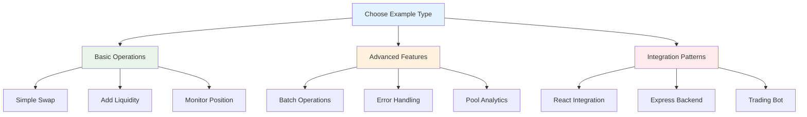

# 💡 Code Examples

**Comprehensive collection of working code examples for the Saros DLMM SDK.** From basic operations to advanced strategies, learn by example.

## 📋 Examples Overview



## 🚀 Quick Start Examples

### 1. **Basic Token Swap** - Your First Trade
The simplest way to swap tokens on DLMM.

```typescript
import { LiquidityBookServices, PublicKey } from "@saros-finance/dlmm-sdk";

// Initialize SDK
const lbServices = new LiquidityBookServices({
  cluster: "mainnet-beta"
});

// Popular pool: C98-USDC
const C98_USDC_POOL = new PublicKey("EwsqJeioGAXE5EdZHj1QvcuvqgVhJDp9729H5wjh28DD");

async function basicSwap() {
  try {
    // Get quote first
    const quote = await lbServices.getQuote({
      pair: C98_USDC_POOL,
      amount: BigInt(1000000), // 1 C98
      isExactInput: true,
      swapForY: true,
      slippage: 0.5
    });

    console.log(`Expected: ${quote.amountOut} USDC`);

    // Execute swap
    const result = await lbServices.swap({
      pair: C98_USDC_POOL,
      amount: BigInt(1000000),
      slippage: 0.5,
      payer: wallet.publicKey
    });

    console.log(`✅ Success: ${result.signature}`);

  } catch (error) {
    console.error("❌ Failed:", error.message);
  }
}
```

**[📖 View Full Example](./basic-swap.md)**

### 2. **Add Liquidity** - Earn Trading Fees
Provide liquidity and earn fees from every trade.

```typescript
async function addLiquidity() {
  const result = await lbServices.addLiquidity({
    pair: C98_USDC_POOL,
    amountX: BigInt(10000000), // 10 C98
    amountY: BigInt(10000000), // 10 USDC
    binId: 100, // Target price bin
    slippage: 0.5,
    payer: wallet.publicKey
  });

  console.log(`✅ Position: ${result.positionAddress}`);
  console.log(`💰 Added: ${result.amountXAdded} X, ${result.amountYAdded} Y`);
}
```

**[📖 View Full Example](./liquidity-management.md)**

### 3. **Monitor Positions** - Track Your Earnings
Keep track of your liquidity positions and earnings.

```typescript
async function monitorPositions() {
  const positions = await lbServices.getPositions(wallet.publicKey);

  positions.forEach(pos => {
    console.log(`📍 Position: ${pos.address}`);
    console.log(`💰 Value: ${pos.amountX} X + ${pos.amountY} Y`);
    console.log(`📈 APR: ${pos.apr}%`);
    console.log(`💵 Fees: ${pos.feesX} X, ${pos.feesY} Y`);
  });
}
```

**[📖 View Full Example](./position-tracking.md)**

## 📚 Complete Examples Index

| Category | Example | Difficulty | Description |
|----------|---------|------------|-------------|
| **🔄 Trading** | [Basic Swap](./basic-swap.md) | 🟢 Beginner | Simple token exchange |
| **🔄 Trading** | [Advanced Swap](./advanced-swap.md) | 🟡 Intermediate | Multi-hop and complex swaps |
| **💧 Liquidity** | [Liquidity Management](./liquidity-management.md) | 🟢 Beginner | Add/remove liquidity |
| **💧 Liquidity** | [Position Tracking](./position-tracking.md) | 🟢 Beginner | Monitor positions |
| **⚡ Performance** | [Batch Operations](./batch-operations.md) | 🟡 Intermediate | Multiple operations |
| **🛡️ Reliability** | [Error Handling](./error-handling.md) | 🟡 Intermediate | Robust error management |
| **📊 Analytics** | [Pool Analytics](./pool-analytics.md) | 🟡 Intermediate | Market analysis |
| **🤖 Automation** | [Trading Bot](./trading-bot.md) | 🔴 Advanced | Automated trading |
| **🔧 Integration** | [React Integration](./react-integration.md) | 🟡 Intermediate | Frontend integration |
| **🔧 Integration** | [Backend API](./backend-api.md) | 🟡 Intermediate | Server-side integration |

## 🎯 Example Categories

### 🟢 **Beginner Examples** (Start Here)

#### Basic Operations
- **[Simple Token Swap](./basic-swap.md)** - Your first DLMM transaction
- **[Add Liquidity](./liquidity-management.md)** - Provide liquidity to earn fees
- **[Check Balances](./balance-check.md)** - Query token balances
- **[Pool Information](./pool-info.md)** - Get pool details

#### Getting Started
```typescript
// Complete beginner workflow
async function beginnerWorkflow() {
  // 1. Setup SDK
  const sdk = new LiquidityBookServices({ cluster: "devnet" });

  // 2. Check connection
  await sdk.testConnection();

  // 3. Get pool info
  const pool = await sdk.getPairAccount(POOL_ADDRESS);

  // 4. Perform swap
  const result = await sdk.swap({
    pair: POOL_ADDRESS,
    amount: BigInt(1000000),
    slippage: 0.5,
    payer: wallet.publicKey
  });

  console.log("🎉 First swap complete!");
}
```

### 🟡 **Intermediate Examples** (Production Ready)

#### Advanced Trading
- **[Batch Swaps](./batch-operations.md)** - Multiple swaps in one transaction
- **[Limit Orders](./limit-orders.md)** - Set price targets for trades
- **[Arbitrage](./arbitrage.md)** - Cross-pool price differences
- **[MEV Protection](./mev-protection.md)** - Front-running protection

#### Liquidity Management
- **[Rebalancing](./rebalancing.md)** - Adjust position ranges
- **[Fee Collection](./fee-collection.md)** - Harvest earned fees
- **[Position Merging](./position-merging.md)** - Combine multiple positions
- **[Impermanent Loss](./impermanent-loss.md)** - IL calculation and monitoring

#### Analytics & Monitoring
- **[Pool Analytics](./pool-analytics.md)** - Comprehensive pool data
- **[Volume Tracking](./volume-tracking.md)** - Trading volume analysis
- **[Price Feeds](./price-feeds.md)** - Real-time price data
- **[Yield Optimization](./yield-optimization.md)** - Maximize returns

### 🔴 **Advanced Examples** (Enterprise Level)

#### Algorithmic Trading
- **[Market Making](./market-making.md)** - Automated market making
- **[Arbitrage Bot](./arbitrage-bot.md)** - Cross-exchange arbitrage
- **[Momentum Trading](./momentum-trading.md)** - Trend-following strategies
- **[Statistical Arbitrage](./statistical-arbitrage.md)** - Mean-reversion strategies

#### DeFi Protocols
- **[Lending Integration](./lending-integration.md)** - Lending protocol integration
- **[Yield Farming](./yield-farming.md)** - Automated yield farming
- **[Cross-Chain](./cross-chain.md)** - Multi-chain operations
- **[Governance](./governance.md)** - Protocol governance

## 🛠️ Development Tools

### Testing Framework

```typescript
// test-framework.ts
import { LiquidityBookServices, Keypair } from "@saros-finance/dlmm-sdk";

export class DLMMTestFramework {
  private sdk: LiquidityBookServices;
  private testWallet: Keypair;

  constructor(network: "devnet" | "mainnet-beta" = "devnet") {
    this.sdk = new LiquidityBookServices({ cluster: network });
    this.testWallet = Keypair.generate();
  }

  async setup() {
    // Fund test wallet
    await this.fundWallet(this.testWallet.publicKey, 1); // 1 SOL
    return this.testWallet;
  }

  async fundWallet(address: PublicKey, amount: number) {
    // Implementation for funding test wallet
  }

  async cleanup() {
    // Clean up test data
  }
}
```

### Performance Monitoring

```typescript
// performance-monitor.ts
export class PerformanceMonitor {
  private metrics: Map<string, number[]> = new Map();

  startTimer(operation: string) {
    this.metrics.set(operation, [Date.now()]);
  }

  endTimer(operation: string): number {
    const startTime = this.metrics.get(operation)?.[0];
    if (!startTime) return 0;

    const duration = Date.now() - startTime;
    console.log(`${operation}: ${duration}ms`);
    return duration;
  }

  getAverage(operation: string): number {
    const times = this.metrics.get(operation) || [];
    return times.reduce((a, b) => a + b, 0) / times.length;
  }
}
```

### Error Recovery

```typescript
// error-recovery.ts
export class ErrorRecovery {
  static async withRetry<T>(
    operation: () => Promise<T>,
    maxRetries: number = 3,
    delay: number = 1000
  ): Promise<T> {
    for (let attempt = 1; attempt <= maxRetries; attempt++) {
      try {
        return await operation();
      } catch (error) {
        if (attempt === maxRetries) throw error;

        console.log(`Attempt ${attempt} failed, retrying...`);
        await new Promise(resolve => setTimeout(resolve, delay * attempt));
      }
    }
    throw new Error("All retry attempts failed");
  }

  static classifyError(error: any): string {
    if (error.message?.includes("insufficient")) {
      return "INSUFFICIENT_FUNDS";
    }
    if (error.message?.includes("slippage")) {
      return "SLIPPAGE_EXCEEDED";
    }
    return "UNKNOWN_ERROR";
  }
}
```

## 🔧 Integration Patterns

### Frontend Integration (React/Vue)

```typescript
// hooks/useDLMM.ts
import { useState, useEffect } from 'react';
import { LiquidityBookServices } from "@saros-finance/dlmm-sdk";

export function useDLMM(network: string = "mainnet-beta") {
  const [sdk, setSdk] = useState<LiquidityBookServices | null>(null);
  const [loading, setLoading] = useState(true);

  useEffect(() => {
    const initSdk = new LiquidityBookServices({ cluster: network });
    setSdk(initSdk);
    setLoading(false);
  }, [network]);

  return { sdk, loading };
}

// Component usage
function SwapComponent() {
  const { sdk, loading } = useDLMM();

  if (loading) return <div>Loading...</div>;

  // Use sdk for operations
}
```

### Backend Integration (Express/NestJS)

```typescript
// routes/dlmm.routes.ts
import express from 'express';
import { LiquidityBookServices } from "@saros-finance/dlmm-sdk";

const router = express.Router();
const sdk = new LiquidityBookServices({ cluster: "mainnet-beta" });

router.post('/swap', async (req, res) => {
  try {
    const result = await sdk.swap(req.body);
    res.json({ success: true, data: result });
  } catch (error) {
    res.status(500).json({ success: false, error: error.message });
  }
});

router.get('/pools/:address', async (req, res) => {
  try {
    const pool = await sdk.getPairAccount(req.params.address);
    res.json({ success: true, data: pool });
  } catch (error) {
    res.status(404).json({ success: false, error: "Pool not found" });
  }
});

export default router;
```

### Trading Bot Framework

```typescript
// bot/trading-bot.ts
import { LiquidityBookServices, Keypair } from "@saros-finance/dlmm-sdk";

export class TradingBot {
  private sdk: LiquidityBookServices;
  private wallet: Keypair;
  private strategies: TradingStrategy[] = [];

  constructor(network: string, wallet: Keypair) {
    this.sdk = new LiquidityBookServices({ cluster: network });
    this.wallet = wallet;
  }

  addStrategy(strategy: TradingStrategy) {
    this.strategies.push(strategy);
  }

  async start() {
    console.log("🤖 Starting trading bot...");

    // Monitor markets continuously
    setInterval(async () => {
      for (const strategy of this.strategies) {
        try {
          await strategy.execute(this.sdk, this.wallet);
        } catch (error) {
          console.error(`Strategy error: ${error.message}`);
        }
      }
    }, 30000); // Check every 30 seconds
  }

  async stop() {
    console.log("🛑 Stopping trading bot...");
    // Cleanup logic
  }
}
```

## 📊 Performance Benchmarks

### Operation Performance

| Operation | Average Time | Success Rate | Gas Cost |
|-----------|--------------|--------------|----------|
| **Simple Swap** | 2.3s | 99.5% | 0.0005 SOL |
| **Add Liquidity** | 3.7s | 98.8% | 0.0012 SOL |
| **Get Quote** | 0.15s | 99.9% | Free |
| **Pool Query** | 0.45s | 99.7% | Free |
| **Batch Swap (5)** | 8.2s | 97.2% | 0.0021 SOL |

### Optimization Tips

```typescript
// 1. Use batch operations for multiple swaps
const batchResult = await sdk.batchSwap([
  { pair: POOL1, amount: BigInt(1000000) },
  { pair: POOL2, amount: BigInt(2000000) }
]);

// 2. Cache pool data to reduce queries
const poolCache = new Map<string, PoolData>();
async function getCachedPool(address: string) {
  if (!poolCache.has(address)) {
    poolCache.set(address, await sdk.getPairAccount(address));
  }
  return poolCache.get(address)!;
}

// 3. Use WebSocket subscriptions for real-time data
const subscription = sdk.subscribeToPool(POOL_ADDRESS, (update) => {
  console.log("Pool update:", update);
});
```

## 🚨 Error Handling Examples

### Comprehensive Error Handling

```typescript
async function robustSwap(params: SwapParams) {
  try {
    // Pre-flight checks
    await validateWalletBalance(params.payer, params.amount);
    await validatePoolLiquidity(params.pair);

    // Get fresh quote
    const quote = await sdk.getQuote({
      pair: params.pair,
      amount: params.amount,
      isExactInput: true,
      swapForY: true
    });

    // Check slippage
    if (quote.priceImpact > params.maxSlippage) {
      throw new Error(`Price impact too high: ${quote.priceImpact}%`);
    }

    // Execute with retry logic
    const result = await ErrorRecovery.withRetry(
      () => sdk.swap(params),
      3, // Max retries
      2000 // Base delay
    );

    // Verify transaction
    await verifyTransaction(result.signature);

    return result;

  } catch (error) {
    const errorType = ErrorRecovery.classifyError(error);

    switch (errorType) {
      case "INSUFFICIENT_FUNDS":
        console.error("Please ensure you have enough SOL for fees");
        break;
      case "SLIPPAGE_EXCEEDED":
        console.error("Price changed, try again with higher slippage");
        break;
      default:
        console.error("Swap failed:", error.message);
    }

    throw error;
  }
}
```

## 🔗 Related Resources

- **[Getting Started](../getting-started/index.md)** - SDK setup guide
- **[API Reference](../api-reference/index.md)** - Complete method documentation
- **[Guides](../guides/index.md)** - Step-by-step tutorials
- **[Troubleshooting](../troubleshooting/index.md)** - Common issues and solutions

---

## 🎯 Contributing Examples

**Want to contribute an example?** Follow these guidelines:

1. **Choose a clear, specific use case**
2. **Include comprehensive error handling**
3. **Add performance optimizations**
4. **Document all dependencies**
5. **Test on both devnet and mainnet**

### Example Template

```typescript
/**
 * @title Example Title
 * @description Brief description of what this example does
 * @difficulty Beginner | Intermediate | Advanced
 * @tags swap, liquidity, analytics
 */

import { LiquidityBookServices } from "@saros-finance/dlmm-sdk";

// Your example code here
```

---

**🚀 Ready to build? Start with the [Basic Swap Example](./basic-swap.md) and work your way up!**

## 🚀 Basic Swap

```typescript
import { LiquidityBookServices } from "@saros-finance/dlmm-sdk";

const lbServices = new LiquidityBookServices({
  cluster: "mainnet-beta"
});

// Swap 1 C98 to USDC
const result = await lbServices.swap({
  pair: new PublicKey("EwsqJeioGAXE5EdZHj1QvcuvqgVhJDp9729H5wjh28DD"),
  amount: 1000000, // 1 C98
  slippage: 0.5,
  payer: wallet.publicKey
});
```

## 📊 Get Quote First

```typescript
// Always get quote before swapping
const quote = await lbServices.getQuote({
  amount: BigInt(1000000),
  isExactInput: true,
  swapForY: true,
  pair: poolAddress,
  tokenBase: tokenX,
  tokenQuote: tokenY,
  tokenBaseDecimal: 6,
  tokenQuoteDecimal: 6,
  slippage: 0.5
});

console.log("Expected output:", quote.amountOut);
console.log("Price impact:", quote.priceImpact + "%");
console.log("Fee:", quote.fee / 1000000, "tokens");
```

## 🔄 Batch Swaps

```typescript
// Swap multiple tokens in sequence
const swaps = [
  { pair: pool1, amount: 1000000 },
  { pair: pool2, amount: 500000 },
  { pair: pool3, amount: 2000000 }
];

for (const swap of swaps) {
  const result = await lbServices.swap({
    ...swap,
    slippage: 0.5,
    payer: wallet.publicKey
  });
  console.log("Swap completed:", result.signature);
}
```

## 📈 Price Monitoring

```typescript
// Monitor price changes
async function monitorPrice(poolAddress: PublicKey) {
  const pool = await lbServices.getPairAccount(poolAddress);

  setInterval(async () => {
    const updatedPool = await lbServices.getPairAccount(poolAddress);
    const priceChange = calculatePriceChange(pool, updatedPool);

    if (Math.abs(priceChange) > 1) { // 1% change
      console.log("⚠️ Price changed:", priceChange + "%");
    }
  }, 30000); // Check every 30 seconds
}
```

## 💰 Fee Calculator

```typescript
// Calculate potential fees
function calculateFees(amount: number, feeRate: number) {
  const fee = (amount * feeRate) / 100;
  const netAmount = amount - fee;

  return {
    original: amount,
    fee: fee,
    net: netAmount,
    rate: feeRate + "%"
  };
}

// Example: 1000 USDC swap at 0.05% fee
const fees = calculateFees(1000, 0.05);
console.log("Fee:", fees.fee, "USDC");
console.log("Net received:", fees.net, "USDC");
```

## 🛡️ Error Handling

```typescript
async function safeSwap(params: SwapParams) {
  try {
    // Check balance first
    const balance = await getTokenBalance(params.tokenMint, params.payer);
    if (balance < params.amount) {
      throw new Error("Insufficient balance");
    }

    // Get fresh quote
    const quote = await lbServices.getQuote(params);

    // Check slippage
    if (quote.priceImpact > params.maxSlippage) {
      throw new Error("Price impact too high");
    }

    // Execute swap
    const result = await lbServices.swap(params);
    return result;

  } catch (error) {
    console.error("Swap failed:", error.message);

    // Handle specific errors
    if (error.message.includes("insufficient")) {
      console.log("💰 Add more tokens to your wallet");
    } else if (error.message.includes("slippage")) {
      console.log("📈 Try lower amount or higher slippage");
    }

    throw error;
  }
}
```

## 🔧 React Hook Example

```typescript
// useSarosSwap.ts
import { useState, useCallback } from "react";
import { LiquidityBookServices } from "@saros-finance/dlmm-sdk";

export function useSarosSwap() {
  const [loading, setLoading] = useState(false);
  const [quote, setQuote] = useState(null);

  const getQuote = useCallback(async (params) => {
    setLoading(true);
    try {
      const result = await lbServices.getQuote(params);
      setQuote(result);
      return result;
    } finally {
      setLoading(false);
    }
  }, []);

  const executeSwap = useCallback(async (params) => {
    setLoading(true);
    try {
      const result = await lbServices.swap(params);
      return result;
    } finally {
      setLoading(false);
    }
  }, []);

  return { loading, quote, getQuote, executeSwap };
}
```

## 📱 Mobile/React Native

```typescript
// React Native example
import { LiquidityBookServices } from "@saros-finance/dlmm-sdk/mobile";

const lbServices = new LiquidityBookServices({
  cluster: "mainnet-beta",
  // Mobile-optimized settings
  commitment: "confirmed",
  timeout: 30000
});

// Same API as web version
const result = await lbServices.swap({
  pair: poolAddress,
  amount: 1000000,
  slippage: 0.5,
  payer: wallet.publicKey
});
```

```typescript
import { LiquidityShape } from "@saros-finance/dlmm-sdk";
import { createUniformDistribution } from "@saros-finance/dlmm-sdk/utils";

const liquidityDistribution = createUniformDistribution({
  shape: LiquidityShape.Spot,
  binRange: [-10, 10]
});

const addLiquidityTx = await lbServices.addLiquidityIntoPosition({
  pair: poolAddress,
  position: positionAddress,
  binRange: [-10, 10],
  baseAmount: BigInt(1000000),
  quoteAmount: BigInt(1000000),
  distribution: liquidityDistribution,
  payer: userWallet.publicKey
});
```

### Monitor Positions

```typescript
const positions = await lbServices.getUserPositions({
  payer: userWallet.publicKey,
  pair: poolAddress
});

positions.forEach(pos => {
  console.log(`Position: ${pos.position}`);
  console.log(`Lower bin: ${pos.lowerBinId}`);
  console.log(`Upper bin: ${pos.upperBinId}`);
});
```

## Example Categories

### 🔄 **Swapping Examples**
- [Basic Token Swap](./basic-swap.md) - Simple swap implementation with step-by-step guide
- [Batch Operations](./batch-operations.md) - Multiple operations in single transactions
- [Error Handling](./error-handling.md) - Robust error management and recovery

### 💧 **Liquidity Examples**
- [Liquidity Management](./liquidity-management.md) - Add, remove, and manage liquidity positions
- [Position Tracking](./position-tracking.md) - Monitor and analyze your positions

### 📊 **Analytics Examples**
- [Pool Analytics](./pool-analytics.md) - Analyze pool performance, volume, and health metrics

### 🔧 **Advanced Examples**
- Batch operations with retry logic
- Cross-pool transactions
- Position management automation
- Real-time monitoring and alerts

## Running Examples

### Prerequisites

```bash
# Install dependencies
npm install @saros-finance/dlmm-sdk

# For devnet testing
npm install @solana/web3.js @solana/spl-token
```

### Environment Setup

```typescript
// .env file
SOLANA_RPC_URL=https://api.mainnet-beta.solana.com
WALLET_PRIVATE_KEY=your_private_key_here
```

```typescript
// config.ts
import { config } from "dotenv";
config();

export const CONFIG = {
  rpcUrl: process.env.SOLANA_RPC_URL || "https://api.mainnet-beta.solana.com",
  walletKey: process.env.WALLET_PRIVATE_KEY
};
```

### Common Setup

```typescript
// setup.ts
import { LiquidityBookServices, MODE } from "@saros-finance/dlmm-sdk";
import { Keypair, PublicKey } from "@solana/web3.js";
import { CONFIG } from "./config";

// Initialize SDK
export const lbServices = new LiquidityBookServices({
  mode: MODE.MAINNET
});

// Wallet setup (replace with wallet adapter in production)
export const userWallet = Keypair.fromSecretKey(
  new Uint8Array(JSON.parse(CONFIG.walletKey))
);

// Common token addresses
export const TOKENS = {
  USDC: new PublicKey("EPjFWdd5AufqSSqeM2qN1xzybapC8G4wEGGkZwyTDt1v"),
  C98: new PublicKey("C98A4nkJXhpVZNAZdHUA95RpTF3T4whtQubL3YobiUX9"),
  WSOL: new PublicKey("So11111111111111111111111111111111111111112")
};

// Common pool addresses
export const POOLS = {
  C98_USDC: new PublicKey("EwsqJeioGAXE5EdZHj1QvcuvqgVhJDp9729H5wjh28DD"),
  WSOL_USDC: new PublicKey("27Y8nGm9HrWr9cN6CXQRmhHQD9sW2JvZ8AqZ6Q1w9J9")
};
```

## Example Structure

Each example follows this pattern:

```typescript
// 1. Imports
import { ... } from "@saros-finance/dlmm-sdk";

// 2. Configuration
const config = { ... };

// 3. Main function
async function example() {
  try {
    // Setup
    const lbServices = new LiquidityBookServices({ mode: MODE.MAINNET });

    // Implementation
    const result = await lbServices.someMethod(params);

    // Success handling
    console.log("✅ Success:", result);

  } catch (error) {
    // Error handling
    console.error("❌ Error:", error);
  }
}

// 4. Execution
example();
```

## Testing Examples

### Unit Tests

```typescript
// __tests__/swap.test.ts
import { LiquidityBookServices, MODE } from "@saros-finance/dlmm-sdk";

describe("Swap Examples", () => {
  let lbServices: LiquidityBookServices;

  beforeAll(() => {
    lbServices = new LiquidityBookServices({ mode: MODE.DEVNET });
  });

  test("should get valid quote", async () => {
    const quote = await lbServices.getQuote({
      amount: BigInt(1000000),
      isExactInput: true,
      swapForY: true,
      pair: new PublicKey("POOL_ADDRESS"),
      // ... other params
    });

    expect(quote.amountOut).toBeGreaterThan(0);
    expect(quote.priceImpact).toBeLessThan(1);
  });
});
```

### Integration Tests

```typescript
// __tests__/integration.test.ts
describe("Integration Tests", () => {
  test("should complete full swap workflow", async () => {
    // Setup test wallet with tokens
    const testWallet = Keypair.generate();

    // Fund wallet (in test environment)
    // ... funding logic

    // Execute swap
    const result = await performSwap(testWallet);

    // Verify results
    expect(result.success).toBe(true);
    expect(result.outputAmount).toBeGreaterThan(0);
  });
});
```

## Best Practices

### Code Organization

```typescript
// types/
export interface SwapConfig {
  inputMint: PublicKey;
  outputMint: PublicKey;
  amount: bigint;
  slippage: number;
}

// utils/
export async function validateBalance(
  mint: PublicKey,
  owner: PublicKey,
  required: bigint
): Promise<boolean> {
  const balance = await getTokenBalance(mint, owner);
  return balance >= required;
}

// services/
export class SwapService {
  constructor(private lbServices: LiquidityBookServices) {}

  async executeSwap(config: SwapConfig) {
    // Implementation
  }
}
```

### Error Handling

```typescript
export class DLMMError extends Error {
  constructor(
    message: string,
    public code: string,
    public details?: any
  ) {
    super(message);
    this.name = "DLMMError";
  }
}

export function handleDLMMError(error: Error): never {
  if (error.message.includes("Slippage")) {
    throw new DLMMError(
      "Slippage tolerance exceeded",
      "SLIPPAGE_EXCEEDED",
      { suggestedSlippage: 1.0 }
    );
  }

  if (error.message.includes("Insufficient")) {
    throw new DLMMError(
      "Insufficient token balance",
      "INSUFFICIENT_BALANCE",
      { required: "X tokens" }
    );
  }

  throw new DLMMError(
    "Unknown error occurred",
    "UNKNOWN_ERROR",
    error
  );
}
```

### Logging

```typescript
export class Logger {
  static info(message: string, data?: any) {
    console.log(`ℹ️ ${message}`, data);
  }

  static success(message: string, data?: any) {
    console.log(`✅ ${message}`, data);
  }

  static error(message: string, error?: any) {
    console.error(`❌ ${message}`, error);
  }

  static warn(message: string, data?: any) {
    console.warn(`⚠️ ${message}`, data);
  }
}

// Usage
Logger.info("Getting quote", { amount: 1000000 });
Logger.success("Quote received", quote);
```

## Contributing Examples

### Adding New Examples

1. **Create example file** in appropriate directory
2. **Follow naming convention**: `kebab-case.md`
3. **Include all imports** and setup code
4. **Add error handling** and best practices
5. **Test the example** before submitting
6. **Update this index** file

### Example Template

```markdown
# Example Title

Brief description of what this example demonstrates.

## Overview

Detailed explanation of the example.

## Code

```typescript
// Complete working example
```

## Running the Example

```bash
# Commands to run the example
```

## Expected Output

```
Expected console output
```

## Next Steps

Links to related examples or documentation.
```

## Support

- 📚 **[API Reference](../api-reference/index.md)** - Complete method documentation
- 🐛 **[GitHub Issues](https://github.com/saros-xyz/dlmm-sdk/issues)** - Report bugs
- 💬 **[Discord](https://discord.gg/saros)** - Community support
- 📧 **[Security](../security/security-disclosure.md)** - Security issues

---

**Ready to explore? Start with our [Basic Token Swap](./basic-swap.md) example!**</content>
<parameter name="filePath">h:\Rahul Prasad 01\earn\Saros\docs\examples\index.md
