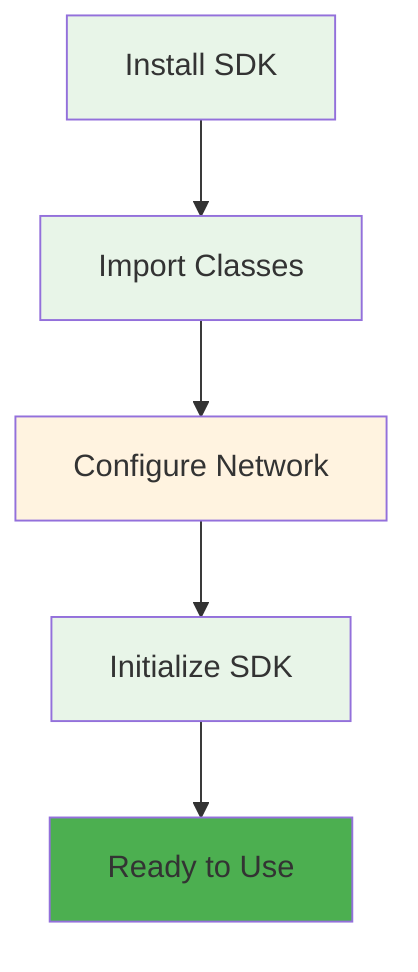
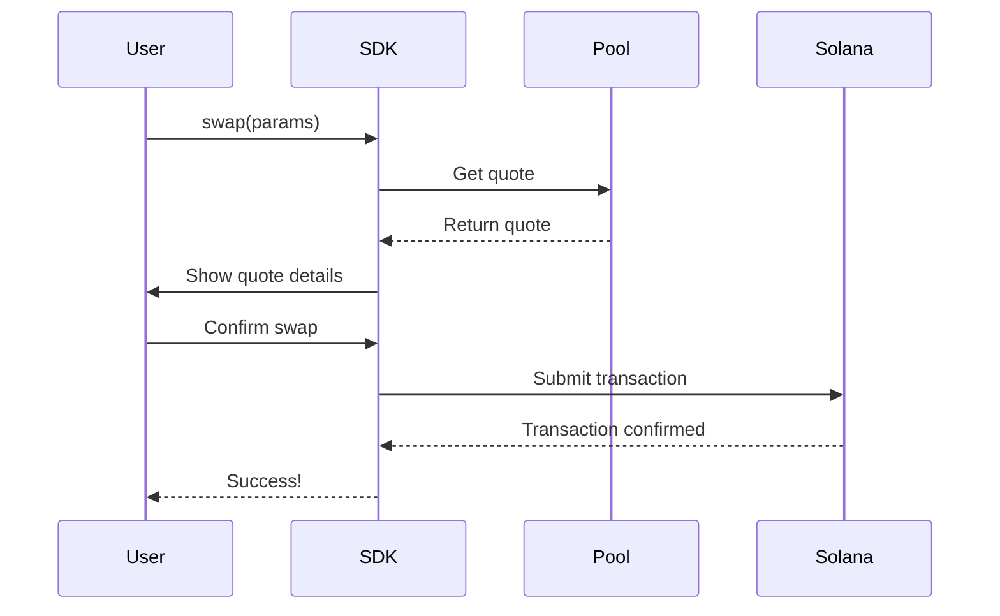
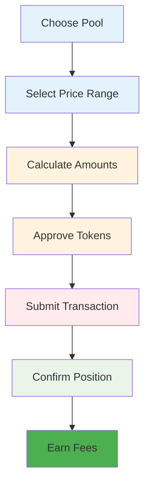

# 🚀 Getting Started (5 minutes)

Welcome to the Saros DLMM SDK! This comprehensive guide will get you up and running with token swapping, liquidity provision, and advanced DeFi operations in just 5 minutes.

## 📋 Prerequisites

Before you begin, ensure you have:
- **Node.js**: v16.0.0 or higher
- **npm/yarn/pnpm**: Latest version
- **TypeScript**: v4.5.0 or higher (recommended)
- **Solana Wallet**: With some SOL for transaction fees

### System Requirements

```bash
# Check Node.js version
node --version  # Should be 16.0.0 or higher

# Check npm version
npm --version   # Should be 7.0.0 or higher

# Check TypeScript (if installed)
tsc --version   # Should be 4.5.0 or higher
```

## ⚡ Quick Installation

```bash
# Using npm
npm install @saros-finance/dlmm-sdk

# Using yarn
yarn add @saros-finance/dlmm-sdk

# Using pnpm
pnpm add @saros-finance/dlmm-sdk
```

### Installation Verification

```typescript
// Verify installation
import { LiquidityBookServices } from "@saros-finance/dlmm-sdk";
console.log("✅ SDK installed successfully!");
```

## 🔧 SDK Initialization

### Basic Setup Flow



### Basic Setup

```typescript
import { LiquidityBookServices } from "@saros-finance/dlmm-sdk";

// Initialize for Mainnet (Production)
const lbServices = new LiquidityBookServices({
  cluster: "mainnet-beta",
  rpcUrl: "https://api.mainnet-beta.solana.com" // Optional: custom RPC
});

// Initialize for Devnet (Testing)
const lbServicesDev = new LiquidityBookServices({
  cluster: "devnet",
  rpcUrl: "https://api.devnet.solana.com"
});
```

### Advanced Configuration

```typescript
const lbServices = new LiquidityBookServices({
  cluster: "mainnet-beta",
  rpcUrl: "https://api.mainnet-beta.solana.com", // Custom RPC endpoint
  commitment: "confirmed", // Transaction commitment level
  preflightCommitment: "confirmed", // Preflight commitment
  confirmTransactionInitialTimeout: 60000, // 60 second timeout
});
```

## 💱 Your First Token Swap

### Swap Process Overview



### Complete Swap Example

```typescript
import { LiquidityBookServices, PublicKey } from "@saros-finance/dlmm-sdk";
import { Keypair } from "@solana/web3.js";

// Initialize SDK
const lbServices = new LiquidityBookServices({
  cluster: "mainnet-beta"
});

// Your wallet (replace with actual wallet)
const wallet = Keypair.generate(); // Use your actual wallet in production

async function performSwap() {
  try {
    // Popular pool: C98-USDC
    const C98_USDC_POOL = new PublicKey("EwsqJeioGAXE5EdZHj1QvcuvqgVhJDp9729H5wjh28DD");

    console.log("🔄 Getting quote...");

    // Get quote first (recommended)
    const quote = await lbServices.getQuote({
      pair: C98_USDC_POOL,
      amount: BigInt(1000000), // 1 C98 (6 decimals)
      isExactInput: true,
      swapForY: true, // C98 -> USDC
      slippage: 0.5 // 0.5% max slippage
    });

    console.log("📊 Quote received:");
    console.log(`   Expected output: ${quote.amountOut} USDC`);
    console.log(`   Price impact: ${quote.priceImpact}%`);
    console.log(`   Fee: ${quote.fee}%`);

    // Execute the swap
    console.log("🚀 Executing swap...");
    const result = await lbServices.swap({
      pair: C98_USDC_POOL,
      amount: BigInt(1000000),
      slippage: 0.5,
      payer: wallet.publicKey
    });

    console.log("✅ Swap successful!");
    console.log(`   Transaction: ${result.signature}`);
    console.log(`   Explorer: https://solscan.io/tx/${result.signature}`);

  } catch (error) {
    console.error("❌ Swap failed:", error.message);
  }
}

// Run the swap
performSwap();
```

## 💧 Adding Liquidity

### Liquidity Provision Flow



### Add Liquidity Example

```typescript
async function addLiquidity() {
  try {
    const C98_USDC_POOL = new PublicKey("EwsqJeioGAXE5EdZHj1QvcuvqgVhJDp9729H5wjh28DD");

    console.log("💧 Adding liquidity...");

    // Add liquidity to the pool
    const result = await lbServices.addLiquidity({
      pair: C98_USDC_POOL,
      amountX: BigInt(10000000), // 10 C98
      amountY: BigInt(10000000), // 10 USDC
      binId: 100, // Target price bin (around current price)
      slippage: 0.5,
      payer: wallet.publicKey
    });

    console.log("✅ Liquidity added!");
    console.log(`   Position: ${result.positionAddress}`);
    console.log(`   Transaction: ${result.signature}`);

  } catch (error) {
    console.error("❌ Add liquidity failed:", error.message);
  }
}
```

## 📊 Monitoring Positions

### Position Tracking

```typescript
async function monitorPosition() {
  try {
    const positionAddress = new PublicKey("YOUR_POSITION_ADDRESS");

    // Get position details
    const position = await lbServices.getPosition(positionAddress);

    console.log("📊 Position Details:");
    console.log(`   Token X: ${position.amountX} C98`);
    console.log(`   Token Y: ${position.amountY} USDC`);
    console.log(`   Fees Earned: ${position.feesEarned} tokens`);
    console.log(`   APR: ${position.apr}%`);

  } catch (error) {
    console.error("❌ Failed to get position:", error.message);
  }
}
```

## 🛠️ Development Environment Setup

### Project Structure

```
your-project/
├── src/
│   ├── config.ts          # SDK configuration
│   ├── services/
│   │   ├── swap.ts        # Swap operations
│   │   ├── liquidity.ts   # Liquidity management
│   │   └── analytics.ts   # Pool analytics
│   └── utils/
│       └── constants.ts   # Token addresses
├── package.json
└── tsconfig.json
```

### Configuration File

```typescript
// src/config.ts
import { LiquidityBookServices } from "@saros-finance/dlmm-sdk";

export const NETWORKS = {
  MAINNET: "mainnet-beta",
  DEVNET: "devnet",
  TESTNET: "testnet"
} as const;

export function createSDK(network: keyof typeof NETWORKS = "MAINNET") {
  return new LiquidityBookServices({
    cluster: NETWORKS[network],
    commitment: "confirmed",
    confirmTransactionInitialTimeout: 60000
  });
}
```

### Constants File

```typescript
// src/utils/constants.ts
import { PublicKey } from "@solana/web3.js";

export const TOKENS = {
  USDC: new PublicKey("EPjFWdd5AufqSSqeM2qN1xzybapC8G4wEGGkZwyTDt1v"),
  C98: new PublicKey("C98A4nkJXhpVZNAZdHUA95RpTF3T4whtQubL3YobiUX9"),
  WSOL: new PublicKey("So11111111111111111111111111111111111111112")
} as const;

export const POOLS = {
  C98_USDC: new PublicKey("EwsqJeioGAXE5EdZHj1QvcuvqgVhJDp9729H5wjh28DD"),
  // Add more pools as needed
} as const;
```

## 🧪 Testing Your Setup

### Basic Test Script

```typescript
// test-setup.ts
import { createSDK } from "./src/config";

async function testSetup() {
  try {
    console.log("🧪 Testing SDK setup...");

    const sdk = createSDK("DEVNET");

    // Test basic connectivity
    const isConnected = await sdk.testConnection();
    console.log(`✅ Connection: ${isConnected ? "Success" : "Failed"}`);

    // Test pool data retrieval
    const poolAddress = POOLS.C98_USDC;
    const poolInfo = await sdk.getPairAccount(poolAddress);
    console.log(`✅ Pool data: ${poolInfo ? "Retrieved" : "Failed"}`);

    console.log("🎉 Setup test completed successfully!");

  } catch (error) {
    console.error("❌ Setup test failed:", error.message);
  }
}

testSetup();
```

## 🚨 Common Issues & Solutions

### Connection Issues

```typescript
// If you get connection errors, try different RPC endpoints
const lbServices = new LiquidityBookServices({
  cluster: "mainnet-beta",
  rpcUrl: "https://solana-api.projectserum.com" // Alternative RPC
});
```

### Insufficient Funds

```typescript
// Check wallet balance before operations
const balance = await connection.getBalance(wallet.publicKey);
console.log(`Wallet balance: ${balance / 1e9} SOL`);

// Minimum required: 0.001 SOL for transactions
if (balance < 1000000) {
  throw new Error("Insufficient SOL for transaction fees");
}
```

## 📚 Next Steps

Now that you're set up, explore these resources:

### 🎯 **Learn More**
- **[Core Concepts](../core-concepts/index.md)** - Understand DLMM mechanics
- **[API Reference](../api-reference/index.md)** - Complete method documentation
- **[Code Examples](../examples/index.md)** - Working code samples

### 💡 **Try These Examples**
- **[Basic Swap](../examples/basic-swap.md)** - Simple token exchange
- **[Liquidity Management](../examples/liquidity-management.md)** - Add/remove liquidity
- **[Pool Analytics](../examples/pool-analytics.md)** - Monitor pool performance

### 🛠️ **Advanced Topics**
- **[Batch Operations](../examples/batch-operations.md)** - Multiple operations
- **[Error Handling](../examples/error-handling.md)** - Robust error management
- **[Position Tracking](../examples/position-tracking.md)** - Monitor your positions

## 🎉 You're Ready!

**Congratulations!** You've successfully set up the Saros DLMM SDK and performed your first operations. The SDK is now ready for:

- ✅ **Token Swapping** - Exchange tokens with minimal slippage
- ✅ **Liquidity Provision** - Earn fees by providing liquidity
- ✅ **Position Management** - Monitor and adjust your positions
- ✅ **Advanced Trading** - Implement complex trading strategies

### 🚀 **Ready for Production?**
When you're ready to deploy to production:
1. Replace test wallets with real user wallets
2. Use mainnet-beta network
3. Implement proper error handling
4. Add transaction monitoring
5. Set up proper logging

---

**Happy building with Saros DLMM! 🚀**
  rpcUrl: "https://api.mainnet-beta.solana.com",
  commitment: "confirmed", // Transaction commitment level
  timeout: 30000, // Request timeout in milliseconds
  priorityFee: 1000 // Priority fee in microlamports
});
```

## 💱 Your First Token Swap

### Step 1: Import Required Dependencies

```typescript
import {
  LiquidityBookServices,
  PublicKey,
  Keypair
} from "@saros-finance/dlmm-sdk";
import { Keypair as SolanaKeypair } from "@solana/web3.js";
```

### Step 2: Set Up Token Addresses and Pool

```typescript
// Common token mint addresses
const TOKENS = {
  USDC: new PublicKey("EPjFWdd5AufqSSqeM2qN1xzybapC8G4wEGGkZwyTDt1v"),
  C98: new PublicKey("C98A4nkJXhpVZNAZdHUA95RpTF3T4whtQubL3YobiUX9"),
  WSOL: new PublicKey("So11111111111111111111111111111111111111112")
};

// Pool addresses (Mainnet)
const POOLS = {
  C98_USDC: new PublicKey("EwsqJeioGAXE5EdZHj1QvcuvqgVhJDp9729H5wjh28DD"),
  WSOL_USDC: new PublicKey("27Y8nGm9HrWr9cN6CXQRmhHQD9sW2JvZ8AqZ6Q1w9J9")
};
```

### Step 3: Create Your Wallet

```typescript
// For development/testing (replace with wallet adapter in production)
const wallet = SolanaKeypair.generate();

// In production, use wallet adapter:
// import { useWallet } from "@solana/wallet-adapter-react";
// const { publicKey, signTransaction } = useWallet();
```

### Step 4: Get a Swap Quote (Recommended)

```typescript
async function getSwapQuote() {
  try {
    const quote = await lbServices.getQuote({
      amount: BigInt(1000000), // 1 C98 (6 decimals)
      isExactInput: true,
      swapForY: true, // C98 -> USDC
      pair: POOLS.C98_USDC,
      tokenBase: TOKENS.C98,
      tokenQuote: TOKENS.USDC,
      tokenBaseDecimal: 6,
      tokenQuoteDecimal: 6,
      slippage: 0.5 // 0.5% max slippage tolerance
    });

    console.log("📊 Swap Quote:");
    console.log(`Expected output: ${quote.amountOut} USDC`);
    console.log(`Price impact: ${quote.priceImpact}%`);
    console.log(`Minimum output: ${quote.minOutAmount} USDC`);
    console.log(`Fee: ${quote.fee} lamports`);

    return quote;

  } catch (error) {
    console.error("❌ Failed to get quote:", error.message);
    throw error;
  }
}
```

### Step 5: Execute the Swap

```typescript
async function executeSwap() {
  try {
    // Get quote first
    const quote = await getSwapQuote();

    // Execute swap
    const result = await lbServices.swap({
      pair: POOLS.C98_USDC,
      amount: BigInt(1000000),
      slippage: 0.5,
      payer: wallet.publicKey,
      // Additional optional parameters
      priorityFee: 1000, // For faster processing
      commitment: "confirmed"
    });

    console.log("✅ Swap successful!");
    console.log(`Transaction signature: ${result.signature}`);
    console.log(`Explorer link: https://solscan.io/tx/${result.signature}`);

    return result;

  } catch (error) {
    console.error("❌ Swap failed:", error.message);

    // Handle specific error types
    if (error.message.includes("insufficient")) {
      console.log("💰 Insufficient token balance");
    } else if (error.message.includes("slippage")) {
      console.log("📉 Price slippage too high");
    } else if (error.message.includes("timeout")) {
      console.log("⏱️ Transaction timeout");
    }

    throw error;
  }
}
```

### Complete Swap Example

```typescript
import {
  LiquidityBookServices,
  PublicKey,
  Keypair
} from "@saros-finance/dlmm-sdk";

async function completeSwapExample() {
  // Initialize SDK
  const lbServices = new LiquidityBookServices({
    cluster: "mainnet-beta"
  });

  // Wallet setup (replace with your wallet in production)
  const wallet = Keypair.generate();

  // Token and pool addresses
  const C98_MINT = new PublicKey("C98A4nkJXhpVZNAZdHUA95RpTF3T4whtQubL3YobiUX9");
  const USDC_MINT = new PublicKey("EPjFWdd5AufqSSqeM2qN1xzybapC8G4wEGGkZwyTDt1v");
  const C98_USDC_POOL = new PublicKey("EwsqJeioGAXE5EdZHj1QvcuvqgVhJDp9729H5wjh28DD");

  try {
    console.log("🔄 Starting token swap...");

    // Step 1: Get quote
    console.log("📊 Getting swap quote...");
    const quote = await lbServices.getQuote({
      amount: BigInt(1000000), // 1 C98
      isExactInput: true,
      swapForY: true,
      pair: C98_USDC_POOL,
      tokenBase: C98_MINT,
      tokenQuote: USDC_MINT,
      tokenBaseDecimal: 6,
      tokenQuoteDecimal: 6,
      slippage: 0.5
    });

    console.log(`Expected: ${quote.amountOut} USDC`);
    console.log(`Price impact: ${quote.priceImpact}%`);

    // Step 2: Execute swap
    console.log("⚡ Executing swap...");
    const result = await lbServices.swap({
      pair: C98_USDC_POOL,
      amount: BigInt(1000000),
      slippage: 0.5,
      payer: wallet.publicKey
    });

    console.log("✅ Swap completed successfully!");
    console.log(`Signature: ${result.signature}`);

  } catch (error) {
    console.error("❌ Swap failed:", error.message);
  }
}

// Run the example
completeSwapExample();
```

## 💧 Adding Liquidity

### Basic Liquidity Addition

```typescript
async function addLiquidity() {
  try {
    const result = await lbServices.addLiquidity({
      pair: POOLS.C98_USDC,
      amountX: BigInt(10000000), // 10 C98
      amountY: BigInt(10000000), // 10 USDC
      binId: 100, // Target price bin (around current price)
      slippage: 0.5,
      payer: wallet.publicKey
    });

    console.log("✅ Liquidity added successfully!");
    console.log(`Position: ${result.positionAddress}`);
    console.log(`Signature: ${result.signature}`);

  } catch (error) {
    console.error("❌ Add liquidity failed:", error.message);
  }
}
```

### Advanced Liquidity Management

```typescript
async function addLiquidityAdvanced() {
  try {
    // Get current pool state
    const pool = await lbServices.getPairAccount(POOLS.C98_USDC);
    console.log(`Current price: ${pool.price}`);
    console.log(`Active bin: ${pool.activeBinId}`);

    // Calculate optimal bin range
    const binRange = {
      lower: pool.activeBinId - 10,
      upper: pool.activeBinId + 10
    };

    // Add liquidity across multiple bins
    const result = await lbServices.addLiquidity({
      pair: POOLS.C98_USDC,
      amountX: BigInt(50000000), // 50 C98
      amountY: BigInt(50000000), // 50 USDC
      binId: pool.activeBinId, // Center around current price
      slippage: 0.5,
      payer: wallet.publicKey,
      // Advanced options
      positionAddress: undefined, // Create new position
      otherAmountOffset: 0
    });

    console.log("✅ Advanced liquidity added!");
    console.log(`Position: ${result.positionAddress}`);

  } catch (error) {
    console.error("❌ Advanced liquidity addition failed:", error.message);
  }
}
```

## 📊 Monitoring and Analytics

### Pool Information

```typescript
async function getPoolInfo() {
  try {
    const pool = await lbServices.getPairAccount(POOLS.C98_USDC);

    console.log("🏊 Pool Information:");
    console.log(`Address: ${POOLS.C98_USDC.toString()}`);
    console.log(`Token X: ${pool.tokenX.toString()}`);
    console.log(`Token Y: ${pool.tokenY.toString()}`);
    console.log(`Current Price: ${pool.price}`);
    console.log(`Total Liquidity: ${pool.totalLiquidity}`);
    console.log(`Active Bin: ${pool.activeBinId}`);
    console.log(`Bin Step: ${pool.binStep}`);
    console.log(`Status: ${pool.isActive ? "Active" : "Inactive"}`);

  } catch (error) {
    console.error("❌ Failed to get pool info:", error.message);
  }
}
```

### Position Tracking

```typescript
async function getUserPositions() {
  try {
    const positions = await lbServices.getUserPositions({
      payer: wallet.publicKey,
      pair: POOLS.C98_USDC
    });

    console.log("📊 Your Positions:");
    positions.forEach((pos, index) => {
      console.log(`${index + 1}. Position: ${pos.positionAddress}`);
      console.log(`   Lower Bin: ${pos.lowerBinId}`);
      console.log(`   Upper Bin: ${pos.upperBinId}`);
      console.log(`   Liquidity: ${pos.liquidity}`);
      console.log(`   Fee X: ${pos.feeX}`);
      console.log(`   Fee Y: ${pos.feeY}`);
      console.log("");
    });

  } catch (error) {
    console.error("❌ Failed to get positions:", error.message);
  }
}
```

## 🔧 Environment Configuration

### Development Setup

```typescript
// .env file
SOLANA_RPC_URL=https://api.devnet.solana.com
WALLET_PRIVATE_KEY=your_private_key_here
CLUSTER=devnet
```

```typescript
// config.ts
import { config } from "dotenv";
config();

export const CONFIG = {
  rpcUrl: process.env.SOLANA_RPC_URL || "https://api.devnet.solana.com",
  cluster: process.env.CLUSTER || "devnet",
  walletKey: process.env.WALLET_PRIVATE_KEY
};
```

### Production Configuration

```typescript
// production-config.ts
export const PRODUCTION_CONFIG = {
  rpcUrl: "https://api.mainnet-beta.solana.com",
  cluster: "mainnet-beta",
  commitment: "confirmed",
  timeout: 30000,
  priorityFee: 1000
};
```

## 🛡️ Error Handling Best Practices

### Comprehensive Error Handler

```typescript
class DLMMErrorHandler {
  static async handleOperation(operation: () => Promise<any>, context: string) {
    try {
      console.log(`🔄 Starting ${context}...`);
      const result = await operation();
      console.log(`✅ ${context} completed successfully`);
      return result;

    } catch (error) {
      console.error(`❌ ${context} failed:`, error.message);

      // Categorize error
      const errorType = this.categorizeError(error);

      switch (errorType) {
        case "network":
          await this.handleNetworkError(error);
          break;
        case "validation":
          this.handleValidationError(error);
          break;
        case "insufficientFunds":
          this.handleInsufficientFundsError(error);
          break;
        case "slippage":
          this.handleSlippageError(error);
          break;
        default:
          this.handleUnknownError(error);
      }

      throw error;
    }
  }

  static categorizeError(error: Error): string {
    const message = error.message.toLowerCase();

    if (message.includes("network") || message.includes("connection") || message.includes("timeout")) {
      return "network";
    }
    if (message.includes("invalid") || message.includes("required")) {
      return "validation";
    }
    if (message.includes("insufficient") || message.includes("balance")) {
      return "insufficientFunds";
    }
    if (message.includes("slippage") || message.includes("minimum")) {
      return "slippage";
    }
    return "unknown";
  }

  static async handleNetworkError(error: Error) {
    console.log("🌐 Network Error Solutions:");
    console.log("  - Check internet connection");
    console.log("  - Switch RPC endpoints");
    console.log("  - Wait for network congestion to clear");
    console.log("  - Implement retry with exponential backoff");
  }

  static handleValidationError(error: Error) {
    console.log("🔍 Validation Error Solutions:");
    console.log("  - Check all required parameters");
    console.log("  - Verify address formats");
    console.log("  - Ensure amounts are positive");
    console.log("  - Validate slippage values");
  }

  static handleInsufficientFundsError(error: Error) {
    console.log("💰 Insufficient Funds Solutions:");
    console.log("  - Deposit more tokens");
    console.log("  - Reduce transaction amount");
    console.log("  - Check token balances");
    console.log("  - Verify token accounts exist");
  }

  static handleSlippageError(error: Error) {
    console.log("📉 Slippage Error Solutions:");
    console.log("  - Increase slippage tolerance");
    console.log("  - Reduce swap amount");
    console.log("  - Wait for better liquidity");
    console.log("  - Check current market conditions");
  }

  static handleUnknownError(error: Error) {
    console.log("🤷 Unknown Error:");
    console.log("  - Check error logs for details");
    console.log("  - Contact support if persists");
    console.log("  - Try again later");
  }
}
```

### Usage with Error Handler

```typescript
async function safeSwap() {
  return await DLMMErrorHandler.handleOperation(async () => {
    return await lbServices.swap({
      pair: POOLS.C98_USDC,
      amount: BigInt(1000000),
      slippage: 0.5,
      payer: wallet.publicKey
    });
  }, "token swap");
}

// Usage
try {
  const result = await safeSwap();
  console.log("Swap successful:", result);
} catch (error) {
  console.log("Swap failed with proper error handling");
}
```

## 🚀 Next Steps

Now that you have the basics, explore these advanced topics:

### 📚 Continue Learning
1. **[Core Concepts](../core-concepts/index.md)** - Understand DLMM mechanics in depth
2. **[API Reference](../api-reference/index.md)** - Complete method documentation
3. **[Advanced Examples](../examples/index.md)** - More complex use cases

### 🛠️ Advanced Guides
1. **[Swapping Guide](../guides/swapping.md)** - Advanced swap strategies
2. **[Liquidity Management](../guides/liquidity.md)** - Position management
3. **[Batch Operations](../examples/batch-operations.md)** - Multiple transactions

### 🔧 Development Tools
1. **[Troubleshooting](../troubleshooting/index.md)** - Debug common issues
2. **[Security](../security/index.md)** - Best practices and audits
3. **[Contributing](../CONTRIBUTING.md)** - Join the development

## 📞 Need Help?

- **📚 Documentation**: You're here! 🔍
- **💬 Discord**: [discord.gg/saros](https://discord.gg/saros)
- **🐛 GitHub Issues**: [Report bugs](https://github.com/saros-xyz/dlmm-sdk/issues)
- **📧 Email**: support@saros.finance

## 🎯 Complete Example Application

```typescript
// complete-example.ts
import {
  LiquidityBookServices,
  PublicKey,
  Keypair
} from "@saros-finance/dlmm-sdk";

class DLMMExampleApp {
  private lbServices: LiquidityBookServices;
  private wallet: Keypair;

  constructor() {
    this.lbServices = new LiquidityBookServices({
      cluster: "mainnet-beta"
    });
    this.wallet = Keypair.generate(); // Replace with your wallet
  }

  async runExample() {
    try {
      console.log("🚀 Starting DLMM Example Application...");

      // Example 1: Get pool information
      await this.getPoolInfo();

      // Example 2: Get swap quote
      await this.getQuote();

      // Example 3: Execute swap (commented for safety)
      // await this.executeSwap();

      // Example 4: Add liquidity (commented for safety)
      // await this.addLiquidity();

      // Example 5: Monitor positions
      await this.monitorPositions();

      console.log("✅ Example application completed successfully!");

    } catch (error) {
      console.error("❌ Example application failed:", error.message);
    }
  }

  async getPoolInfo() {
    console.log("\n🏊 Getting pool information...");
    const poolAddress = new PublicKey("EwsqJeioGAXE5EdZHj1QvcuvqgVhJDp9729H5wjh28DD");
    const pool = await this.lbServices.getPairAccount(poolAddress);

    console.log("Pool Details:");
    console.log(`- Address: ${poolAddress.toString()}`);
    console.log(`- Price: ${pool.price}`);
    console.log(`- Liquidity: ${pool.totalLiquidity}`);
    console.log(`- Active Bin: ${pool.activeBinId}`);
  }

  async getQuote() {
    console.log("\n📊 Getting swap quote...");
    const poolAddress = new PublicKey("EwsqJeioGAXE5EdZHj1QvcuvqgVhJDp9729H5wjh28DD");

    const quote = await this.lbServices.getQuote({
      amount: BigInt(1000000),
      isExactInput: true,
      swapForY: true,
      pair: poolAddress,
      tokenBase: new PublicKey("C98A4nkJXhpVZNAZdHUA95RpTF3T4whtQubL3YobiUX9"),
      tokenQuote: new PublicKey("EPjFWdd5AufqSSqeM2qN1xzybapC8G4wEGGkZwyTDt1v"),
      tokenBaseDecimal: 6,
      tokenQuoteDecimal: 6,
      slippage: 0.5
    });

    console.log("Quote Results:");
    console.log(`- Expected output: ${quote.amountOut}`);
    console.log(`- Price impact: ${quote.priceImpact}%`);
    console.log(`- Fee: ${quote.fee}`);
  }

  async executeSwap() {
    console.log("\n💱 Executing swap...");
    const poolAddress = new PublicKey("EwsqJeioGAXE5EdZHj1QvcuvqgVhJDp9729H5wjh28DD");

    const result = await this.lbServices.swap({
      pair: poolAddress,
      amount: BigInt(1000000),
      slippage: 0.5,
      payer: this.wallet.publicKey
    });

    console.log(`Swap successful: ${result.signature}`);
  }

  async addLiquidity() {
    console.log("\n💧 Adding liquidity...");
    const poolAddress = new PublicKey("EwsqJeioGAXE5EdZHj1QvcuvqgVhJDp9729H5wjh28DD");

    const result = await this.lbServices.addLiquidity({
      pair: poolAddress,
      amountX: BigInt(10000000),
      amountY: BigInt(10000000),
      binId: 100,
      slippage: 0.5,
      payer: this.wallet.publicKey
    });

    console.log(`Liquidity added: ${result.signature}`);
  }

  async monitorPositions() {
    console.log("\n📊 Monitoring positions...");
    const poolAddress = new PublicKey("EwsqJeioGAXE5EdZHj1QvcuvqgVhJDp9729H5wjh28DD");

    const positions = await this.lbServices.getUserPositions({
      payer: this.wallet.publicKey,
      pair: poolAddress
    });

    console.log(`Found ${positions.length} positions`);
    positions.forEach((pos, index) => {
      console.log(`${index + 1}. Position ${pos.positionAddress.slice(0, 8)}...`);
    });
  }
}

// Run the example
const app = new DLMMExampleApp();
app.runExample().catch(console.error);
```

---

**🎉 Congratulations!** You've completed the getting started guide and are now ready to build powerful DeFi applications with the Saros DLMM SDK.

**Ready for more?** Check out the [Core Concepts](../core-concepts/index.md) to deepen your understanding of DLMM mechanics!
});

// For development (devnet)
const lbServicesDev = new LiquidityBookServices({
  mode: MODE.DEVNET
});
```

### 3. Verify Connection

```typescript
// Check if connected to the correct network
console.log("Connected to:", lbServices.connection.rpcEndpoint);
console.log("DEX Name:", lbServices.getDexName());
console.log("Program ID:", lbServices.getDexProgramId());
```

## Your First Swap

Let's create a simple token swap application.

### Complete Example

```typescript
import {
  LiquidityBookServices,
  MODE
} from "@saros-finance/dlmm-sdk";
import { PublicKey, Keypair } from "@solana/web3.js";

async function performSwap() {
  // Initialize SDK
  const lbServices = new LiquidityBookServices({
    mode: MODE.MAINNET
  });

  // Example: Swap C98 to USDC
  const C98_MINT = new PublicKey("C98A4nkJXhpVZNAZdHUA95RpTF3T4whtQubL3YobiUX9");
  const USDC_MINT = new PublicKey("EPjFWdd5AufqSSqeM2qN1xzybapC8G4wEGGkZwyTDt1v");
  const POOL_ADDRESS = new PublicKey("EwsqJeioGAXE5EdZHj1QvcuvqgVhJDp9729H5wjh28DD");

  // Your wallet (replace with actual keypair)
  const userWallet = Keypair.generate();

  try {
    // Step 1: Get a quote
    console.log("Getting swap quote...");
    const quote = await lbServices.getQuote({
      amount: BigInt(1000000), // 1 C98 (6 decimals)
      isExactInput: true,
      swapForY: true, // C98 -> USDC
      pair: POOL_ADDRESS,
      tokenBase: C98_MINT,
      tokenQuote: USDC_MINT,
      tokenBaseDecimal: 6,
      tokenQuoteDecimal: 6,
      slippage: 0.5 // 0.5% slippage tolerance
    });

    console.log(`Expected output: ${quote.amountOut} USDC`);
    console.log(`Price impact: ${quote.priceImpact}%`);

    // Step 2: Create swap transaction
    console.log("Creating swap transaction...");
    const swapTx = await lbServices.swap({
      amount: quote.amount,
      tokenMintX: C98_MINT,
      tokenMintY: USDC_MINT,
      otherAmountOffset: quote.otherAmountOffset,
      hook: lbServices.hooksConfig,
      isExactInput: true,
      swapForY: true,
      pair: POOL_ADDRESS,
      payer: userWallet.publicKey
    });

    // Step 3: Sign and send (in production, use wallet adapter)
    const { blockhash, lastValidBlockHeight } =
      await lbServices.connection.getLatestBlockhash();

    swapTx.recentBlockhash = blockhash;
    swapTx.feePayer = userWallet.publicKey;
    swapTx.sign(userWallet);

    console.log("Transaction created successfully!");
    console.log("Transaction signature would be:", swapTx.signature);

    // In production:
    // const signature = await lbServices.connection.sendRawTransaction(
    //   swapTx.serialize()
    // );

  } catch (error) {
    console.error("Swap failed:", error);
  }
}

// Run the example
performSwap();
```

## Environment Configuration

### Development (Devnet)

```typescript
const lbServices = new LiquidityBookServices({
  mode: MODE.DEVNET
});

// Devnet token addresses
const WSOL_MINT = new PublicKey("So11111111111111111111111111111111111111112");
const SAROS_MINT = new PublicKey("mntCAkd76nKSVTYxwu8qwQnhPcEE9JyEbgW6eEpwr1N");
const DEVNET_POOL = new PublicKey("C8xWcMpzqetpxwLj7tJfSQ6Juh1wHFdT5KrkwdYPQB");
```

### Production (Mainnet)

```typescript
const lbServices = new LiquidityBookServices({
  mode: MODE.MAINNET
});

// Mainnet token addresses
const USDC_MINT = new PublicKey("EPjFWdd5AufqSSqeM2qN1xzybapC8G4wEGGkZwyTDt1v");
const C98_MINT = new PublicKey("C98A4nkJXhpVZNAZdHUA95RpTF3T4whtQubL3YobiUX9");
const MAINNET_POOL = new PublicKey("EwsqJeioGAXE5EdZHj1QvcuvqgVhJDp9729H5wjh28DD");
```

## Error Handling

Always wrap your SDK calls in try-catch blocks:

```typescript
try {
  const result = await lbServices.someMethod(params);
  console.log("Success:", result);
} catch (error) {
  console.error("Error:", error.message);

  // Handle specific error types
  if (error.message.includes("Slippage")) {
    console.log("Price slippage exceeded tolerance");
  } else if (error.message.includes("Insufficient")) {
    console.log("Insufficient token balance");
  }
}
```

## Next Steps

Now that you have the basics, explore:

1. **[Core Concepts](../core-concepts/index.md)** - Understand DLMM mechanics
2. **[API Reference](../api-reference/index.md)** - Complete method documentation
3. **[Guides](../guides/index.md)** - Advanced tutorials
4. **[Examples](../examples/index.md)** - More code samples

## Need Help?

- 📚 [Full Documentation](../)
- 💬 [Discord Community](https://discord.gg/saros)
- 🐛 [GitHub Issues](https://github.com/saros-xyz/dlmm-sdk/issues)
- 📧 [Security Issues](../security/security-disclosure.md)

---

**Happy building with Saros DLMM! 🚀**</content>
<parameter name="filePath">h:\Rahul Prasad 01\earn\Saros\docs\getting-started\index.md
