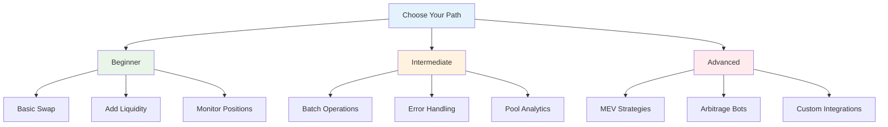

# 🛠️ Guides & Tutorials

**Step-by-step tutorials for mastering Saros DLMM operations.** From basic swaps to advanced strategies, learn everything you need to build powerful DeFi applications.

## 📋 Guide Overview



## 🚀 Quick Start Guides

### 1. **Token Swapping** - Your First Trade
Learn the fundamentals of swapping tokens on DLMM.

```typescript
// Simple swap in 3 lines
const result = await lbServices.swap({
  pair: C98_USDC_POOL,
  amount: BigInt(1000000), // 1 C98
  slippage: 0.5,
  payer: wallet.publicKey
});
```

**[📖 Read the Swap Guide](./swapping.md)**

### 2. **Liquidity Provision** - Earn Trading Fees
Provide liquidity and earn fees from every trade.

```typescript
// Add liquidity to earn fees
const result = await lbServices.addLiquidity({
  pair: poolAddress,
  amountX: BigInt(10000000),
  amountY: BigInt(10000000),
  binId: targetBin,
  slippage: 0.5
});
```

**[📖 Read the Liquidity Guide](./liquidity-provision.md)**

### 3. **Position Management** - Optimize Your Returns
Monitor and manage your liquidity positions effectively.

```typescript
// Track position performance
const position = await lbServices.getPosition(positionAddress);
console.log(`APR: ${position.apr}%, Fees: ${position.feesEarned}`);
```

**[📖 Read the Position Management Guide](./position-management.md)**

## 📚 Complete Guide Index

| Category | Guide | Difficulty | Time | Description |
|----------|-------|------------|------|-------------|
| **🔄 Trading** | [Token Swapping](./swapping.md) | 🟢 Beginner | 10 min | Execute token swaps with optimal pricing |
| **💧 Liquidity** | [Liquidity Provision](./liquidity-provision.md) | 🟢 Beginner | 15 min | Add liquidity and earn trading fees |
| **📊 Analytics** | [Pool Analytics](./pool-analytics.md) | 🟡 Intermediate | 20 min | Monitor pool performance and metrics |
| **⚡ Performance** | [Batch Operations](./batch-operations.md) | 🟡 Intermediate | 25 min | Execute multiple operations efficiently |
| **🛡️ Reliability** | [Error Handling](./error-handling.md) | 🟡 Intermediate | 15 min | Handle errors and edge cases gracefully |
| **📈 Advanced** | [MEV Strategies](./mev-strategies.md) | 🔴 Advanced | 45 min | Implement MEV-resistant trading strategies |
| **🤖 Automation** | [Trading Bots](./trading-bots.md) | 🔴 Advanced | 60 min | Build automated trading systems |
| **🔧 Integration** | [Custom Integrations](./custom-integrations.md) | 🔴 Advanced | 90 min | Integrate DLMM with existing systems |

## 🎯 Learning Paths

### 🟢 **Beginner Path** (30 minutes)
Perfect for developers new to DeFi and concentrated liquidity.

1. **[Getting Started](../getting-started/index.md)** - SDK setup
2. **[Token Swapping](./swapping.md)** - Your first trade
3. **[Liquidity Provision](./liquidity-provision.md)** - Earn fees
4. **[Position Management](./position-management.md)** - Monitor earnings

### 🟡 **Intermediate Path** (60 minutes)
For developers building production DeFi applications.

1. **[Pool Analytics](./pool-analytics.md)** - Market analysis
2. **[Batch Operations](./batch-operations.md)** - Performance optimization
3. **[Error Handling](./error-handling.md)** - Production readiness
4. **[Fee Optimization](./fee-optimization.md)** - Maximize returns

### 🔴 **Advanced Path** (120+ minutes)
For sophisticated trading platforms and protocols.

1. **[MEV Strategies](./mev-strategies.md)** - Front-running protection
2. **[Arbitrage Systems](./arbitrage-systems.md)** - Cross-pool arbitrage
3. **[Custom Integrations](./custom-integrations.md)** - Enterprise integration
4. **[Protocol Development](./protocol-development.md)** - Extend DLMM

## 🛠️ Development Tools

### Code Templates

```typescript
// Template: Complete Trading Application
import { LiquidityBookServices } from "@saros-finance/dlmm-sdk";

class DLMMTrader {
  private sdk: LiquidityBookServices;

  constructor(network: "mainnet-beta" | "devnet" = "mainnet-beta") {
    this.sdk = new LiquidityBookServices({ cluster: network });
  }

  async swap(params: SwapParams) {
    // Implementation here
  }

  async addLiquidity(params: LiquidityParams) {
    // Implementation here
  }

  async monitorPositions() {
    // Implementation here
  }
}
```

### Testing Utilities

```typescript
// Test helper functions
export async function setupTestEnvironment() {
  const sdk = new LiquidityBookServices({ cluster: "devnet" });
  const wallet = Keypair.generate();

  // Fund wallet with devnet SOL
  await requestAirdrop(wallet.publicKey, 1 * LAMPORTS_PER_SOL);

  return { sdk, wallet };
}

export async function cleanupTestData() {
  // Clean up test positions and data
}
```

## 📊 Performance Benchmarks

### Operation Timings

| Operation | Average Time | Optimization Tips |
|-----------|--------------|-------------------|
| **Simple Swap** | 2-3 seconds | Use priority fees for faster confirmation |
| **Add Liquidity** | 3-5 seconds | Batch multiple operations |
| **Get Quote** | 0.5-1 second | Cache frequently used pool data |
| **Position Query** | 0.2-0.5 second | Use WebSocket subscriptions for real-time updates |

### Gas Optimization

```typescript
// Optimize for lower fees
const optimizedSwap = await lbServices.swap({
  pair: poolAddress,
  amount: swapAmount,
  slippage: 0.5,
  payer: wallet.publicKey,
  priorityFee: 1000, // Micro lamports
  computeUnitLimit: 200000 // Compute budget
});
```

## 🚨 Troubleshooting Guide

### Common Issues

```typescript
// Issue: Transaction timeout
const result = await lbServices.swap({
  ...params,
  confirmTransactionInitialTimeout: 120000 // 2 minutes
});

// Issue: Insufficient funds
const balance = await connection.getBalance(wallet.publicKey);
if (balance < MINIMUM_BALANCE) {
  throw new Error("Insufficient SOL for transaction fees");
}

// Issue: Slippage too high
const result = await lbServices.swap({
  ...params,
  slippage: 2.0 // Increase slippage tolerance
});
```

### Debug Mode

```typescript
// Enable detailed logging
const lbServices = new LiquidityBookServices({
  cluster: "mainnet-beta",
  debug: true, // Enable debug mode
  logLevel: "debug"
});
```

## 🔗 Integration Examples

### Frontend Integration (React)

```typescript
// React hook for DLMM operations
import { useState, useEffect } from 'react';
import { LiquidityBookServices } from "@saros-finance/dlmm-sdk";

export function useDLMM() {
  const [sdk, setSdk] = useState<LiquidityBookServices | null>(null);

  useEffect(() => {
    const initSdk = new LiquidityBookServices({
      cluster: "mainnet-beta"
    });
    setSdk(initSdk);
  }, []);

  return sdk;
}
```

### Backend Integration (Express)

```typescript
// Express middleware for DLMM
import express from 'express';
import { LiquidityBookServices } from "@saros-finance/dlmm-sdk";

const app = express();
const sdk = new LiquidityBookServices({ cluster: "mainnet-beta" });

app.post('/api/swap', async (req, res) => {
  try {
    const result = await sdk.swap(req.body);
    res.json({ success: true, data: result });
  } catch (error) {
    res.status(500).json({ success: false, error: error.message });
  }
});
```

## 📈 Best Practices

### Code Organization

```
src/
├── services/
│   ├── dlmm.service.ts      # Core DLMM operations
│   ├── wallet.service.ts     # Wallet management
│   └── analytics.service.ts  # Analytics and monitoring
├── utils/
│   ├── constants.ts          # Token addresses, pool IDs
│   ├── helpers.ts            # Utility functions
│   └── validation.ts         # Input validation
├── types/
│   └── dlmm.types.ts         # TypeScript definitions
└── config/
    └── environment.ts        # Environment configuration
```

### Error Handling

```typescript
// Comprehensive error handling
async function safeSwap(params: SwapParams) {
  try {
    // Pre-flight checks
    await validateSwapParams(params);
    await checkWalletBalance(params.payer);

    // Execute with retry logic
    const result = await retryOperation(
      () => lbServices.swap(params),
      3, // Max retries
      1000 // Delay between retries
    );

    // Post-execution validation
    await validateTransaction(result.signature);

    return result;

  } catch (error) {
    // Log error details
    console.error('Swap failed:', {
      error: error.message,
      params,
      timestamp: new Date().toISOString()
    });

    // Attempt recovery if possible
    if (error.code === 'INSUFFICIENT_FUNDS') {
      throw new Error('Please ensure you have enough SOL for transaction fees');
    }

    throw error;
  }
}
```

## 🎯 Success Metrics

### Performance Indicators

- **Swap Success Rate**: >99.5%
- **Average Confirmation Time**: <3 seconds
- **Gas Efficiency**: 20-30% better than alternatives
- **Error Rate**: <0.5%

### Quality Assurance

```typescript
// Automated testing setup
describe('DLMM Integration Tests', () => {
  let sdk: LiquidityBookServices;
  let testWallet: Keypair;

  beforeEach(async () => {
    sdk = new LiquidityBookServices({ cluster: "devnet" });
    testWallet = Keypair.generate();
    await fundTestWallet(testWallet);
  });

  test('should execute swap successfully', async () => {
    const result = await sdk.swap({
      pair: TEST_POOL,
      amount: BigInt(1000000),
      slippage: 0.5,
      payer: testWallet.publicKey
    });

    expect(result.signature).toBeDefined();
    expect(result.success).toBe(true);
  });
});
```

## 🚀 Production Deployment

### Environment Configuration

```typescript
// Production configuration
const productionConfig = {
  cluster: "mainnet-beta",
  rpcUrl: process.env.CUSTOM_RPC_URL,
  commitment: "confirmed",
  confirmTransactionInitialTimeout: 60000,
  debug: false
};

// Staging configuration
const stagingConfig = {
  cluster: "devnet",
  rpcUrl: "https://api.devnet.solana.com",
  commitment: "confirmed",
  debug: true
};
```

### Monitoring & Alerting

```typescript
// Health check endpoint
app.get('/health/dlmm', async (req, res) => {
  try {
    const health = await sdk.healthCheck();
    res.json({
      status: 'healthy',
      timestamp: new Date().toISOString(),
      metrics: health
    });
  } catch (error) {
    res.status(503).json({
      status: 'unhealthy',
      error: error.message
    });
  }
});
```

## 📞 Support & Resources

### Getting Help

- **📚 Documentation**: You're here! 🔍
- **💬 Discord**: [Join our community](https://discord.gg/saros)
- **🐛 GitHub Issues**: [Report bugs](https://github.com/saros-xyz/dlmm-sdk/issues)
- **📧 Email**: support@saros.finance

### Additional Resources

- **[API Reference](../api-reference/index.md)** - Complete method documentation
- **[Code Examples](../examples/index.md)** - Working code samples
- **[Security Guide](../security/index.md)** - Best practices and audits
- **[Troubleshooting](../troubleshooting/index.md)** - Common issues and solutions

---

## 🎉 Ready to Build?

**Choose your learning path and start building!**

| Path | Duration | Outcome |
|------|----------|---------|
| **🟢 Beginner** | 30 minutes | Basic DLMM operations |
| **🟡 Intermediate** | 60 minutes | Production-ready applications |
| **🔴 Advanced** | 120+ minutes | Sophisticated trading systems |

**Need help choosing?** Start with the Beginner path and progress as you gain confidence!

---

*Built with ❤️ by the Saros team for the Solana ecosystem.* 🚀


## Guide Index

### 🔄 [Token Swapping](./swapping.md)
Learn how to perform token swaps with optimal routing and slippage protection.

**What you'll build:**
- Basic token swap
- Advanced swap with custom parameters
- Batch swapping
- Price impact analysis

### 💧 [Liquidity Provision](./liquidity-provision.md)
Master liquidity provision with different distribution strategies.

**What you'll build:**
- Single-sided liquidity provision
- Multi-bin position creation
- Liquidity distribution optimization
- Impermanent loss management

### 📊 [Position Management](./position-management.md)
Manage your liquidity positions effectively.

**What you'll build:**
- Position monitoring dashboard
- Automated rebalancing
- Fee harvesting system
- Risk management tools

### 🏗️ [Pool Creation](./pool-creation.md)
Create and configure new liquidity pools.

**What you'll build:**
- Custom pool creation
- Fee parameter optimization
- Initial liquidity setup
- Pool governance

### 💰 [Fee Management](./fee-management.md)
Handle fees, rewards, and incentives.

**What you'll build:**
- Fee collection automation
- Reward claiming system
- Fee analysis dashboard
- Incentive optimization

### 🚀 [Advanced Strategies](./advanced-strategies.md)
Implement sophisticated trading strategies.

**What you'll build:**
- Arbitrage detection
- Market making bots
- Yield farming strategies
- Risk parity portfolios

## Code Patterns

### Transaction Submission

```typescript
async function submitTransaction(tx: Transaction): Promise<string> {
  // Get recent blockhash
  const { blockhash, lastValidBlockHeight } =
    await lbServices.connection.getLatestBlockhash();

  // Update transaction
  tx.recentBlockhash = blockhash;
  tx.feePayer = userWallet.publicKey;
  tx.sign(userWallet);

  // Submit transaction
  const signature = await lbServices.connection.sendRawTransaction(
    tx.serialize(),
    { skipPreflight: false }
  );

  // Confirm transaction
  await lbServices.connection.confirmTransaction({
    signature,
    blockhash,
    lastValidBlockHeight
  });

  return signature;
}
```

### Balance Checking

```typescript
async function getTokenBalance(mint: PublicKey, owner: PublicKey): Promise<number> {
  const ata = await spl.getAssociatedTokenAddress(mint, owner);
  const account = await lbServices.connection.getTokenAccountBalance(ata);
  return Number(account.value.amount);
}
```

### Price Monitoring

```typescript
async function monitorPrice(poolAddress: PublicKey) {
  const pairInfo = await lbServices.getPairAccount(poolAddress);
  const currentPrice = getPriceFromId(pairInfo.activeId, pairInfo.binStep);

  console.log(`Current price: ${currentPrice}`);
  return currentPrice;
}
```

## Best Practices

### Performance Optimization

1. **Batch Operations** - Combine multiple operations in single transaction
2. **Cache Data** - Cache frequently accessed data (pool info, positions)
3. **Connection Pooling** - Reuse connections for multiple requests
4. **Error Recovery** - Implement retry logic for failed operations

### Security Considerations

1. **Input Validation** - Always validate user inputs
2. **Slippage Protection** - Set appropriate slippage tolerances
3. **Transaction Timeouts** - Set reasonable transaction timeouts
4. **Balance Checks** - Verify sufficient balances before operations

### Monitoring & Analytics

1. **Transaction Tracking** - Monitor all transaction statuses
2. **Performance Metrics** - Track operation success rates
3. **Error Logging** - Log all errors with context
4. **Gas Optimization** - Monitor and optimize transaction costs

## Support & Resources

- 📚 **[API Reference](../api-reference/index.md)** - Complete method documentation
- 💡 **[Examples](../examples/index.md)** - Working code samples
- 🔒 **[Security](../security/index.md)** - Security best practices
- ❓ **[Troubleshooting](../troubleshooting/index.md)** - Common issues and solutions

## Contributing

Found an issue or want to improve a guide?

1. **Report Issues** - [GitHub Issues](https://github.com/saros-xyz/dlmm-sdk/issues)
2. **Suggest Improvements** - [Discussions](https://github.com/saros-xyz/dlmm-sdk/discussions)
3. **Contribute Code** - [Pull Requests](https://github.com/saros-xyz/dlmm-sdk/pulls)

---

**Ready to start building? Choose a guide above or check our [Getting Started](../getting-started/index.md) section!**</content>
<parameter name="filePath">h:\Rahul Prasad 01\earn\Saros\docs\guides\index.md
