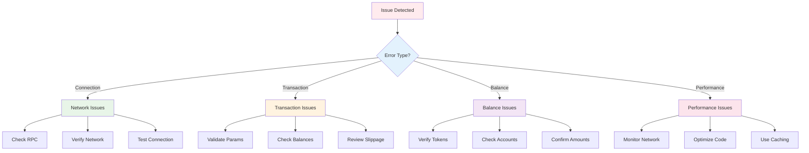
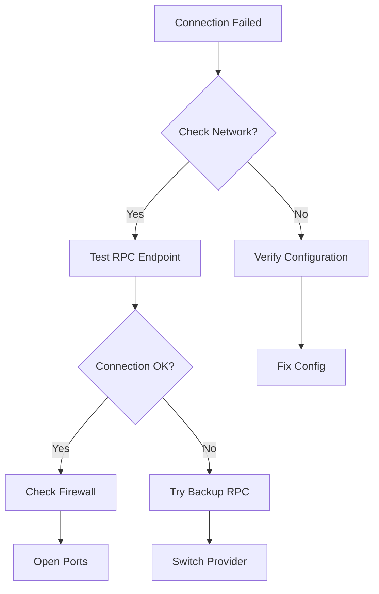
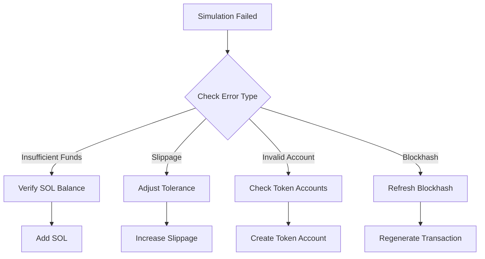
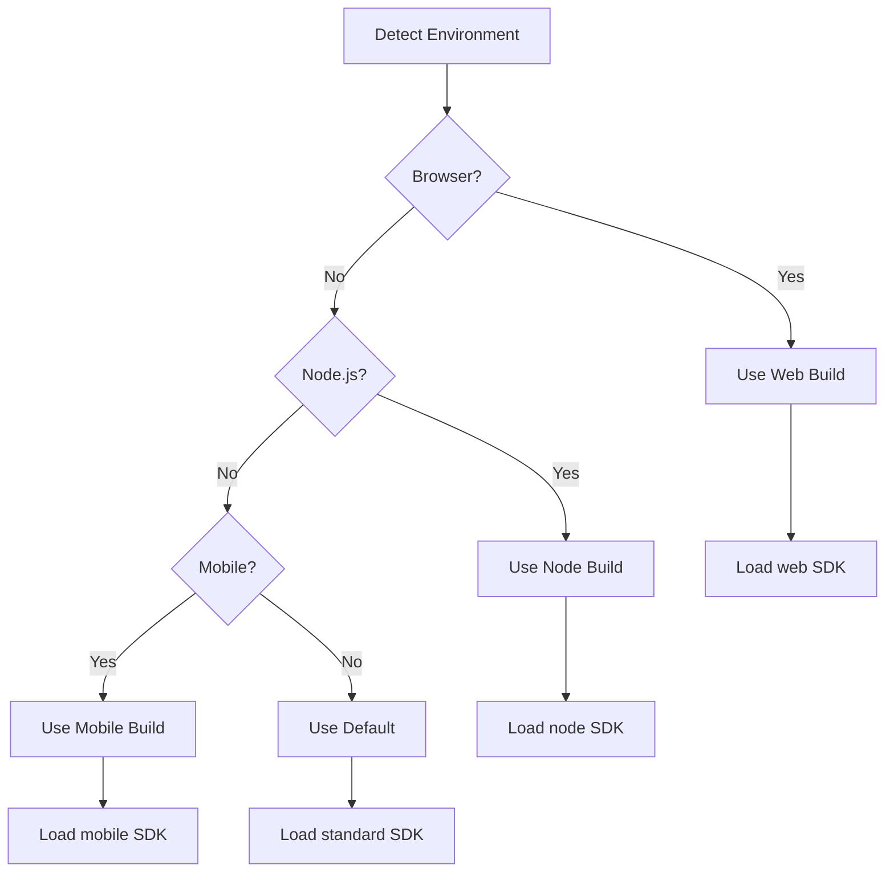

# Troubleshooting

Common issues, debugging tips, and solutions for the Saros DLMM SDK.

## 🔍 Quick Issue Diagnosis

### Connection Issues

**Problem**: `Connection to cluster failed`
```typescript
# 🔧 Troubleshooting Guide

**Comprehensive troubleshooting guide for the Saros DLMM SDK.** Quick diagnosis, debugging tools, and solutions for common issues.

## 🔍 Quick Issue Diagnosis



## 🚨 Common Error Messages & Solutions

### Connection Issues

#### "Connection to cluster failed"

**🔍 Diagnosis Flow:**


**✅ Solutions:**

1. **Network Configuration**
```typescript
// ✅ GOOD: Explicit network configuration
const lbServices = new LiquidityBookServices({
  cluster: "mainnet-beta",
  rpcUrl: "https://api.mainnet-beta.solana.com",
  commitment: "confirmed"
});
```

2. **RPC Connection Test**
```typescript
// Test RPC connectivity
async function testRPCConnection() {
  try {
    const version = await lbServices.connection.getVersion();
    console.log("✅ RPC Connected:", version);

    const slot = await lbServices.connection.getSlot();
    console.log("✅ Current Slot:", slot);

    return true;
  } catch (error) {
    console.error("❌ RPC Connection Failed:", error.message);
    return false;
  }
}
```

3. **Backup RPC Endpoints**
```typescript
// Multiple RPC providers for resilience
const RPC_ENDPOINTS = {
  primary: "https://api.mainnet-beta.solana.com",
  backup1: "https://solana-api.projectserum.com",
  backup2: "https://rpc.ankr.com/solana",
  backup3: "https://ssc-dao.genesysgo.net"
};

async function connectWithFallback() {
  for (const [name, url] of Object.entries(RPC_ENDPOINTS)) {
    try {
      const connection = new Connection(url, "confirmed");
      await connection.getVersion();
      console.log(`✅ Connected to ${name}`);
      return connection;
    } catch (error) {
      console.warn(`❌ ${name} failed:`, error.message);
    }
  }
  throw new Error("All RPC endpoints failed");
}
```

### Transaction Failures

#### "Transaction simulation failed"

**🔍 Root Cause Analysis:**


**✅ Solutions:**

1. **SOL Balance Check**
```typescript
// Comprehensive balance validation
async function validateBalances(wallet: PublicKey, requiredSOL = 0.01) {
  const solBalance = await lbServices.connection.getBalance(wallet);
  const solBalanceSOL = solBalance / LAMPORTS_PER_SOL;

  console.log(`💰 SOL Balance: ${solBalanceSOL} SOL`);

  if (solBalanceSOL < requiredSOL) {
    const shortfall = requiredSOL - solBalanceSOL;
    throw new Error(
      `Insufficient SOL. Need ${shortfall.toFixed(4)} more SOL for fees. ` +
      `Current: ${solBalanceSOL.toFixed(4)} SOL`
    );
  }

  return { solBalance, solBalanceSOL };
}
```

2. **Token Account Validation**
```typescript
// Check token account existence and balance
async function validateTokenAccount(tokenMint: PublicKey, owner: PublicKey, requiredAmount: bigint) {
  const associatedTokenAccount = await getAssociatedTokenAddress(tokenMint, owner);

  try {
    const accountInfo = await lbServices.connection.getAccountInfo(associatedTokenAccount);

    if (!accountInfo) {
      throw new Error(
        `Token account not found: ${associatedTokenAccount.toString()}
` +
        `Please create the token account first.`
      );
    }

    // Get token balance
    const tokenBalance = await lbServices.connection.getTokenAccountBalance(associatedTokenAccount);
    const balance = BigInt(tokenBalance.value.amount);

    console.log(`🪙 Token Balance: ${tokenBalance.value.uiAmount} ${tokenBalance.value.symbol}`);

    if (balance < requiredAmount) {
      throw new Error(
        `Insufficient token balance. Required: ${requiredAmount.toString()}, ` +
        `Available: ${balance.toString()}`
      );
    }

    return { account: associatedTokenAccount, balance };

  } catch (error) {
    if (error.message.includes("Token account not found")) {
      // Auto-create token account instruction
      const createATAInstruction = createAssociatedTokenAccountInstruction(
        owner, // payer
        associatedTokenAccount, // ata
        owner, // owner
        tokenMint // mint
      );

      console.log("💡 Need to create token account first");
      throw new Error(
        `Token account creation needed. Add this instruction to your transaction:
` +
        JSON.stringify(createATAInstruction, null, 2)
      );
    }
    throw error;
  }
}
```

3. **Slippage Optimization**
```typescript
// Dynamic slippage calculation
async function calculateOptimalSlippage(
  pair: PublicKey,
  amount: bigint,
  baseSlippage = 0.5
): Promise<number> {
  try {
    // Get pool info
    const poolInfo = await lbServices.getPairAccount(pair);

    // Calculate price impact
    const priceImpact = await lbServices.calculatePriceImpact(pair, amount);

    // Adjust slippage based on impact
    let optimalSlippage = baseSlippage;

    if (priceImpact > 1) {
      optimalSlippage = Math.max(baseSlippage, priceImpact * 1.5);
    } else if (priceImpact < 0.1) {
      optimalSlippage = Math.max(0.1, baseSlippage * 0.5);
    }

    console.log(`📊 Price Impact: ${priceImpact.toFixed(2)}%`);
    console.log(`🎯 Optimal Slippage: ${optimalSlippage.toFixed(2)}%`);

    return optimalSlippage;

  } catch (error) {
    console.warn("Could not calculate optimal slippage, using base:", baseSlippage);
    return baseSlippage;
  }
}

// Usage
const optimalSlippage = await calculateOptimalSlippage(pairAddress, amount);
const result = await lbServices.swap({
  pair: pairAddress,
  amount,
  slippage: optimalSlippage
});
```

## 🐛 Advanced Debugging Tools

### Transaction Inspector

```typescript
// Comprehensive transaction analysis
class TransactionInspector {
  private lbServices: LiquidityBookServices;

  constructor(lbServices: LiquidityBookServices) {
    this.lbServices = lbServices;
  }

  async inspectTransaction(tx: Transaction, label = "Transaction") {
    console.log(`🔍 ${label} Analysis:`);
    console.log(`  📝 Instructions: ${tx.instructions.length}`);
    console.log(`  🔑 Accounts: ${tx.keys?.length || 'N/A'}`);
    console.log(`  ⏰ Recent Blockhash: ${tx.recentBlockhash?.slice(0, 8)}...`);
    console.log(`  💰 Fee Payer: ${tx.feePayer?.toString()}`);

    // Calculate transaction size
    const serialized = tx.serialize({ requireAllSignatures: false });
    console.log(`  📏 Size: ${serialized.length} bytes`);

    // Estimate fees
    try {
      const feeEstimate = await this.lbServices.connection.getFeeForMessage(
        tx.compileMessage()
      );
      console.log(`  💸 Estimated Fee: ${feeEstimate.value / LAMPORTS_PER_SOL} SOL`);
    } catch (error) {
      console.warn(`  ⚠️ Fee estimation failed:`, error.message);
    }

    return {
      instructions: tx.instructions.length,
      size: serialized.length,
      fee: feeEstimate?.value
    };
  }

  async simulateTransaction(tx: Transaction) {
    console.log(`🎭 Simulating Transaction...`);

    try {
      const simulation = await this.lbServices.connection.simulateTransaction(tx);

      if (simulation.value.err) {
        console.error(`❌ Simulation Failed:`, simulation.value.err);
        console.error(`📋 Logs:`, simulation.value.logs);

        // Analyze common errors
        this.analyzeSimulationError(simulation.value.err, simulation.value.logs);

        return { success: false, error: simulation.value.err, logs: simulation.value.logs };
      } else {
        console.log(`✅ Simulation Successful`);
        console.log(`📋 Logs:`, simulation.value.logs);
        return { success: true, logs: simulation.value.logs };
      }
    } catch (error) {
      console.error(`❌ Simulation Error:`, error.message);
      return { success: false, error: error.message };
    }
  }

  private analyzeSimulationError(error: any, logs: string[]) {
    const errorStr = JSON.stringify(error).toLowerCase();
    const logStr = logs?.join(' ').toLowerCase() || '';

    if (errorStr.includes('insufficient') || logStr.includes('insufficient')) {
      console.log(`💡 Suggestion: Check SOL balance and token balances`);
    }

    if (errorStr.includes('slippage') || logStr.includes('slippage')) {
      console.log(`💡 Suggestion: Increase slippage tolerance`);
    }

    if (errorStr.includes('account') || logStr.includes('account')) {
      console.log(`💡 Suggestion: Verify token accounts exist`);
    }

    if (errorStr.includes('blockhash') || logStr.includes('blockhash')) {
      console.log(`💡 Suggestion: Refresh transaction blockhash`);
    }
  }
}

// Usage
const inspector = new TransactionInspector(lbServices);
await inspector.inspectTransaction(tx, "Swap Transaction");
const simulation = await inspector.simulateTransaction(tx);
```

### Performance Monitor

```typescript
// Performance monitoring and optimization
class PerformanceMonitor {
  private metrics: Map<string, number[]> = new Map();
  private startTimes: Map<string, number> = new Map();

  startTimer(operation: string) {
    this.startTimes.set(operation, Date.now());
  }

  endTimer(operation: string): number {
    const startTime = this.startTimes.get(operation);
    if (!startTime) return 0;

    const duration = Date.now() - startTime;
    this.recordMetric(operation, duration);

    console.log(`⏱️ ${operation}: ${duration}ms`);
    return duration;
  }

  private recordMetric(operation: string, duration: number) {
    if (!this.metrics.has(operation)) {
      this.metrics.set(operation, []);
    }
    this.metrics.get(operation)!.push(duration);
  }

  getMetrics(operation: string) {
    const times = this.metrics.get(operation) || [];
    if (times.length === 0) return null;

    const avg = times.reduce((a, b) => a + b, 0) / times.length;
    const min = Math.min(...times);
    const max = Math.max(...times);

    return { avg, min, max, count: times.length };
  }

  logPerformanceReport() {
    console.log(`📊 Performance Report:`);

    for (const [operation, times] of this.metrics.entries()) {
      const metrics = this.getMetrics(operation);
      if (metrics) {
        console.log(`  ${operation}:`);
        console.log(`    Average: ${metrics.avg.toFixed(2)}ms`);
        console.log(`    Range: ${metrics.min}ms - ${metrics.max}ms`);
        console.log(`    Samples: ${metrics.count}`);
      }
    }
  }
}

// Usage
const monitor = new PerformanceMonitor();

monitor.startTimer("getQuote");
const quote = await lbServices.getQuote(params);
monitor.endTimer("getQuote");

monitor.startTimer("swap");
const result = await lbServices.swap(params);
monitor.endTimer("swap");

monitor.logPerformanceReport();
```

### Network Health Checker

```typescript
// Network health monitoring
class NetworkHealthChecker {
  private lbServices: LiquidityBookServices;

  constructor(lbServices: LiquidityBookServices) {
    this.lbServices = lbServices;
  }

  async checkNetworkHealth() {
    console.log(`🏥 Network Health Check:`);

    const health = {
      rpc: await this.checkRPCHealth(),
      performance: await this.checkPerformance(),
      congestion: await this.checkCongestion(),
      version: await this.checkVersion()
    };

    this.logHealthReport(health);
    return health;
  }

  private async checkRPCHealth() {
    try {
      const start = Date.now();
      const version = await this.lbServices.connection.getVersion();
      const latency = Date.now() - start;

      return {
        status: 'healthy',
        latency,
        version: version['solana-core']
      };
    } catch (error) {
      return {
        status: 'unhealthy',
        error: error.message
      };
    }
  }

  private async checkPerformance() {
    try {
      const samples = await this.lbServices.connection.getRecentPerformanceSamples(5);
      const avgSlotTime = samples.reduce((acc, sample) =>
        acc + (sample.samplePeriodSecs / sample.numSlots), 0
      ) / samples.length;

      return {
        avgSlotTime,
        status: avgSlotTime < 0.5 ? 'fast' : avgSlotTime < 1 ? 'normal' : 'slow'
      };
    } catch (error) {
      return { status: 'unknown', error: error.message };
    }
  }

  private async checkCongestion() {
    try {
      const currentSlot = await this.lbServices.connection.getSlot();
      const block = await this.lbServices.connection.getConfirmedBlock(currentSlot - 1);

      const txCount = block.transactions.length;
      const congestion = txCount > 3000 ? 'high' : txCount > 1500 ? 'medium' : 'low';

      return {
        congestion,
        transactions: txCount,
        blockTime: block.blockTime
      };
    } catch (error) {
      return { congestion: 'unknown', error: error.message };
    }
  }

  private async checkVersion() {
    try {
      const version = await this.lbServices.connection.getVersion();
      return {
        'solana-core': version['solana-core'],
        'feature-set': version['feature-set']
      };
    } catch (error) {
      return { error: error.message };
    }
  }

  private logHealthReport(health: any) {
    console.log(`  RPC: ${health.rpc.status} (${health.rpc.latency || 'N/A'}ms)`);
    console.log(`  Performance: ${health.performance.status}`);
    console.log(`  Congestion: ${health.congestion.congestion}`);
    console.log(`  Version: ${health.version['solana-core'] || 'Unknown'}`);

    // Recommendations
    if (health.rpc.status === 'unhealthy') {
      console.log(`💡 Try switching RPC endpoints`);
    }

    if (health.performance.status === 'slow') {
      console.log(`💡 Network is slow, consider priority fees`);
    }

    if (health.congestion.congestion === 'high') {
      console.log(`💡 High network congestion, expect delays`);
    }
  }
}

// Usage
const healthChecker = new NetworkHealthChecker(lbServices);
await healthChecker.checkNetworkHealth();
```

## 🔧 Configuration Issues

### Environment-Specific Setup

**🔍 Environment Detection:**


**✅ Environment Configurations:**

1. **Browser Environment**
```typescript
// For web applications
import { LiquidityBookServices } from "@saros-finance/dlmm-sdk/web";

const lbServices = new LiquidityBookServices({
  cluster: "mainnet-beta",
  // Browser-optimized settings
  commitment: "confirmed",
  confirmTransactionTimeout: 30000
});
```

2. **Node.js Environment**
```typescript
// For server-side applications
import { LiquidityBookServices } from "@saros-finance/dlmm-sdk/node";

const lbServices = new LiquidityBookServices({
  cluster: "mainnet-beta",
  // Server-optimized settings
  rpcUrl: process.env.RPC_URL,
  commitment: "finalized",
  confirmTransactionTimeout: 60000
});
```

3. **React Native / Mobile**
```typescript
// For mobile applications
import { LiquidityBookServices } from "@saros-finance/dlmm-sdk/mobile";

const lbServices = new LiquidityBookServices({
  cluster: "mainnet-beta",
  // Mobile-optimized settings
  commitment: "confirmed",
  timeout: 20000,
  // Reduced batch sizes for mobile
  maxBatchSize: 5
});
```

### Network Configuration Matrix

| Environment | RPC URL | Commitment | Timeout | Priority Fee |
|-------------|---------|------------|---------|--------------|
| **Browser** | Public | `confirmed` | 30s | Low |
| **Node.js** | Private | `finalized` | 60s | Medium |
| **Mobile** | Public | `confirmed` | 20s | Low |
| **Testing** | Devnet | `confirmed` | 15s | None |

## 💰 Fee Optimization

### Dynamic Fee Calculation

```typescript
// Intelligent fee optimization
class FeeOptimizer {
  private lbServices: LiquidityBookServices;

  constructor(lbServices: LiquidityBookServices) {
    this.lbServices = lbServices;
  }

  async calculateOptimalFees(
    tx: Transaction,
    urgency: 'low' | 'medium' | 'high' = 'medium'
  ) {
    // Base fee calculation
    const baseFee = await this.calculateBaseFee(tx);

    // Network congestion factor
    const congestionFactor = await this.getCongestionFactor();

    // Urgency multiplier
    const urgencyMultipliers = {
      low: 1,
      medium: 1.5,
      high: 3
    };

    const optimalFee = Math.ceil(baseFee * congestionFactor * urgencyMultipliers[urgency]);

    console.log(`💸 Fee Optimization:`);
    console.log(`  Base Fee: ${baseFee} lamports`);
    console.log(`  Congestion: ${congestionFactor.toFixed(2)}x`);
    console.log(`  Urgency: ${urgencyMultipliers[urgency]}x`);
    console.log(`  Optimal: ${optimalFee} lamports (${optimalFee / LAMPORTS_PER_SOL} SOL)`);

    return optimalFee;
  }

  private async calculateBaseFee(tx: Transaction): Promise<number> {
    try {
      const feeEstimate = await this.lbServices.connection.getFeeForMessage(
        tx.compileMessage()
      );
      return feeEstimate.value;
    } catch (error) {
      // Fallback to estimated fee
      return 5000; // 0.000005 SOL
    }
  }

  private async getCongestionFactor(): Promise<number> {
    try {
      const samples = await this.lbServices.connection.getRecentPerformanceSamples(1);
      const recentSample = samples[0];

      if (!recentSample) return 1;

      const slotTime = recentSample.samplePeriodSecs / recentSample.numSlots;

      // Higher factor for slower networks
      if (slotTime > 1) return 2;
      if (slotTime > 0.5) return 1.5;
      return 1;
    } catch (error) {
      return 1; // Default factor
    }
  }

  async addPriorityFee(tx: Transaction, priorityFee: number) {
    // Add compute budget instruction
    const computeBudgetIx = ComputeBudgetProgram.setComputeUnitPrice({
      microLamports: priorityFee
    });

    tx.add(computeBudgetIx);
    return tx;
  }
}

// Usage
const feeOptimizer = new FeeOptimizer(lbServices);
const optimalFee = await feeOptimizer.calculateOptimalFees(tx, 'high');
await feeOptimizer.addPriorityFee(tx, optimalFee);
```

## 🔄 Synchronization Issues

### State Synchronization Manager

```typescript
// Handle state desynchronization
class StateSyncManager {
  private lbServices: LiquidityBookServices;
  private cache: Map<string, { data: any; timestamp: number }> = new Map();
  private readonly CACHE_TTL = 30000; // 30 seconds

  constructor(lbServices: LiquidityBookServices) {
    this.lbServices = lbServices;
  }

  async getSyncedPoolData(pairAddress: PublicKey, forceRefresh = false) {
    const cacheKey = pairAddress.toString();

    // Check cache unless force refresh
    if (!forceRefresh) {
      const cached = this.cache.get(cacheKey);
      if (cached && Date.now() - cached.timestamp < this.CACHE_TTL) {
        return cached.data;
      }
    }

    // Fetch fresh data with retry
    const poolData = await this.fetchWithRetry(
      () => this.lbServices.getPairAccount(pairAddress),
      3
    );

    // Update cache
    this.cache.set(cacheKey, {
      data: poolData,
      timestamp: Date.now()
    });

    return poolData;
  }

  async syncUserPositions(userAddress: PublicKey) {
    console.log(`🔄 Syncing positions for ${userAddress.toString()}`);

    try {
      const positions = await this.fetchWithRetry(
        () => this.lbServices.getUserPositions(userAddress),
        3
      );

      // Validate position data
      for (const position of positions) {
        await this.validatePosition(position);
      }

      console.log(`✅ Synced ${positions.length} positions`);
      return positions;

    } catch (error) {
      console.error(`❌ Position sync failed:`, error.message);
      throw error;
    }
  }

  private async fetchWithRetry<T>(
    operation: () => Promise<T>,
    maxRetries: number,
    delay = 1000
  ): Promise<T> {
    for (let attempt = 1; attempt <= maxRetries; attempt++) {
      try {
        return await operation();
      } catch (error) {
        if (attempt === maxRetries) throw error;

        console.warn(`Attempt ${attempt} failed, retrying in ${delay}ms...`);
        await new Promise(resolve => setTimeout(resolve, delay));
        delay *= 2; // Exponential backoff
      }
    }
    throw new Error("All retry attempts failed");
  }

  private async validatePosition(position: any) {
    // Basic validation
    if (!position.position || !position.lowerBinId || !position.upperBinId) {
      throw new Error("Invalid position data structure");
    }

    // Verify position still exists
    try {
      const accountInfo = await this.lbServices.connection.getAccountInfo(
        new PublicKey(position.position)
      );

      if (!accountInfo) {
        console.warn(`Position ${position.position} no longer exists`);
      }
    } catch (error) {
      console.warn(`Could not verify position ${position.position}:`, error.message);
    }
  }

  clearCache() {
    this.cache.clear();
    console.log(`🧹 Cache cleared`);
  }
}

// Usage
const syncManager = new StateSyncManager(lbServices);

// Get fresh pool data
const poolData = await syncManager.getSyncedPoolData(pairAddress, true);

// Sync user positions
const positions = await syncManager.syncUserPositions(wallet.publicKey);
```

## 📊 Performance Optimization

### Batch Operation Manager

```typescript
// Optimize multiple operations
class BatchOperationManager {
  private lbServices: LiquidityBookServices;
  private readonly MAX_BATCH_SIZE = 10;

  constructor(lbServices: LiquidityBookServices) {
    this.lbServices = lbServices;
  }

  async executeBatchOperations(
    operations: BatchOperation[],
    options: BatchOptions = {}
  ) {
    const batches = this.createBatches(operations, options.maxBatchSize || this.MAX_BATCH_SIZE);
    const results = [];

    console.log(`📦 Processing ${operations.length} operations in ${batches.length} batches`);

    for (let i = 0; i < batches.length; i++) {
      const batch = batches[i];
      console.log(`  Batch ${i + 1}/${batches.length}: ${batch.length} operations`);

      try {
        const batchResults = await this.executeBatch(batch, options);
        results.push(...batchResults);

        // Progress callback
        if (options.onProgress) {
          options.onProgress((i + 1) / batches.length * 100);
        }

        // Delay between batches to avoid rate limits
        if (i < batches.length - 1 && options.delayBetweenBatches) {
          await this.delay(options.delayBetweenBatches);
        }

      } catch (error) {
        console.error(`❌ Batch ${i + 1} failed:`, error.message);

        if (options.continueOnError) {
          // Record error but continue
          results.push({ error: error.message });
        } else {
          throw error;
        }
      }
    }

    return results;
  }

  private createBatches(operations: BatchOperation[], maxSize: number): BatchOperation[][] {
    const batches = [];

    for (let i = 0; i < operations.length; i += maxSize) {
      batches.push(operations.slice(i, i + maxSize));
    }

    return batches;
  }

  private async executeBatch(batch: BatchOperation[], options: BatchOptions) {
    // Group by operation type for optimization
    const grouped = this.groupByType(batch);

    const results = [];

    // Execute swaps together
    if (grouped.swaps.length > 0) {
      const swapResults = await this.executeBatchSwaps(grouped.swaps);
      results.push(...swapResults);
    }

    // Execute liquidity operations together
    if (grouped.liquidity.length > 0) {
      const liquidityResults = await this.executeBatchLiquidity(grouped.liquidity);
      results.push(...liquidityResults);
    }

    return results;
  }

  private groupByType(operations: BatchOperation[]) {
    return operations.reduce((groups, op) => {
      if (op.type === 'swap') {
        groups.swaps.push(op);
      } else if (op.type === 'addLiquidity' || op.type === 'removeLiquidity') {
        groups.liquidity.push(op);
      }
      return groups;
    }, { swaps: [], liquidity: [] } as GroupedOperations);
  }

  private async executeBatchSwaps(swaps: SwapOperation[]) {
    // Implement batch swap logic
    const results = [];

    for (const swap of swaps) {
      try {
        const result = await this.lbServices.swap(swap.params);
        results.push({ success: true, result, operation: swap });
      } catch (error) {
        results.push({ success: false, error: error.message, operation: swap });
      }
    }

    return results;
  }

  private async executeBatchLiquidity(liquidityOps: LiquidityOperation[]) {
    // Implement batch liquidity logic
    const results = [];

    for (const op of liquidityOps) {
      try {
        let result;
        if (op.type === 'addLiquidity') {
          result = await this.lbServices.addLiquidity(op.params);
        } else {
          result = await this.lbServices.removeLiquidity(op.params);
        }
        results.push({ success: true, result, operation: op });
      } catch (error) {
        results.push({ success: false, error: error.message, operation: op });
      }
    }

    return results;
  }

  private delay(ms: number): Promise<void> {
    return new Promise(resolve => setTimeout(resolve, ms));
  }
}

// Usage
const batchManager = new BatchOperationManager(lbServices);

const operations = [
  { type: 'swap', params: swapParams1 },
  { type: 'swap', params: swapParams2 },
  { type: 'addLiquidity', params: liquidityParams }
];

const results = await batchManager.executeBatchOperations(operations, {
  maxBatchSize: 5,
  delayBetweenBatches: 1000,
  continueOnError: true,
  onProgress: (progress) => console.log(`Progress: ${progress}%`)
});
```

## 📞 Support & Diagnostics

### Debug Information Collector

```typescript
// Comprehensive debug information
class DebugInfoCollector {
  private lbServices: LiquidityBookServices;

  constructor(lbServices: LiquidityBookServices) {
    this.lbServices = lbServices;
  }

  async collectDebugInfo(wallet?: PublicKey) {
    const debug = {
      timestamp: new Date().toISOString(),
      environment: this.getEnvironmentInfo(),
      sdk: await this.getSDKInfo(),
      network: await this.getNetworkInfo(),
      wallet: wallet ? await this.getWalletInfo(wallet) : null,
      system: this.getSystemInfo()
    };

    console.log("🐛 Debug Information:");
    console.log(JSON.stringify(debug, null, 2));

    return debug;
  }

  private getEnvironmentInfo() {
    return {
      platform: typeof window !== 'undefined' ? 'browser' : 'node',
      userAgent: typeof navigator !== 'undefined' ? navigator.userAgent : 'N/A',
      nodeVersion: process?.version || 'N/A',
      location: typeof window !== 'undefined' ? window.location.href : 'N/A'
    };
  }

  private async getSDKInfo() {
    return {
      version: "1.4.0", // Replace with actual version
      cluster: this.lbServices.cluster,
      commitment: "confirmed"
    };
  }

  private async getNetworkInfo() {
    try {
      const version = await this.lbServices.connection.getVersion();
      const slot = await this.lbServices.connection.getSlot();
      const performance = await this.lbServices.connection.getRecentPerformanceSamples(1);

      return {
        version: version['solana-core'],
        currentSlot: slot,
        performance: performance[0] ? {
          slotTime: performance[0].samplePeriodSecs / performance[0].numSlots,
          transactions: performance[0].numTransactions
        } : null
      };
    } catch (error) {
      return { error: error.message };
    }
  }

  private async getWalletInfo(wallet: PublicKey) {
    try {
      const solBalance = await this.lbServices.connection.getBalance(wallet);

      return {
        address: wallet.toString(),
        solBalance: solBalance / LAMPORTS_PER_SOL,
        // Add token balances if needed
      };
    } catch (error) {
      return { error: error.message };
    }
  }

  private getSystemInfo() {
    return {
      memory: typeof performance !== 'undefined' && performance.memory ? {
        used: performance.memory.usedJSHeapSize,
        total: performance.memory.totalJSHeapSize,
        limit: performance.memory.jsHeapSizeLimit
      } : null,
      timing: typeof performance !== 'undefined' && performance.timing ? {
        loadTime: performance.timing.loadEventEnd - performance.timing.navigationStart,
        domReady: performance.timing.domContentLoadedEventEnd - performance.timing.navigationStart
      } : null
    };
  }
}

// Usage
const debugCollector = new DebugInfoCollector(lbServices);
const debugInfo = await debugCollector.collectDebugInfo(wallet.publicKey);
```

### Issue Report Generator

```typescript
// Generate comprehensive issue reports
class IssueReportGenerator {
  private debugCollector: DebugInfoCollector;

  constructor(debugCollector: DebugInfoCollector) {
    this.debugCollector = debugCollector;
  }

  async generateReport(
    error: Error,
    context: IssueContext,
    wallet?: PublicKey
  ): Promise<string> {
    const debugInfo = await this.debugCollector.collectDebugInfo(wallet);

    const report = {
      title: `SDK Issue: ${error.name}`,
      description: this.formatErrorDescription(error, context),
      environment: debugInfo,
      steps: this.generateReproductionSteps(context),
      expected: context.expectedBehavior,
      actual: context.actualBehavior,
      additional: context.additionalInfo
    };

    return this.formatMarkdownReport(report);
  }

  private formatErrorDescription(error: Error, context: IssueContext): string {
    return `
**Error**: ${error.message}
**Type**: ${error.name}
**Operation**: ${context.operation}
**Timestamp**: ${new Date().toISOString()}

**Stack Trace**:
```
${error.stack}
```
    `.trim();
  }

  private generateReproductionSteps(context: IssueContext): string[] {
    const steps = [
      "Initialize SDK with configuration",
      `Attempt ${context.operation} operation`
    ];

    if (context.parameters) {
      steps.push(`Use parameters: ${JSON.stringify(context.parameters, null, 2)}`);
    }

    steps.push("Observe error in console/logs");

    return steps;
  }

  private formatMarkdownReport(report: any): string {
    return `
# ${report.title}

${report.description}

## Environment
```json
${JSON.stringify(report.environment, null, 2)}
```

## Steps to Reproduce
${report.steps.map((step, i) => `${i + 1}. ${step}`).join('
')}

## Expected Behavior
${report.expected}

## Actual Behavior
${report.actual}

${report.additional ? `## Additional Information
${report.additional}` : ''}
    `.trim();
  }
}

// Usage
const reportGenerator = new IssueReportGenerator(debugCollector);
const report = await reportGenerator.generateReport(error, {
  operation: "swap",
  parameters: swapParams,
  expectedBehavior: "Transaction should complete successfully",
  actualBehavior: "Transaction failed with error",
  additionalInfo: "Using devnet for testing"
});

console.log(report);
```

## 🚀 Quick Fix Commands

### Emergency Fixes

```bash
# Clear all caches and restart
npm run clean-cache

# Reset network connections
npm run reset-connections

# Update to latest version
npm update @saros-finance/dlmm-sdk

# Run diagnostics
npm run diagnose
```

### Development Fixes

```typescript
// Quick diagnostic functions
const quickFixes = {
  // Fix connection issues
  async fixConnection() {
    const connection = new Connection("https://api.mainnet-beta.solana.com");
    await connection.getVersion();
    return connection;
  },

  // Fix balance issues
  async fixBalances(wallet: PublicKey) {
    const balance = await lbServices.connection.getBalance(wallet);
    if (balance < 10000000) { // 0.01 SOL
      console.log("Low balance - request airdrop on devnet");
    }
  },

  // Fix slippage issues
  async fixSlippage(params: SwapParams) {
    const quote = await lbServices.getQuote(params);
    if (quote.priceImpact > 1) {
      params.slippage = Math.max(params.slippage, quote.priceImpact * 1.2);
    }
    return params;
  }
};
```

---

**🔧 Most issues can be resolved with these troubleshooting steps. For persistent problems, use the debug information collector and create a detailed issue report with the Issue Report Generator above.**
```

**Solutions**:
1. **Check Network Configuration**
```typescript
// ✅ GOOD: Explicit network configuration
const lbServices = new LiquidityBookServices({
  cluster: "mainnet-beta", // or "devnet", "testnet"
  rpcUrl: "https://api.mainnet-beta.solana.com"
});
```

2. **Verify RPC Endpoint**
```typescript
// Test RPC connection
try {
  const version = await lbServices.connection.getVersion();
  console.log("RPC connected:", version);
} catch (error) {
  console.error("RPC connection failed:", error);
}
```

3. **Check Firewall Settings**
   - Ensure port 443 (HTTPS) is open
   - Verify no VPN/proxy interference
   - Try different RPC endpoints

### Transaction Failures

**Problem**: `Transaction simulation failed`
```typescript
// Error: Transaction simulation failed: Insufficient funds
```

**Common Causes & Solutions**:

1. **Insufficient SOL Balance**
```typescript
// Check SOL balance
const balance = await lbServices.connection.getBalance(wallet.publicKey);
console.log("SOL Balance:", balance / LAMPORTS_PER_SOL);

// Minimum required: 0.001 SOL for basic transactions
if (balance < 1000000) { // 0.001 SOL
  throw new Error("Insufficient SOL for transaction fees");
}
```

2. **Token Account Issues**
```typescript
// Check token balance
const tokenBalance = await getTokenBalance(tokenMint, wallet.publicKey);
if (tokenBalance < amount) {
  throw new Error("Insufficient token balance");
}

// Check if token account exists
const tokenAccount = await getAssociatedTokenAddress(
  tokenMint,
  wallet.publicKey
);
const accountInfo = await lbServices.connection.getAccountInfo(tokenAccount);
if (!accountInfo) {
  throw new Error("Token account not found. Please create it first.");
}
```

3. **Slippage Too Low**
```typescript
// Increase slippage tolerance
const result = await lbServices.swap({
  // ... other params
  slippage: 0.5 // 0.5% instead of default 0.1%
});
```

## 🚨 Common Error Messages

### "Invalid pair address"

**Cause**: Pool address is incorrect or doesn't exist
```typescript
// ✅ GOOD: Validate pool first
const poolInfo = await lbServices.getPairAccount(pairAddress);
if (!poolInfo) {
  throw new Error("Invalid pool address");
}
```

### "Insufficient liquidity"

**Cause**: Pool has insufficient liquidity for the swap amount
```typescript
// Check pool liquidity
const poolState = await lbServices.getPairAccount(pairAddress);
console.log("Pool liquidity:", poolState.liquidity);

// Reduce swap amount or find alternative pool
```

### "Blockhash not found"

**Cause**: Transaction took too long to sign/submit
```typescript
// ✅ GOOD: Set transaction timeout
const tx = await lbServices.swap(params);
tx.lastValidBlockHeight = (await lbServices.connection.getLatestBlockhash())
  .lastValidBlockHeight;

// Submit immediately after signing
```

### "Program failed to complete"

**Cause**: Various program execution errors
```typescript
// Enable detailed error logging
const result = await lbServices.swap({
  // ... params
  computeUnitLimit: 200000, // Increase compute budget
  computeUnitPrice: 1000    // Set priority fee
});
```

## 🐛 Debugging Tools

### Enable Debug Logging

```typescript
// Enable detailed logging
import { Logger } from "@saros-finance/dlmm-sdk";

Logger.setLevel("debug");

// All SDK operations will now log detailed information
const result = await lbServices.swap(params);
```

### Transaction Inspector

```typescript
// Inspect transaction before submission
const tx = await lbServices.swap(params);

// Log transaction details
console.log("Transaction:", {
  instructions: tx.instructions.length,
  accounts: tx.keys.length,
  recentBlockhash: tx.recentBlockhash,
  feePayer: tx.feePayer?.toString()
});

// Simulate transaction
const simulation = await lbServices.connection.simulateTransaction(tx);
if (simulation.value.err) {
  console.error("Simulation failed:", simulation.value.err);
}
```

### Balance Checker

```typescript
// Comprehensive balance check
async function checkBalances(wallet: PublicKey, tokenXMint: PublicKey, tokenYMint: PublicKey) {
  const solBalance = await lbServices.connection.getBalance(wallet);
  const tokenXBalance = await getTokenBalance(tokenXMint, wallet);
  const tokenYBalance = await getTokenBalance(tokenYMint, wallet);

  console.log("Balances:", {
    SOL: solBalance / LAMPORTS_PER_SOL,
    TokenX: tokenXBalance,
    TokenY: tokenYBalance
  });

  return { solBalance, tokenXBalance, tokenYBalance };
}
```

## 🔧 Configuration Issues

### Environment Setup

**Problem**: SDK not working in different environments

**Solutions**:

1. **Browser Environment**
```typescript
// For browser usage
import { LiquidityBookServices } from "@saros-finance/dlmm-sdk/web";

// Use web-specific build
const lbServices = new LiquidityBookServices({
  cluster: "mainnet-beta"
});
```

2. **Node.js Environment**
```typescript
// For Node.js usage
import { LiquidityBookServices } from "@saros-finance/dlmm-sdk/node";

// Configure with custom RPC
const lbServices = new LiquidityBookServices({
  rpcUrl: process.env.RPC_URL || "https://api.mainnet-beta.solana.com"
});
```

3. **React Native / Mobile**
```typescript
// For mobile environments
import { LiquidityBookServices } from "@saros-finance/dlmm-sdk/mobile";

// Use mobile-optimized settings
const lbServices = new LiquidityBookServices({
  cluster: "mainnet-beta",
  commitment: "confirmed" // Faster confirmations
});
```

### Network Configuration

**Problem**: Wrong network configuration

```typescript
// ✅ GOOD: Environment-based configuration
const NETWORK_CONFIGS = {
  mainnet: {
    cluster: "mainnet-beta",
    rpcUrl: "https://api.mainnet-beta.solana.com",
    programId: new PublicKey("LBUZKhRxPF3XUpBCjp4YzTKgLccjZhTSDM9YuVaPwxo")
  },
  devnet: {
    cluster: "devnet",
    rpcUrl: "https://api.devnet.solana.com",
    programId: new PublicKey("LBUZKhRxPF3XUpBCjp4YzTKgLccjZhTSDM9YuVaPwxo")
  }
};

const config = NETWORK_CONFIGS[process.env.NETWORK || "devnet"];
const lbServices = new LiquidityBookServices(config);
```

## 💰 Fee & Gas Issues

### High Transaction Fees

**Problem**: Transactions costing too much SOL

**Solutions**:

1. **Optimize Compute Budget**
```typescript
// Set reasonable compute limits
const tx = await lbServices.swap({
  // ... params
  computeUnitLimit: 150000,  // Reasonable limit
  computeUnitPrice: 500      // Lower priority fee
});
```

2. **Batch Operations**
```typescript
// Batch multiple operations
const instructions = [];

// Add multiple swaps to single transaction
instructions.push(await lbServices.swapInstruction(params1));
instructions.push(await lbServices.swapInstruction(params2));

// Execute as single transaction
const tx = new Transaction().add(...instructions);
```

3. **Use Cheaper RPC Endpoints**
```typescript
// Try different RPC providers
const RPC_ENDPOINTS = [
  "https://api.mainnet-beta.solana.com",     // Free, rate limited
  "https://solana-api.projectserum.com",     // Alternative free
  "https://rpc.ankr.com/solana",             // Ankr (free tier)
  "https://ssc-dao.genesysgo.net"            // GenesysGo (paid)
];
```

### Insufficient Funds for Fees

```typescript
// Calculate required fees
const feeEstimate = await lbServices.connection.getFeeForMessage(
  tx.compileMessage()
);

const requiredSOL = feeEstimate.value + 1000000; // Add buffer
const currentSOL = await lbServices.connection.getBalance(wallet.publicKey);

if (currentSOL < requiredSOL) {
  const shortfall = requiredSOL - currentSOL;
  throw new Error(`Need additional ${shortfall / LAMPORTS_PER_SOL} SOL for fees`);
}
```

## 🔄 Synchronization Issues

### State Desynchronization

**Problem**: Local state doesn't match blockchain state

**Solutions**:

1. **Force Refresh**
```typescript
// Refresh pool state
await lbServices.refreshPoolState(pairAddress);

// Get fresh data
const freshPoolInfo = await lbServices.getPairAccount(pairAddress);
```

2. **Implement Retry Logic**
```typescript
async function retryOperation(operation: () => Promise<any>, maxRetries = 3) {
  for (let i = 0; i < maxRetries; i++) {
    try {
      return await operation();
    } catch (error) {
      if (i === maxRetries - 1) throw error;

      // Wait with exponential backoff
      await new Promise(resolve => setTimeout(resolve, 1000 * Math.pow(2, i)));
    }
  }
}

// Usage
const result = await retryOperation(() => lbServices.swap(params));
```

3. **Monitor Network Status**
```typescript
// Check network health
const performance = await lbServices.connection.getRecentPerformanceSamples(1);
const avgSlotTime = performance[0]?.samplePeriodSecs / performance[0]?.numSlots;

if (avgSlotTime > 1) {
  console.warn("Network is congested. Transactions may be slower.");
}
```

## 📊 Performance Issues

### Slow Transaction Confirmations

**Problem**: Transactions taking too long to confirm

**Solutions**:

1. **Adjust Commitment Level**
```typescript
// For faster confirmations (less secure)
const result = await lbServices.swap(params, {
  commitment: "confirmed" // Instead of "finalized"
});
```

2. **Use Priority Fees**
```typescript
// Add priority fee for faster processing
const tx = await lbServices.swap(params);
tx.add(ComputeBudgetProgram.setComputeUnitPrice({
  microLamports: 10000 // Higher = faster processing
}));
```

3. **Monitor Network Load**
```typescript
// Check current network load
const { blockhash, lastValidBlockHeight } =
  await lbServices.connection.getLatestBlockhash();

const currentSlot = await lbServices.connection.getSlot();
const recentBlock = await lbServices.connection.getConfirmedBlock(currentSlot - 1);

console.log("Network status:", {
  slot: currentSlot,
  transactionsInBlock: recentBlock.transactions.length,
  blockTime: recentBlock.blockTime
});
```

## 🔐 Security-Related Issues

### Wallet Connection Problems

**Problem**: Wallet not connecting or signing

```typescript
// ✅ GOOD: Proper wallet error handling
try {
  const result = await lbServices.swap(params);
} catch (error) {
  if (error.message.includes("User rejected")) {
    console.log("User cancelled transaction");
  } else if (error.message.includes("Wallet not connected")) {
    console.log("Please connect your wallet");
  } else {
    console.error("Transaction failed:", error);
  }
}
```

### Permission Errors

**Problem**: Insufficient permissions for operation

```typescript
// Check wallet permissions
const wallet = useWallet();
if (!wallet.connected) {
  throw new Error("Wallet not connected");
}

if (!wallet.publicKey) {
  throw new Error("Wallet public key not available");
}

// For token operations, check token account ownership
const tokenAccount = await getAssociatedTokenAddress(tokenMint, wallet.publicKey);
const accountInfo = await lbServices.connection.getAccountInfo(tokenAccount);

if (accountInfo.owner.toString() !== wallet.publicKey.toString()) {
  throw new Error("Token account not owned by wallet");
}
```

## 📞 Getting Help

### Debug Information Collection

When reporting issues, please include:

```typescript
// Collect debug information
const debugInfo = {
  sdkVersion: "1.4.0",
  network: lbServices.cluster,
  wallet: wallet.publicKey?.toString(),
  solBalance: await lbServices.connection.getBalance(wallet.publicKey),
  nodeVersion: process.version,
  timestamp: new Date().toISOString()
};

console.log("Debug Info:", JSON.stringify(debugInfo, null, 2));
```

### Support Channels

1. **GitHub Issues**: For bugs and feature requests
2. **Discord**: For community support
3. **Documentation**: Check this troubleshooting guide first
4. **Security Issues**: Email security@saros.finance (not GitHub)

### Issue Report Template

```
**SDK Version**: 1.4.0
**Environment**: Browser/Node.js
**Network**: mainnet-beta/devnet
**Error Message**: [exact error]
**Steps to Reproduce**:
1. [Step 1]
2. [Step 2]
3. [Step 3]

**Expected Behavior**: [what should happen]
**Actual Behavior**: [what actually happens]

**Debug Info**: [paste debug info here]
```

## 🚀 Advanced Troubleshooting

### Memory Issues

**Problem**: High memory usage or leaks

```typescript
// Monitor memory usage
if (typeof performance !== 'undefined' && performance.memory) {
  console.log("Memory usage:", {
    used: performance.memory.usedJSHeapSize,
    total: performance.memory.totalJSHeapSize,
    limit: performance.memory.jsHeapSizeLimit
  });
}

// Clean up resources
lbServices.connection.removeAllListeners();
```

### Network Timeout Issues

**Problem**: Requests timing out

```typescript
// Configure timeouts
const lbServices = new LiquidityBookServices({
  cluster: "mainnet-beta",
  timeout: 30000, // 30 seconds
  confirmTransactionTimeout: 60000 // 60 seconds
});
```

### Rate Limiting

**Problem**: Too many requests

```typescript
// Implement request throttling
class RequestThrottler {
  private lastRequest = 0;
  private readonly minInterval = 100; // ms

  async throttle<T>(request: () => Promise<T>): Promise<T> {
    const now = Date.now();
    const timeSinceLast = now - this.lastRequest;

    if (timeSinceLast < this.minInterval) {
      await new Promise(resolve =>
        setTimeout(resolve, this.minInterval - timeSinceLast)
      );
    }

    this.lastRequest = Date.now();
    return request();
  }
}

const throttler = new RequestThrottler();
const result = await throttler.throttle(() => lbServices.getPairAccount(pair));
```

---

**Most issues can be resolved by following these troubleshooting steps. If you continue to experience problems, please create a detailed issue report with the debug information above.**</content>
<parameter name="filePath">h:\Rahul Prasad 01\earn\Saros\docs\troubleshooting\index.md
