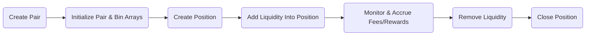

# Saros DLMM SDK — Developer Guide (Expanded)

Version: 1.4.x (adapted from repository v1.4.0)
Last updated: 2025-09-08

This guide is an expanded, developer-focused reference for building with the Saros Dynamic Liquidity Market Maker (DLMM) TypeScript SDK on Solana. It collects examples, deep-dives, workflows and practical tips so you can integrate swaps, concentrated liquidity positions, and reward hooks into production-ready apps.

Table of contents
- 1) Overview
- 2) Quick Start (Minimal working examples)
  - Install
  - Initialize SDK
  - Get quote -> Swap
  - Add liquidity (single position)
  - Remove liquidity (single or multiple)
- 3) Architecture & Workflow diagrams
  - Swap / Transaction flow
  - Liquidity lifecycle flow
- 4) Detailed API reference (methods, parameters & mapping)
- 5) Advanced developer patterns
  - Batching & multi-transaction flows
  - Native SOL handling
  - Compute units and priority fees
  - Hooks & rewards (overview)
- 6) Utilities & helper functions
- 7) Error handling, logging & best practices
- 8) Troubleshooting
- 9) Contributing, testing & roadmap
- 10) Appendix: useful addresses and constants

1) Overview
Saros DLMM SDK gives you programmatic access to concentrated-liquidity pools on Solana. Core capabilities:
- Quote calculation (getQuote)
- Swap transaction creation and execution (swap)
- Pair creation and bin initialization (createPairWithConfig)
- Position lifecycle (createPosition, addLiquidityIntoPosition, removeMultipleLiquidity, closePosition)
- Hooks/reward integration for per-bin reward accounting
- Utilities for building distributions and inspecting pool state

2) Quick Start (Minimal working examples)
Prerequisites:
- Node >=16
- TypeScript and ts-node (for samples)
- Solana wallet (Keypair or wallet adapter) and some SOL on devnet for testing

Install:
```bash
# npm
npm install @saros-finance/dlmm-sdk@1.4.0 @solana/web3.js@1.98.2 js-big-decimal @coral-xyz/anchor

# or yarn
yarn add @saros-finance/dlmm-sdk@1.4.0 @solana/web3.js@1.98.2 js-big-decimal @coral-xyz/anchor
```

Initialize the SDK:
```ts
import { LiquidityBookServices, MODE } from "@saros-finance/dlmm-sdk";

const lbServices = new LiquidityBookServices({ mode: MODE.DEVNET });
// For mainnet use MODE.MAINNET
```

2.1 Example: Get quote -> Swap (exact input)
- Steps:
  1. Call `getQuote(...)` to compute amount & slippage-safe minimum
  2. Call `swap(...)` to build a Transaction
  3. Sign and send the Transaction via the wallet adapter or Keypair

Example (simplified):
```ts
import { PublicKey } from "@solana/web3.js";

const pair = new PublicKey("EwsqJeioGAXE5EdZH..."); // replace
const tokenX = new PublicKey("C98A4nkJXhpVZ..."); // base
const tokenY = new PublicKey("EPjFWdd5Au..."); // quote

const quote = await lbServices.getQuote({
  pair,
  tokenBase: tokenX,
  tokenQuote: tokenY,
  tokenBaseDecimal: 6,
  tokenQuoteDecimal: 6,
  amount: BigInt(1_000_000), // 1 token with 6 decimals
  isExactInput: true,
  swapForY: true,
  slippage: 0.5,
});

// Build transaction
const tx = await lbServices.swap({
  pair,
  tokenMintX: tokenX,
  tokenMintY: tokenY,
  amount: quote.amount,
  otherAmountOffset: quote.otherAmountOffset,
  swapForY: true,
  isExactInput: true,
  hook: null, // or hook pubkey for rewarder
  payer: wallet.publicKey,
});

// Sign & send with adapter
const signed = await wallet.signTransaction(tx);
const sig = await lbServices.connection.sendRawTransaction(signed.serialize(), { skipPreflight: true });
await lbServices.connection.confirmTransaction(sig);
```

2.2 Example: Add liquidity (single position)
High-level steps:
- Query pair info (getPairAccount)
- Choose a binRange relative to active bin (e.g., -5..+5)
- Create or fetch required bin arrays (getBinArray)
- Create position if not exists (createPosition)
- Add liquidity using `addLiquidityIntoPosition`
- Sign and submit transaction(s)

Simplified example:
```ts
// determine distribution (uniform in example)
import { createUniformDistribution, LiquidityShape } from "@saros-finance/dlmm-sdk";

const pair = new PublicKey("...");

const pairInfo = await lbServices.getPairAccount(pair);
const active = pairInfo.activeId;
const binRange = [active - 5, active + 5]; // choose range
const distribution = createUniformDistribution({ shape: LiquidityShape.Spot, binRange: [-5, 5] });

// Prepare bin arrays and position
const binArrayLower = await lbServices.getBinArray({ binArrayIndex: Math.floor((active - 5)/256), pair, payer: wallet.publicKey });
const binArrayUpper = await lbServices.getBinArray({ binArrayIndex: Math.floor((active + 5)/256), pair, payer: wallet.publicKey });

// Create tx with addLiquidityIntoPosition (sdk method appends necessary instructions)
const positionMint = Keypair.generate().publicKey;
const tx = new Transaction();
await lbServices.addLiquidityIntoPosition({
  positionMint,
  payer: wallet.publicKey,
  pair,
  binArrayLower,
  binArrayUpper,
  transaction: tx,
  liquidityDistribution: distribution,
  amountX: 10_000_000, // 10 * 1e6
  amountY: 10_000_000,
});
tx.feePayer = wallet.publicKey;
tx.recentBlockhash = (await lbServices.connection.getLatestBlockhash()).blockhash;
const signed = await wallet.signTransaction(tx);
const sig = await lbServices.connection.sendRawTransaction(signed.serialize());
await lbServices.connection.confirmTransaction(sig);
```

2.3 Example: Remove liquidity (multiple positions)
- Use `getUserPositions` to list user positions
- Create `maxPositionList` entries and call `removeMultipleLiquidity`
- The method returns txs (and optional create/close account txs) — sign and submit as batch

3) Architecture & Workflow diagrams
3.1 High-level "Swap / Transaction" flow (Mermaid + ASCII fallback)

Mermaid (recommended for docs site that supports it):
```mermaid
flowchart TD
  A[Developer App/UI] -->|Init SDK| B(LiquidityBookServices)
  B --> C{Get Quote?}
  C -->|Yes| D[getQuote()]
  D --> E[Quote returned]
  E --> F[Build swap Tx via swap()]
  F --> G[Wallet signTransaction()]
  G --> H[sendRawTransaction()]
  H --> I[confirmTransaction()]
  I --> J[Update UI / analytics]
```

ASCII fallback:
```
Developer App/UI
       |
     Init SDK
       |
    getQuote? --- Yes ---> getQuote() -> Quote
       |                         |
       No                        v
       |                     swap() builds Transaction
       v                         |
   (skip)                 Wallet signs -> sendRawTransaction -> confirmTransaction
```

3.2 "Liquidity lifecycle" diagram

Mermaid:


ASCII:
```
Create Pair -> Init Bin Arrays -> Create Position -> Add Liquidity -> Monitor -> Remove Liquidity -> Close Position
```

4) Detailed API reference (concise, mapping to SDK methods)
Note: refer to the SDK source for full TS types. Below are practical parameter descriptions.

4.1 LiquidityBookServices constructor
- new LiquidityBookServices({ mode: MODE.DEVNET | MODE.MAINNET | MODE.TESTNET, options?: { rpcUrl, commitmentOrConfig } })

4.2 getPairAccount(pair: PublicKey): Promise<PairAccount>
- Fetch raw on-chain pair account via Anchor program IDL
- Use for activeId, binStep, static/dynamic fee params, hook pubkey

4.3 getQuote(params: GetTokenOutputParams): Promise<GetTokenOutputResponse>
- params:
  - pair: PublicKey
  - tokenBase: PublicKey
  - tokenQuote: PublicKey
  - amount: bigint (smallest unit)
  - swapForY: boolean (true to convert X->Y)
  - isExactInput: boolean
  - tokenBaseDecimal, tokenQuoteDecimal: number
  - slippage: percent (e.g., 0.5)
- returns amountIn, amountOut, priceImpact, amount (used for swap), otherAmountOffset (min output or max input)

4.4 swap(params: SwapParams): Promise<Transaction>
- Build transaction instructions for swap and does not submit
- params:
  - tokenMintX, tokenMintY: PublicKey
  - amount: bigint (use quote.amount)
  - otherAmountOffset: bigint
  - swapForY: boolean
  - isExactInput: boolean
  - pair: PublicKey
  - hook: PublicKey | null
  - payer: PublicKey (wallet pubkey)
- Note: you must sign the returned Transaction with wallet adapter or Keypair and call connection.sendRawTransaction

4.5 createPairWithConfig(params: CreatePairWithConfigParams)
- Creates `initialize_pair` + initializes two neighboring bin arrays
- params:
  - tokenBase { mintAddress, decimal }
  - tokenQuote { mintAddress, decimal }
  - binStep (choose from BIN_STEP_CONFIGS)
  - ratePrice (initial price)
  - payer: PublicKey
- returns tx (Transaction) and derived addresses (pair, binArrayLower/Upper, hooksConfig)

4.6 createPosition(params: CreatePositionParams)
- Creates a new position PDA and position token mint association
- params: payer, relativeBinIdLeft, relativeBinIdRight, pair, binArrayIndex, positionMint, transaction

4.7 addLiquidityIntoPosition(params: AddLiquidityIntoPositionParams)
- Appends compute-budget instructions, handles native SOL wrapping, creates increasePosition instruction via Anchor
- Important: The method expects a Transaction instance (or adds to one) and uses `liquidityDistribution` to split liquidity across bins

4.8 removeMultipleLiquidity(params: RemoveMultipleLiquidityParams): Promise<RemoveMultipleLiquidityResponse>
- Accepts list of positions with range to remove
- Prepares createAccount tx to ensure associated token accounts exist, returns txs[] for actual removal/close instructions
- You should sign `txCreateAccount` + `txs` + `txCloseAccount` in order and submit

4.9 getBinArray / getBinArrayInfo
- Derive bin array PDA with index; optionally append initializeBinArray instruction to a provided Transaction if missing on-chain

4.10 getUserPositions({ payer, pair })
- Scans token accounts (TOKEN_2022 program) for position NFTs, derives PDAs and returns positions for given pair

4.11 fetchPoolAddresses & fetchPoolMetadata
- `fetchPoolAddresses` lists on-chain Pair accounts by filtering program accounts
- `fetchPoolMetadata(pair: string)` returns base/quote mints, reserves, and trade fee

5) Advanced developer patterns

5.1 Batching & multi-transaction flows
- The SDK exposes helper flows that produce multiple transactions: e.g., create position (tx), add-liquidity (tx), removeMultipleLiquidity returns many txs
- Pattern: build all transactions, set feePayer and recentBlockhash per tx (use latest before signing), sign them in a single `signAllTransactions` call (wallet adapter) and send them sequentially while confirming each and refreshing blockhashes between dependent groups

5.2 Native SOL handling
- Pools using WRAP_SOL address require wrapping/unwrapping: SDK will:
  - add SystemProgram.transfer to associatedUserVault
  - call spl.createSyncNativeInstruction
  - close the wrapped account after swap/remove if necessary

Be careful: if a user wallet must pay lamports to the ATA for wrapping, ensure the wallet has SOL.

5.3 Compute units & priority fees
- The SDK sets ComputeBudget instructions (units: CCU_LIMIT) and sets compute unit price scaled by `getGasPrice()` and `UNIT_PRICE_DEFAULT`
- The SDK exposes `bufferGas` internal property used to scale unit price if you need to increase it for heavy transactions. To increase reliability under network load, set higher compute unit price or add a small delay between transactions.

5.4 Hooks & Rewards overview
- Hooks are on-chain rewarders that can be attached to a pair; the SDK supports passing `hook` when building operations
- Hooks maintain per-bin HookBinArray and HookPosition accounts; reward claim flows require additional PDAs and potential associated token accounts
- Use `fetchPoolMetadata` to read `extra.hook` field and decide whether to add hook-specific calls such as claim

6) Utilities & helper functions
- createUniformDistribution({ shape, binRange }): creates liquidity distribution across relative bins
- getMaxBinArray, getBinRange, getMaxPosition, findPosition to map logical ranges to required bin array indices and position slots
- getGasPrice(connection): returns a best-effort prioritization unit price (wrapped in a timeout fallback)

7) Error handling, logging & best practices
- Always call `getQuote` before `swap` to compute safe `otherAmountOffset`. Avoid relying on UI-only calculations.
- Confirm transactions using `connection.confirmTransaction({ signature, blockhash, lastValidBlockHeight })` for deterministic confirmation.
- For multi-tx flows:
  - Group preflight / account-creation txs first
  - Sign account-creation txs, submit & confirm them, then fetch a new blockhash and produce dependent txs
- Unit testing:
  - Use devnet and localnet; write simulation tests that call `getQuote` and assert correctness before sending signed txs
- Logging: include transaction signatures, blockhash and timing to debug reorgs or blockhash expiration.
- Security:
  - Never persist wallet private keys in repo
  - Use environment variables and short-lived key material for CI tests

8) Troubleshooting (common errors)
- "Pair not found"
  - Cause: wrong pair address or program id mismatch (devnet vs mainnet)
  - Fix: ensure `LiquidityBookServices` is initialized with the correct MODE; use `fetchPoolAddresses` to verify pools exist and `getPairAccount(pair)` to check details
- "Insufficient Liquidity"
  - Cause: pool does not have enough reserves for desired swap
  - Fix: use a smaller amount or a pool with larger liquidity
- "Invalid Bin Range" or "Bin not found"
  - Cause: requested bin range doesn't overlap initialized bin arrays
  - Fix: call `getBinArray` for required indices, or initialize them using `createPairWithConfig` flow
- "Transaction signature verification failed" or expired blockhash
  - Fix: ensure you sign a tx with the matching recentBlockhash and send the tx quickly; refresh blockhash before signing large batches
- "Insufficient funds" (SOL for fees)
  - Fix: fund wallet on devnet or mainnet; remember wrapping SOL uses lamports for SPL ATA creation
- Slow confirmations or failures under load
  - Fix: increase compute unit price, add small delays between large batches, or split into smaller transactions

9) Contributing, testing & roadmap
- Contributing:
  - Follow repo CONDUCT and CONTRIBUTING.md
  - Use the SDK's typed interfaces in /types for changes
  - Add unit tests for critical math routines (utils/math, utils/price, services/swap)
- Running tests (example local dev flow)
  - Set up a devnet wallet with SOL and test tokens
  - Use ts-node to run example scripts and assert expected outputs with console debug
- Roadmap & improvements (suggestions from analysis)
  - Improve full TypeScript typings for returned Anchor account shapes
  - Add standardized error codes and categorize messages
  - Document `createUniformDistribution` internals and sample tuning
  - Add a Docusaurus site for searchable docs and rendered diagrams

10) Appendix: useful constants & addresses
- WRAP_SOL_ADDRESS: `So11111111111111111111111111111111111111112`
- Example mainnet pair (C98/USDC): `EwsqJeioGAXE5EdZHj1QvcuvqgVhJDp9729H5wjh28DD`
- Example devnet pair (SAROS/WSOL): `C8xWcMpzqetpxwLj7tJfSQ6J8Juh1wHFdT5KrkwdYPQB`
- BIN_STEP_CONFIGS: available in `constants/config.ts` — choose appropriate risk/performance trade-off bin step

Appendix: Example "Complete flow" checklist (developer quick checklist)
- [ ] Install packages and set MODE
- [ ] Fund devnet wallet with SOL & test tokens
- [ ] Use getQuote before any swap
- [ ] For add liquidity: ensure bin arrays exist for targeted range
- [ ] For batch flows: sign & submit account creation txs first, then position txs, then liquidity txs
- [ ] Monitor transactions and handle errors with informative logs
- [ ] Add tests and CI job to run on devnet/localnet

If you want, I can:
- Convert the Mermaid diagrams into PNG/SVG and add them to docs/assets/
- Add runnable example scripts under examples/ (swap.ts, addLiquidity.ts, removeLiquidity.ts) with environment variable support
- Create a condensed "Getting Started" page suitable for README linking

Happy building — if you'd like I can now:
- commit this file to the repository (docs/DEVELOPER_GUIDE.md) and open a draft PR, or
- generate the example scripts (examples/) and tests for CI
