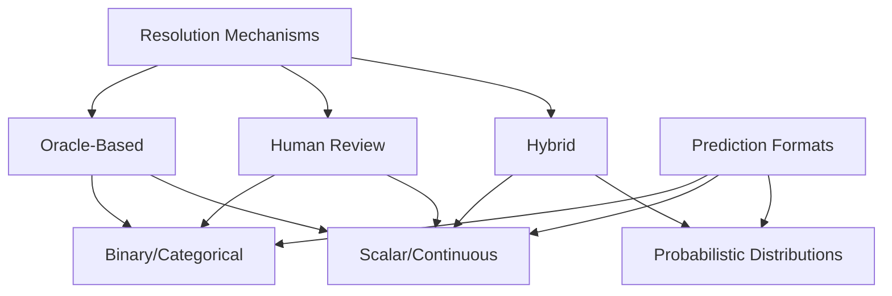
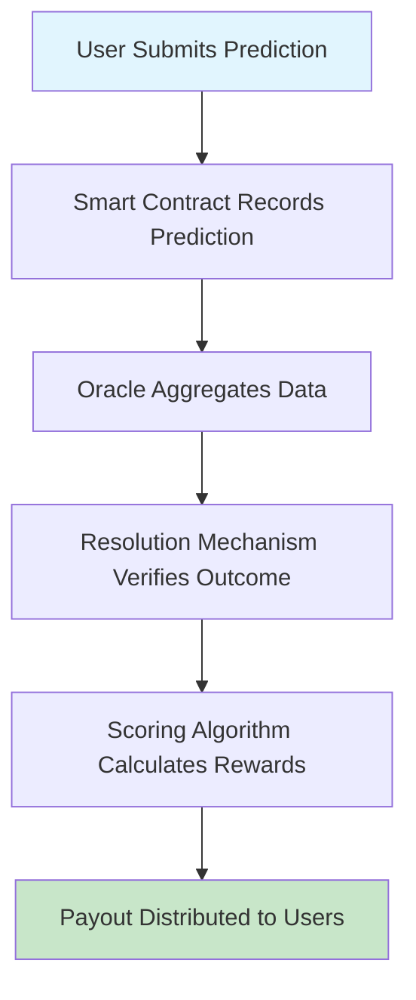

# Technical Typology and Impact Analysis of Prediction Market Platforms: Trepa's Revolutionary Precision Forecasting Model

## 🔍 Key Highlights
- 📊 Comprehensive Framework: 6-dimensional technical classification system covering resolution mechanisms, infrastructure, prediction formats, scoring systems, liquidity models, and user experience
- 🎯 Platform Analysis: Detailed examination of Binary Oracle platforms (Polymarket, Augur), Hybrid Resolution systems (Trepa, UMA), and Human Review mechanisms with strategic SWOT analysis
- ⚡ Trepa Innovation: Revolutionary accuracy-based rewards on Solana blockchain that transforms prediction markets from gambling platforms to intellectual skill-based forecasting systems
- 🚀 Technical Architecture: Deep dive into blockchain infrastructure, oracle mechanisms, smart contracts, and mathematical scoring rules powering next-generation platforms
- 💡 Market Impact: How Trepa's precision model could reshape prediction markets into institutional risk management and collective intelligence tools
- 🔮 Future Vision: Research directions including AI integration, cross-chain protocols, enhanced oracles, and regulatory frameworks distinguishing skill-based vs chance-based platforms

## Abstract
Prediction markets are experiencing a fundamental transformation from simple binary betting to sophisticated forecasting platforms that aggregate collective intelligence. This analysis establishes a comprehensive technical framework for classifying prediction platforms across six critical dimensions and examines Trepa's groundbreaking precision-based approach. Our research reveals that while traditional binary markets like Polymarket dominate current adoption, Trepa's hybrid resolution mechanism with accuracy-based continuous payouts represents a paradigm shift toward intellectually rigorous forecasting systems that reward analytical skill over speculative gambling.

## 1. The Prediction Market Evolution
Traditional prediction markets operate on winner-take-all binary models where participants either receive full payouts for correct predictions or lose everything. This approach has fundamental limitations: it discourages careful analysis, fails to capture nuanced thinking, and essentially functions as sophisticated gambling rather than genuine forecasting.

Trepa fundamentally disrupts this model by implementing accuracy-based rewards for numerical forecasts on economic indicators like inflation rates, employment data, and bond yields. Instead of binary win/lose outcomes, users receive proportional rewards based on prediction precision - predicting 3.2% inflation when the actual result is 3.1% earns substantial rewards, while a 2.8% prediction still receives meaningful payouts.

This evolution reflects broader trends toward skill-based digital platforms and the growing demand for sophisticated risk management tools in an increasingly uncertain economic environment.

### Prediction Market Platform Classification Matrix: Resolution Mechanism vs. Prediction Format

## 2. Technical Classification Framework

### 2.1 Resolution Mechanisms: How Truth is Determined
- **Oracle-Based Resolution**: Automated systems using external data feeds like price APIs or government statistics. Polymarket exemplifies this approach, automatically resolving markets using reliable data sources. Benefits include speed and objectivity, but limitations include vulnerability to data manipulation and inability to handle subjective outcomes.
- **Human Review Resolution**: Manual verification by designated reviewers or community voting. While flexible for complex scenarios, these systems face scalability constraints, potential bias, and higher operational costs.
- **Hybrid Resolution**: Advanced systems combining automation with human oversight, like UMA Protocol's optimistic oracle mechanism. These assume data accuracy unless challenged, creating economic incentives for dispute resolution while maintaining efficiency.

### 2.2 Infrastructure Architecture
- **On-Chain Platforms**: Fully decentralized systems operating entirely on blockchain networks. Trepa leverages Solana's high throughput and sub-cent transaction costs to enable frequent predictions and micropayments. This infrastructure choice is critical for supporting continuous, low-friction forecasting.
- **Off-Chain Systems**: Traditional centralized platforms offering superior performance but sacrificing decentralization benefits.
- **Hybrid Architectures**: Platforms balancing decentralization with usability through Layer 2 solutions or sidechains.

### 2.3 Prediction Formats
- **Binary/Categorical Markets**: Simple yes/no or multiple-choice predictions dominating platforms like Polymarket and Augur. While conceptually simple, they fail to capture probabilistic thinking or partial accuracy.
- **Scalar/Continuous Predictions**: Numerical range or exact value predictions. Trepa specializes here, enabling specific predictions on inflation rates, employment percentages, or bond yields. This format requires sophisticated scoring but provides granular information aggregation.
- **Probabilistic Distributions**: Advanced systems allowing full probability distribution submissions rather than point estimates.

### 2.4 Scoring and Incentive Mechanisms
- **All-or-Nothing Payouts**: Traditional binary systems where winners take all. Simple to understand but discourages analytical thinking.
- **Accuracy-Based Scoring**: Trepa's innovation: proportional rewards based on prediction precision using modified scoring rules. This encourages careful analysis while reducing gambling aspects.
- **Market Scoring Rules**: Sophisticated mechanisms like the Logarithmic Market Scoring Rule (LMSR) providing continuous liquidity while maintaining truth-telling incentives.

### Technical Architecture Flow: Prediction Market Platform Operations from Submission to Payout

## 3. Platform Category Analysis

### 3.1 Binary Oracle-Based Platforms
**Representative Platforms:**
- Polymarket: Dominates with 99% market share, processing billions in volume with automated resolution
- Augur V2: Pioneer utilizing reputation tokens for dispute resolution

**SWOT Analysis:**

| Aspect | Description |
|--------|-------------|
| Strengths | High automation reduces costs and delays Objective outcomes eliminate human bias Scalable architecture supporting thousands of markets Clear user understanding of outcomes |
| Weaknesses | Limited to objectively verifiable outcomes Vulnerable to oracle manipulation Binary outcomes miss nuanced predictions All-or-nothing payouts discourage analysis |
| Opportunities | IoT integration for novel prediction types Prediction-based derivatives expansion Cross-chain integration |
| Threats | Regulatory scrutiny as unregistered securities Oracle centralization risks Competition from superior UX platforms |

### 3.2 Hybrid Resolution Scalar Platforms
**Representative Platforms:**
- Trepa: Flagship example using Solana infrastructure with slider-based numerical predictions and accuracy-based payouts
- Advanced UMA Protocol: Optimistic oracle for complex numerical assertions

**SWOT Analysis:**

| Aspect | Description |
|--------|-------------|
| Strengths | Accuracy rewards encourage analytical thinking Hybrid resolution provides outcome flexibility Continuous formats capture more information Lower risk profile through partial rewards Educational value promoting financial literacy |
| Weaknesses | Higher UI/UX complexity requirements Sophisticated infrastructure increases costs Challenge establishing numerical resolution criteria Limited liquidity vs binary markets |
| Opportunities | AI/ML integration for enhanced accuracy Corporate forecasting applications Prediction-based credit scoring Cross-platform data sharing |
| Threats | Regulatory uncertainty around novel payouts Technical complexity barriers Oracle system manipulation risks Traditional derivatives competition |

**Strengths:**
- Accuracy rewards encourage analytical thinking
- Hybrid resolution provides outcome flexibility
- Continuous formats capture more information
- Lower risk profile through partial rewards
- Educational value promoting financial literacy

**Weaknesses:**
- Higher UI/UX complexity requirements
- Sophisticated infrastructure increases costs
- Challenge establishing numerical resolution criteria
- Limited liquidity vs binary markets

## 4. Trepa Deep Dive: Technical Innovation

### 4.1 Revolutionary Architecture
**Solana Integration**
Transaction costs below $0.01 and 400ms confirmation times enable frequent micro-predictions and real-time feedback. This infrastructure supports Trepa's vision of continuous, accessible forecasting.

**Precision Scoring Innovation**
Distance-weighted scoring functions provide partial payouts for near-correct forecasts while maintaining proper incentives. This mathematical foundation distinguishes skill-based analysis from gambling behavior.

**Intuitive Interface Design**
Slider-based numerical input eliminates complex trading interfaces while maintaining analytical rigor. This significantly lowers barriers while preserving intellectual depth.

### 4.2 Competitive Differentiation
**Intellectual vs Speculative Appeal**
Accuracy-based rewards attract users interested in genuine forecasting skills rather than binary gambling. This aligns with the superforecasting movement and appeals to quantitatively-minded participants.

**Risk Profile Transformation**
Partial reward systems reduce downside risk, encouraging broader participation and longer-term engagement.

**Educational Value**
Functions as interactive learning environment for macroeconomic analysis, developing user intuition for economic relationships.

### 4.3 Market Impact Potential
**Intellectual Capital Attraction**
Creating genuine rewards for analytical skill may attract domain experts previously avoiding prediction markets, improving forecasting quality.

**Institutional Applications**
Evolution toward sophisticated risk management tools providing crowd-sourced forecasts for regulatory stress testing and strategic planning.

**Regulatory Advantages**
Emphasis on skill over chance may provide compliance benefits in jurisdictions distinguishing games of skill from gambling.

## 5. Future Evolution and Innovation Opportunities

### 5.1 Technical Advancement Directions
**Enhanced Oracle Systems**
AI-powered data analysis and multi-source verification could expand predictable outcomes while maintaining accuracy.

**Advanced Scoring Mechanisms**
Research into optimal scoring rules for continuous predictions incorporating machine learning and information theory insights.

**Cross-Chain Integration**
Multi-blockchain predictions could increase liquidity and access while creating arbitrage and information synthesis opportunities.

**AI Agent Integration**
Emerging AI agent participation could enhance forecasting accuracy while creating new platform design challenges.

### 5.2 Market Structure Evolution
**Institutional Adoption**
Mature prediction markets may serve institutional risk management, strategic planning, and research applications requiring enhanced security and compliance.

**Regulatory Clarification**
Clearer frameworks likely distinguishing platform types based on technical characteristics and use cases.

**Traditional Finance Integration**
Prediction mechanisms may integrate into established financial products, creating hybrid derivatives combining crowd-sourced forecasting with traditional infrastructure.

## 6. The Prediction Market Ecosystem Map
Based on the comprehensive ecosystem mapping, prediction markets and forecasting platforms form a rich landscape:

### Prediction Markets
- Manifold, Polymarket, Predictit, Kalshi, IBKR ForecastTrader, Insight Predictions

### Forecasting Platforms
- Metaculus, Good Judgement, Fatebook, Cultivate Labs, INFER, Confido Institute

### Research & Consultancy
- Forecasting Research Institute, Samotsvety Forecasting, Quantified Uncertainty Research Institute, Arb Research, Sentinel, Swift Centre for Applied Forecasting

### Tools for Forecasting
- Squiggle, Guesstimate, Quantified Intuitions, Metaforecast, Estimaker, Viewpoints

### Learning Resources
- Textbooks, Videos, Training & practice, Books

### Community Infrastructure
- Online communities fostering collaboration and knowledge sharing

This ecosystem highlights the growing maturity of prediction markets, with Trepa positioned at the forefront of innovation in precision forecasting.

## 7. Conclusion: The Precision Forecasting Future
This technical analysis reveals prediction markets undergoing fundamental evolution from binary betting to sophisticated information aggregation systems. Trepa's precision-based approach addresses critical limitations while opening applications beyond speculative trading.

### Critical Design Trade-offs
- **Simplicity vs Information Richness**: Trepa prioritizes information depth while maintaining usability
- **Automation vs Flexibility**: Hybrid systems balance efficiency with adaptability
- **Scalability vs Precision**: Platform choices determine user reach vs analytical depth

### Innovation Priorities
Future development should focus on oracle reliability, sophisticated scoring mechanisms, and risk management applications. AI integration and traditional finance connectivity will become increasingly important.

### Trepa's Promising Trajectory
Trepa's model aligns with growing demand for data-driven decision making and institutional applications. Success depends on maintaining user engagement, expanding beyond macroeconomics, and navigating regulatory challenges while preserving accuracy-based innovation.

The prediction market landscape is poised for significant growth toward intellectually rigorous, practically valuable forecasting systems. Platforms like Trepa lead this evolution toward critical infrastructure for risk management, strategic planning, and collective intelligence in an uncertain world.
